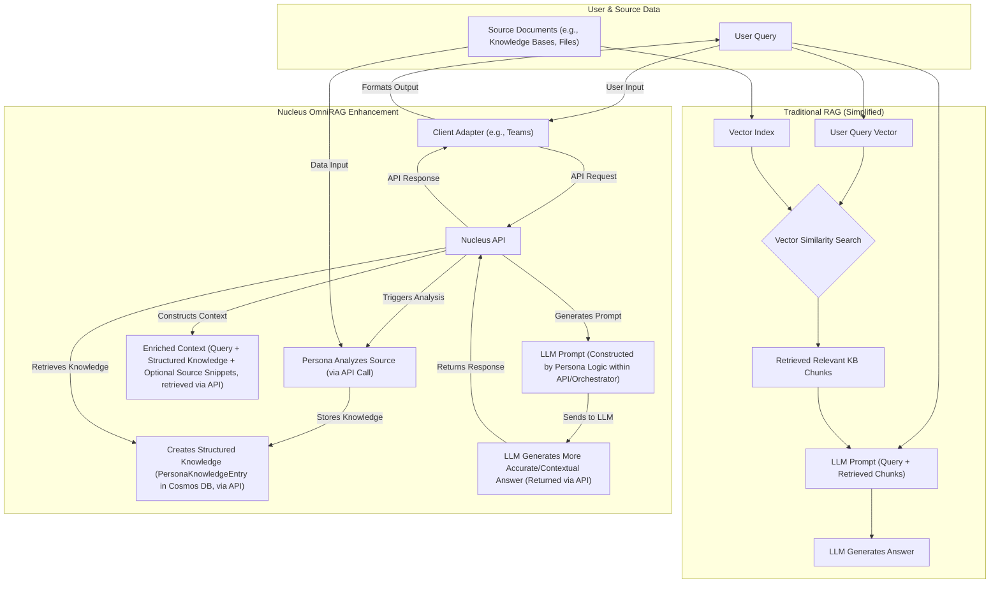
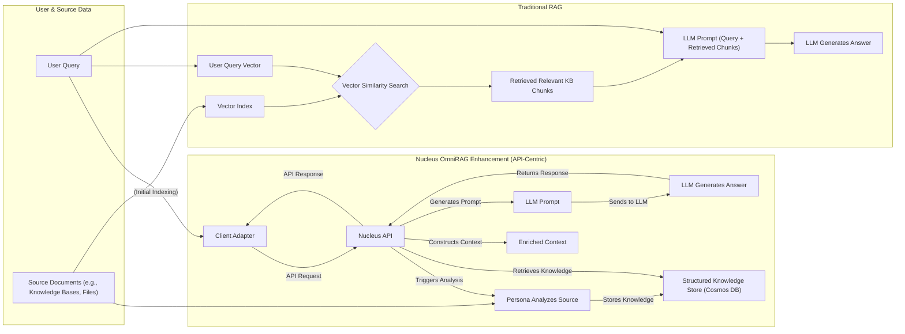

# Nucleus OmniRAG: System Architecture Overview

## 1. Introduction & Vision

Nucleus OmniRAG is a platform designed to empower individuals and teams by transforming their disparate digital information into actionable, contextual knowledge through specialized AI assistants ("Personas"). It provides a robust, flexible, and secure foundation for Retrieval-Augmented Generation (RAG) that respects user data ownership and adapts to different deployment needs. **The system is built upon an API-First architecture**, where a central `Nucleus.Services.Api` project orchestrates all interactions and core logic.

**Core Goal:** To serve as the central "nucleus" processing information provided by users ("mitochondria") using configured resources (AI models, compute budget/"ATP") to produce insightful outputs ("transcriptome"), as outlined in the [Project Mandate](../Requirements/00_PROJECT_MANDATE.md).

This document provides a high-level map of the system's components, interactions, required infrastructure, and codebase structure. Detailed designs for specific areas can be found in the subsequent architecture documents:

### Core Components Overview

This section provides links to detailed architecture documents for major components:

#### Core & Orchestration

*   [01_ARCHITECTURE_PROCESSING.md](./01_ARCHITECTURE_PROCESSING.md) - Overall data processing flow and orchestration (managed via the API).
*   [Processing/ARCHITECTURE_PROCESSING_ORCHESTRATION.md](./Processing/ARCHITECTURE_PROCESSING_ORCHESTRATION.md) - Detailed orchestration logic (e.g., using Durable Functions, invoked by the API).
*   [Processing/Ingestion/ARCHITECTURE_INGESTION_*.md](./Processing/Ingestion/) - Specific data ingestion methods (triggered via the API).
*   [Processing/Dataviz/ARCHITECTURE_PROCESSING_DATAVIZ.md](./Processing/Dataviz/ARCHITECTURE_PROCESSING_DATAVIZ.md) - Data visualization generation (potentially served via API endpoints).

#### Intelligence & Personas

*   [02_ARCHITECTURE_PERSONAS.md](./02_ARCHITECTURE_PERSONAS.md) - High-level persona concepts (logic resides within or is called by the API service).
*   [08_ARCHITECTURE_AI_INTEGRATION.md](./08_ARCHITECTURE_AI_INTEGRATION.md) - Integration patterns for external AI models (accessed via the API service).
*   [Personas/*/*.md](./Personas/) - Specific persona implementations (logic used by the API service).

#### Data & Storage

*   [03_ARCHITECTURE_STORAGE.md](./03_ARCHITECTURE_STORAGE.md) - General storage concepts (embeddings, metadata, source content, accessed via the API service).
*   [04_ARCHITECTURE_DATABASE.md](./04_ARCHITECTURE_DATABASE.md) - Database schema and interaction patterns (likely Cosmos DB, accessed via the API service).

#### Interaction & Clients

*   [10_ARCHITECTURE_API.md](./10_ARCHITECTURE_API.md) - **(Primary Entry Point)** Defines the contracts and capabilities of the core API service.
*   [05_ARCHITECTURE_CLIENTS.md](./05_ARCHITECTURE_CLIENTS.md) - How users interact with Nucleus (always via the API).
*   [ClientAdapters/ARCHITECTURE_ADAPTER_*.md](./ClientAdapters/) - Specific client adapters (Console, Teams, Email, etc. - **act as thin clients to the API**).

#### Security & Deployment

*   [06_ARCHITECTURE_SECURITY.md](./06_ARCHITECTURE_SECURITY.md) - Security considerations, authentication, and authorization.
*   [07_ARCHITECTURE_DEPLOYMENT.md](./07_ARCHITECTURE_DEPLOYMENT.md) - Deployment models, CI/CD, and hosting environments.
*   [Deployment/*/*.md](./Deployment/) - Specific deployment/hosting details.

## 3. High-Level System Architecture

This diagram illustrates the primary components and their interactions, emphasizing the central role of the `Nucleus.Services.Api`.

```mermaid
graph LR
    subgraph User Interaction Channels
        UserConsole[User via Console App]
        UserTeams[User via Teams Bot]
        UserSlack[User via Slack App]
        UserDiscord[User via Discord Bot]
        UserEmail[User via Email]
    end

    subgraph Nucleus Platform
        ApiService[Nucleus.Services.Api]

        subgraph Internal Components (Managed by API Service)
            Orchestrator[Processing Orchestrator (e.g., Durable Functions)]
            PersonaManager[Persona Logic]
            DataService[Data Access Layer]
            AIService[AI Model Integration]
            InternalQueue[Internal Task Queue (Optional, for async)]
        end

        subgraph Data Stores
            DB[(Cosmos DB / Metadata Store)]
            SourceStore[(Blob Storage / Source Content)]
        end

        subgraph External Services
            AIModels[External AI Services (OpenAI, Gemini)]
        end

        Orchestrator -- Triggers / Uses --> PersonaManager
        PersonaManager -- Uses --> AIService
        PersonaManager -- Accesses --> DataService
        DataService -- Interacts --> DB
        DataService -- Interacts --> SourceStore
        AIService -- Calls --> AIModels
        ApiService -- Manages/Invokes --> Orchestrator
        ApiService -- Manages/Invokes --> PersonaManager
        ApiService -- Manages/Invokes --> DataService
        ApiService -- Manages/Invokes --> AIService
        ApiService -- Uses (Optional) --> InternalQueue
        Orchestrator -- Uses (Optional) --> InternalQueue
    end

    UserConsole -- REST/gRPC --> ApiService
    UserTeams -- Bot Framework / REST --> ApiService
    UserSlack -- Slack Events API / REST --> ApiService
    UserDiscord -- Discord API / REST --> ApiService
    UserEmail -- Email Polling / REST --> ApiService
```

**Key Components:**

*   **User Interaction Channels:** Users interact via various thin clients (Console App, Platform Bots, Email integration). **These clients ONLY communicate with the `Nucleus.Services.Api`.** They handle platform-specific protocols and translate user input/output.
*   **`Nucleus.Services.Api` (ASP.NET Core):** The central hub and single entry point for all external interactions. It handles authentication, authorization, request validation, routing, and orchestrates calls to internal components. It exposes a well-defined API contract (e.g., REST, gRPC).
*   **Internal Components (Managed by API):**

    *   **Processing Orchestrator:** Manages complex, potentially long-running workflows (e.g., multi-step ingestion, analysis using Durable Functions or similar). Invoked and managed by the API service.
    *   **Persona Logic:** Encapsulates the core reasoning, analysis, and response generation capabilities specific to each Persona. Called by the Orchestrator or directly by the API service for simpler tasks.
    *   **Data Access Layer:** Provides an abstraction for interacting with data stores. Used by Personas and the API service.
    *   **AI Model Integration:** Handles communication with external AI services (embeddings, completions, etc.). Used by Personas.
    *   **Internal Task Queue (Optional):** For decoupling long-running tasks initiated by the API (e.g., Azure Queue Storage).
*   **Data Stores:**

    *   **Database (e.g., Cosmos DB):** Stores metadata, derived knowledge (PersonaKnowledgeEntry), configuration, user data, etc. Accessed via the Data Access Layer.
    *   **Source Storage (e.g., Azure Blob Storage):** Where the actual content of source files/attachments is stored securely. Accessed via the Data Access Layer.
*   **External AI Services:** External models providing core capabilities, accessed via the AI Model Integration layer.

## 4. Technology Stack (Illustrative)

| Component                     | Description                                                                                                | Technology Stack (Anticipated)                                     |
| :---------------------------- | :--------------------------------------------------------------------------------------------------------- | :----------------------------------------------------------------- |
| **User Interaction Channels** | Interfaces for users (Console App, Bots, Email). **Thin clients to the API.**                   | .NET Console, Bot Framework SDK, Slack/Discord SDKs, MailKit |
| **Core API Service**          | Central ASP.NET Core service handling all requests, orchestration, and business logic.       | ASP.NET Core, C#, REST/gRPC                                  |
| **Orchestration**           | Managing complex workflows (optional, depending on complexity).                                    | Azure Durable Functions, .NET                                |
| **Persona Logic**             | Core AI reasoning units executed within the API service or orchestrated functions.            | .NET, Semantic Kernel, Azure OpenAI                          |
| **Data Access Layer**         | Abstraction for data store interactions. Used by Personas and API service.                    | .NET, Cosmos DB SDK, Azure Blob Storage SDK                |
| **AI Model Integration**       | Handles external AI service calls. Used by Personas.                                             | .NET, Azure OpenAI SDK, OpenAI SDK                           |
| **Internal Task Queue**       | Decoupling long-running tasks (optional).                                                           | Azure Queue Storage, .NET                                     |

## 6. Architectural Principles

*   **API-First:** The `Nucleus.Services.Api` is the definitive contract and central point of interaction. Clients (Adapters) are thin.
*   **Modular:** Components are designed for clear separation of concerns.
*   **Persona-Centric:** The architecture is designed to support multiple, specialized AI Personas, each with its own data (`PersonaKnowledgeEntry`) and logic.
*   **Flexibility:** Supports both Cloud-Hosted and Self-Hosted deployment models with configuration adjustments.
*   **Extensibility:** Designed for adding new personas and content sources with minimal friction.
*   **Scalability:** Leverages serverless and PaaS components for elastic scaling.
*   **Intelligence-Driven:** Rejects simplistic chunking; relies on AI personas for relevance extraction and analysis, orchestrated via the API.
*   **Efficiency:** Utilizes LLM provider-level prompt/context caching (**Planned for Phase 2+**, driven by efficiency requirements likely detailed in [Phase 2 Requirements](../Requirements/02_REQUIREMENTS_PHASE2_MULTI_PLATFORM.md)) where available (e.g., Gemini, Azure OpenAI) to minimize redundant processing of large contexts, reducing cost and latency.

## Data Processing Approach Comparison (Nucleus vs. Standard RAG)

**Purpose:** Contrasts the Nucleus system's data processing and retrieval method with standard RAG techniques, highlighting the focus on structured understanding and API-mediated interaction.



**Explanation:** This illustrates a key difference from standard RAG. Typical systems perform generic text chunking and rely solely on text similarity. The Nucleus approach uses an **API** as the central gateway. Client adapters send requests to the API. The API service then orchestrates the processing: Personas analyze content contextually (extracting structured data), storing results via the API's data layer. Retrieval uses both semantic search and structured data (queried via the API) to build a richer context for the LLM, leading to more precise answers delivered back through the API to the client.



```mermaid
graph LR
    A["User Interaction (e.g., Teams/Console)"] --> ClientAdapter[Client Adapter]
    ClientAdapter -- API Call --> B(Nucleus API)
    B --> C{Orchestrator (within API Service)}
    C -- "Identify/Invoke Relevant Persona(s)" --> D["Persona Logic (within API Service)"]
    D -- "Request/Receive Data" --> DataService[Data Service (within API)]
    DataService -- "Interact" --> E([Cosmos DB])
    DataService -- "Interact" --> SourceStore[(Blob Storage)]

    D -- "Request External AI Call" --> AIService[AI Service (within API)]
    AIService -- "Call External Model" --> H([LLM / AI Models])
    H -- "Result" --> AIService
    AIService -- "Return Result" --> D

    D -- "Analysis Result / Formulate Response" --> C
    C --> B
    B -- "API Response" --> ClientAdapter
    ClientAdapter -- "Deliver Response" --> A
```