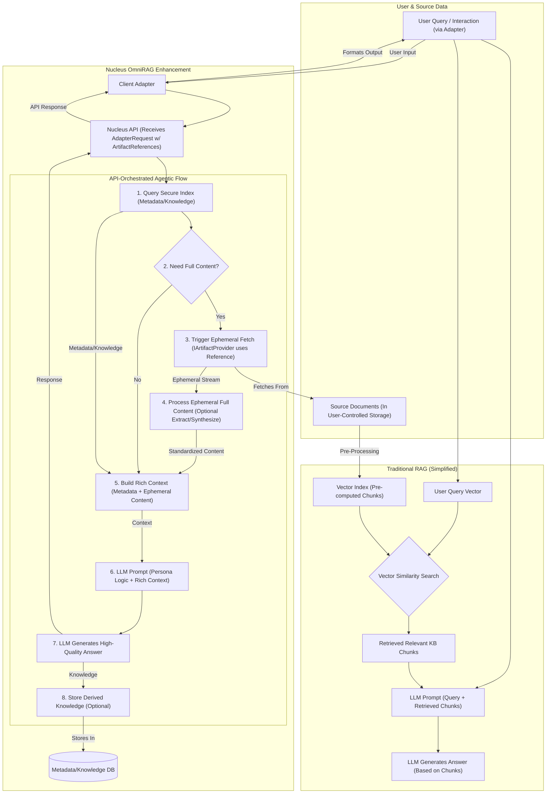

# Nucleus: System Architecture Overview

## 1. Introduction & Vision

Nucleus is a platform designed to empower individuals and teams by transforming their disparate digital information into actionable, contextual knowledge through specialized **agentic AI assistants ("Personas")**. It provides a robust, flexible, and secure foundation for Retrieval-Augmented Generation (RAG) that respects user data ownership and adapts to different deployment needs. **The system is built upon an API-First architecture**, where a central [`Nucleus.Services.Api`](../../src/Nucleus.Services/Nucleus.Services.Api/) project orchestrates all interactions and core logic. **Crucially, Nucleus adheres to strict, non-negotiable security principles**: *It maintains Zero Trust for user file content, meaning the backend never stores or persists raw user files. Instead, files remain in user-controlled storage (e.g., OneDrive, local disk) and the API interacts with them solely via secure [`ArtifactReference`](../../src/Nucleus.Abstractions/Models/ArtifactReference.cs) objects.* Content is retrieved ephemerally only when necessary for processing ([Security](./06_ARCHITECTURE_SECURITY.md), [Processing](./01_ARCHITECTURE_PROCESSING.md), [Personas](./02_ARCHITECTURE_PERSONAS.md)).

**Core Goal:** To serve as the central "nucleus" processing information provided by users ("mitochondria") using configured resources (AI models, compute budget/"ATP") to produce insightful outputs ("transcriptome"), as outlined in the [Project Mandate](../Requirements/00_PROJECT_MANDATE.md).

This document provides a high-level map of the system's components, interactions, required infrastructure, and codebase structure. Detailed designs for specific areas can be found in the subsequent architecture documents:

### Core Components Overview

This section provides links to detailed architecture documents for major components:

#### Core & Orchestration

*   [01_ARCHITECTURE_PROCESSING.md](./01_ARCHITECTURE_PROCESSING.md) - Overall data processing flow and orchestration (managed via the API).
*   [Processing/ARCHITECTURE_PROCESSING_ORCHESTRATION.md](./Processing/ARCHITECTURE_PROCESSING_ORCHESTRATION.md) - Detailed orchestration logic (e.g., using Durable Functions, invoked by the API).
*   [Processing/Ingestion/ARCHITECTURE_INGESTION_*.md](./Processing/Ingestion/) - Specific data ingestion methods (triggered via the API).
*   [Processing/Dataviz/ARCHITECTURE_PROCESSING_DATAVIZ.md](./Processing/Dataviz/ARCHITECTURE_PROCESSING_DATAVIZ.md) - Data visualization generation (potentially served via API endpoints).

#### Intelligence & Personas

*   [02_ARCHITECTURE_PERSONAS.md](./02_ARCHITECTURE_PERSONAS.md) - High-level persona concepts (logic resides within or is called by the API service).
*   [08_ARCHITECTURE_AI_INTEGRATION.md](./08_ARCHITECTURE_AI_INTEGRATION.md) - Integration patterns for external AI models (accessed via the API service).
*   [Personas/*/*.md](./Personas/) - Specific persona implementations (logic used by the API service).

#### Data & Storage

*   [03_ARCHITECTURE_STORAGE.md](./03_ARCHITECTURE_STORAGE.md) - General storage concepts (embeddings, metadata, source content, accessed via the API service).
*   [04_ARCHITECTURE_DATABASE.md](./04_ARCHITECTURE_DATABASE.md) - Database schema and interaction patterns (likely Cosmos DB, accessed via the API service).

#### Codebase & Data Structure

*   [11_ARCHITECTURE_NAMESPACES_FOLDERS.md](./11_ARCHITECTURE_NAMESPACES_FOLDERS.md) - Defines the standard namespace and folder structure for the Nucleus project.
*   [12_ARCHITECTURE_ABSTRACTIONS.md](./12_ARCHITECTURE_ABSTRACTIONS.md) - Describes the core abstractions and entities used throughout the Nucleus system.

#### Interaction & Clients

*   [10_ARCHITECTURE_API.md](./10_ARCHITECTURE_API.md) - **(Primary Entry Point)** Defines the contracts and capabilities of the core API service.
*   [05_ARCHITECTURE_CLIENTS.md](./05_ARCHITECTURE_CLIENTS.md) - How users interact with Nucleus (always via the API).
*   [ClientAdapters/ARCHITECTURE_ADAPTER_*.md](./ClientAdapters/) - Specific client adapters (Console, Teams, Email, etc. - **act as thin clients to the API**).

#### Security & Deployment

*   [06_ARCHITECTURE_SECURITY.md](./06_ARCHITECTURE_SECURITY.md) - Security considerations, authentication, and authorization.
*   [07_ARCHITECTURE_DEPLOYMENT.md](./07_ARCHITECTURE_DEPLOYMENT.md) - Deployment models, CI/CD, and hosting environments.
*   [Deployment/*/*.md](./Deployment/) - Specific deployment/hosting details.

## 3. High-Level System Architecture

This diagram illustrates the primary components and their interactions, emphasizing the central role of the `Nucleus.Services.Api` in orchestrating reference-based, ephemeral processing.

```mermaid
graph LR
    subgraph User Interaction Channels
        UserConsole[User via Console App]
        UserTeams[User via Teams Bot]
        UserSlack[User via Slack App]
        UserDiscord[User via Discord Bot]
        UserEmail[User via Email]
    end

    subgraph Nucleus Platform (Managed by API Service)
        ApiService[Nucleus.Services.Api]

        subgraph Internal Components
            Orchestrator[Processing Orchestrator]
            PersonaManager[Persona Logic (Agentic)]
            ProviderResolver[IArtifactProvider Resolver]
            DataService[Data Access Layer (Metadata/Knowledge)]
            AIService[AI Model Integration]
            InternalQueue[Internal Task Queue (Optional, for async)]
        end

        subgraph Data Stores
            DB[(Cosmos DB / Metadata & Knowledge Store)]
            %% SourceStore is external, accessed via Provider
        end

        subgraph External Services & Data
            AIModels[External AI Services (OpenAI, Gemini)]
            UserStorage[(User-Controlled Storage - OneDrive, Local, etc.)]
        end

        Orchestrator -- Triggers / Uses --> PersonaManager
        PersonaManager -- Uses --> AIService
        PersonaManager -- Accesses --> DataService
        PersonaManager -- Requests Fetch via --> Orchestrator
        Orchestrator -- Uses --> ProviderResolver
        ProviderResolver -- Provides --> IArtifactProviderImplementations
        IArtifactProviderImplementations -- Fetches Ephemerally --> UserStorage
        DataService -- Interacts --> DB
        AIService -- Calls --> AIModels
        ApiService -- Manages/Invokes --> Orchestrator
        ApiService -- Manages/Invokes --> PersonaManager
        ApiService -- Manages/Invokes --> DataService
        ApiService -- Manages/Invokes --> AIService
        ApiService -- Uses (Optional) --> InternalQueue
        Orchestrator -- Uses (Optional) --> InternalQueue
    end

    UserConsole -- API Request (AdapterRequest w/ ArtifactReferences) --> ApiService
    UserTeams -- API Request (AdapterRequest w/ ArtifactReferences) --> ApiService
    UserSlack -- API Request (AdapterRequest w/ ArtifactReferences) --> ApiService
    UserDiscord -- API Request (AdapterRequest w/ ArtifactReferences) --> ApiService
    UserEmail -- API Request (AdapterRequest w/ ArtifactReferences) --> ApiService
```

**Key Components:**

*   **User Interaction Channels:** Users interact via various thin clients (Console App, Platform Bots, Email). **These clients ONLY communicate with the `Nucleus.Services.Api`, sending [`AdapterRequest`](../../src/Nucleus.Abstractions/Models/ApiContracts/AdapterRequest.cs) payloads that include `ArtifactReference` objects for any relevant files.** They handle platform-specific protocols and translate user input/output.
*   **`Nucleus.Services.Api` (ASP.NET Core):** The central hub and single entry point. It handles authentication, authorization, request validation (including `ArtifactReference`s), routing, and orchestrates calls to internal components. **It does NOT accept direct file uploads.**
*   **Internal Components (Managed by API):**
    *   **Processing Orchestrator:** Manages complex, potentially long-running **agentic workflows** (e.g., multi-step analysis). Invoked by the API service, it coordinates persona logic, metadata access, and **triggers ephemeral content retrieval** via [`IArtifactProvider`](../../src/Nucleus.Abstractions/IArtifactProvider.cs)s when requested by persona logic.
    *   **Persona Logic (Agentic):** Encapsulates the core reasoning, analysis, and response generation capabilities. Operates in potentially multi-step loops, requesting artifact content fetches from the Orchestrator as needed.
    *   **`IArtifactProvider` Resolver & Implementations:** Selects and uses the correct `IArtifactProvider` (e.g., for Graph, local files via Console Adapter) based on the `ArtifactReference.ReferenceType` to **ephemerally fetch content directly from `UserStorage`**.
    *   **Data Access Layer:** Provides abstraction for interacting with the **metadata/knowledge store (`DB`)**. Used by Personas and the Orchestrator.
    *   **AI Model Integration:** Handles communication with external `AIModels`. Used by Personas.
    *   **Internal Task Queue (Optional):** For decoupling long-running tasks.
*   **Data Stores:**
    *   **Database (e.g., Cosmos DB):** Stores **only derived metadata ([`ArtifactMetadata`](../../src/Nucleus.Abstractions/Models/ArtifactMetadata.cs)) and knowledge ([`PersonaKnowledgeEntry`](../../src/Nucleus.Abstractions/Models/PersonaKnowledgeEntry.cs))** (the **Secure Index**), configuration, etc. Does **NOT** store raw user file content.
*   **External Services & Data:**
    *   **External AI Services:** Models providing core AI capabilities.
    *   **User-Controlled Storage:** Where the actual source file content resides (e.g., OneDrive, SharePoint, local disk via Console). Accessed ephemerally and securely by `IArtifactProvider` implementations.

## 4. Technology Stack (Illustrative)

| Component                     | Description                                                                                                | Technology Stack (Anticipated)                                     |
| :---------------------------- | :--------------------------------------------------------------------------------------------------------- | :----------------------------------------------------------------- |
| **User Interaction Channels** | Interfaces for users (Console App, Bots, Email). **Thin clients to the API.**                   | .NET Console, Bot Framework SDK, Slack/Discord SDKs, MailKit |
| **Core API Service**          | Central ASP.NET Core service handling all requests, orchestration, and business logic.       | ASP.NET Core, C#, REST/gRPC                                  |
| **Orchestration**           | Managing complex workflows (optional, depending on complexity).                                    | Azure Durable Functions, .NET                                |
| **Persona Logic**             | Core AI reasoning units executed within the API service or orchestrated functions.            | .NET, Semantic Kernel, Azure OpenAI                          |
| **Data Access Layer**         | Abstraction for data store interactions. Used by Personas and API service.                    | .NET, Cosmos DB SDK, Azure Blob Storage SDK                |
| **AI Model Integration**       | Handles external AI service calls. Used by Personas.                                             | .NET, Azure OpenAI SDK, OpenAI SDK                           |
| **Internal Task Queue**       | Decoupling long-running tasks (optional).                                                           | Azure Queue Storage, .NET                                     |

## 6. Architectural Principles

*   **API-First:** The `Nucleus.Services.Api` is the definitive contract. Clients (Adapters) are thin and interact solely via the API, typically sending `AdapterRequest` payloads.
*   **Zero Trust for User File Content:** The Nucleus backend **never** stores or persists raw user file content. Interaction is strictly through `ArtifactReference` objects.
*   **Reference-Based Interaction:** All file operations are initiated using `ArtifactReference` objects pointing to data in user-controlled storage.
*   **Ephemeral Content Retrieval:** File content is fetched *only when needed* by persona logic during processing, using `IArtifactProvider` implementations, and is not persisted by the backend.
*   **Agentic Personas:** Personas operate as agents, performing multi-step reasoning. *This typically involves an iterative loop: analyzing context, querying the secure metadata index to identify relevant artifacts, and triggering ephemeral fetches of full artifact content to build a rich understanding before generating a high-quality response.* ([Personas](./02_ARCHITECTURE_PERSONAS.md), [Processing](./01_ARCHITECTURE_PROCESSING.md)).
*   **Secure Metadata Index:** Derived metadata and knowledge (`ArtifactMetadata`, `PersonaKnowledgeEntry`) stored in the database serve as a secure index for efficient retrieval without exposing raw content. *This index allows personas to quickly determine "what they know" about a topic before deciding if ephemeral retrieval of full content is needed.* ([Processing](./01_ARCHITECTURE_PROCESSING.md), [Security](./06_ARCHITECTURE_SECURITY.md)).
*   **Modular:** Components are designed for clear separation of concerns.
*   **Flexibility:** Supports both Cloud-Hosted and Self-Hosted deployment models.
*   **Extensibility:** Designed for adding new personas, `IArtifactProvider`s, and client adapters.
*   **Scalability:** Leverages serverless and PaaS components.

## Data Processing Approach Comparison (Nucleus vs. Standard RAG)

**Purpose:** Contrasts the Nucleus system's agentic, reference-based processing with standard RAG, highlighting the focus on structured understanding, ephemeral full-content access, and API-mediation.



**Key Differences from Standard RAG:**

*   **No Direct Uploads/Pre-Chunking:** Nucleus relies on `ArtifactReference`s passed via the API, not direct uploads or pre-ingestion chunking into a vector store.
*   **Secure Metadata Index:** Retrieval often starts by querying structured knowledge and metadata (`PersonaKnowledgeEntry`, `ArtifactMetadata`), not just a vector index of raw chunks.
*   **Ephemeral Full Content Retrieval:** When deeper context is needed, Nucleus (via `IArtifactProvider`) fetches the *full content* of relevant documents ephemerally using the `ArtifactReference`, rather than relying solely on potentially out-of-context pre-computed chunks. *This ability to access rich, full documents transiently enables higher-quality analysis and responses compared to systems limited by chunked data.*
*   **Agentic Processing:** Personas can perform multi-step reasoning, deciding *when* and *which* full documents to retrieve ephemerally based on the evolving context of the interaction.
*   **API-Centric:** All steps are orchestrated and mediated through the `Nucleus.Services.Api`.