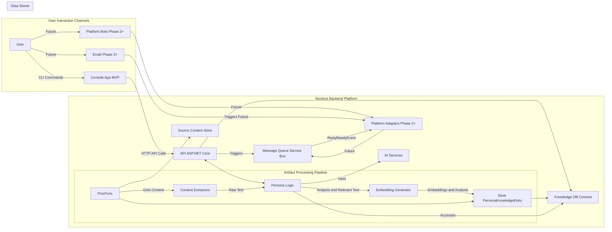
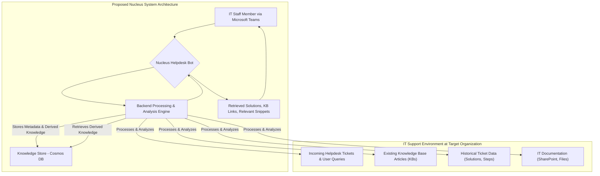
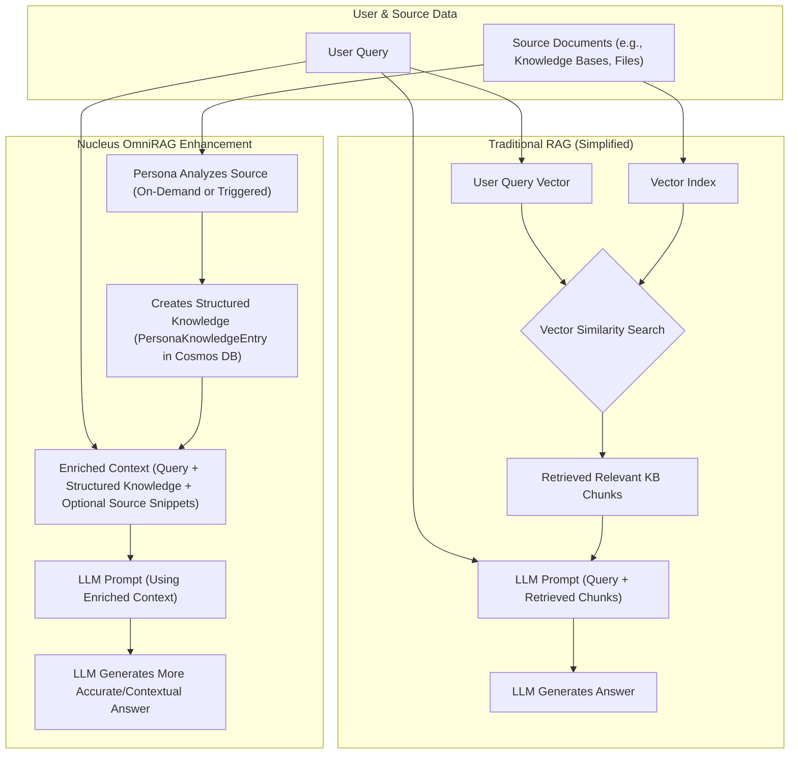
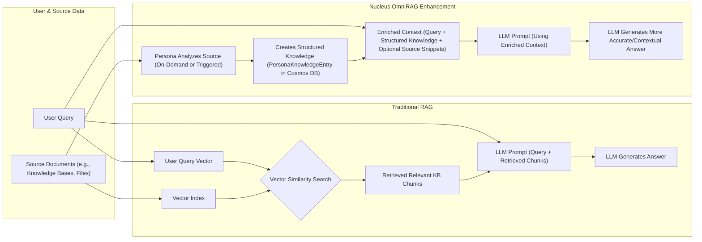

# Nucleus OmniRAG: System Architecture Overview

## 1. Introduction & Vision

Nucleus OmniRAG is a platform designed to empower individuals and teams by transforming their disparate digital information into actionable, contextual knowledge through specialized AI assistants ("Personas"). It provides a robust, flexible, and secure foundation for Retrieval-Augmented Generation (RAG) that respects user data ownership and adapts to different deployment needs.

**Core Goal:** To serve as the central "nucleus" processing information provided by users ("mitochondria") using configured resources (AI models, compute budget/"ATP") to produce insightful outputs ("transcriptome"), as outlined in the [Project Mandate](../Requirements/00_PROJECT_MANDATE.md).

This document provides a high-level map of the system's components, interactions, required infrastructure, and codebase structure. Detailed designs for specific areas can be found in the subsequent architecture documents:

### Core Components Overview

This section provides links to detailed architecture documents for major components:

#### Core & Orchestration

*   [01_ARCHITECTURE_PROCESSING.md](./01_ARCHITECTURE_PROCESSING.md) - Overall data processing flow and orchestration.
*   [Processing/ARCHITECTURE_PROCESSING_ORCHESTRATION.md](./Processing/ARCHITECTURE_PROCESSING_ORCHESTRATION.md) - Detailed orchestration logic.
*   [Processing/Ingestion/ARCHITECTURE_INGESTION_*.md](./Processing/Ingestion/) - Specific data ingestion methods.
*   [Processing/Dataviz/ARCHITECTURE_PROCESSING_DATAVIZ.md](./Processing/Dataviz/ARCHITECTURE_PROCESSING_DATAVIZ.md) - Data visualization generation.

#### Intelligence & Personas

*   [02_ARCHITECTURE_PERSONAS.md](./02_ARCHITECTURE_PERSONAS.md) - High-level persona concepts.
*   [08_ARCHITECTURE_AI_INTEGRATION.md](./08_ARCHITECTURE_AI_INTEGRATION.md) - Integration patterns for external AI models.
*   [Personas/*/*.md](./Personas/) - Specific persona implementations (Bootstrapper, Educator, Professional).

#### Data & Storage

*   [03_ARCHITECTURE_STORAGE.md](./03_ARCHITECTURE_STORAGE.md) - General storage concepts (embeddings, metadata, source content).
*   [04_ARCHITECTURE_DATABASE.md](./04_ARCHITECTURE_DATABASE.md) - Database schema and interaction patterns (likely Cosmos DB).

#### Interaction & Clients

*   [05_ARCHITECTURE_CLIENTS.md](./05_ARCHITECTURE_CLIENTS.md) - How users interact with Nucleus.
*   [ClientAdapters/ARCHITECTURE_ADAPTER_*.md](./ClientAdapters/) - Specific client adapters (Console, Teams, Email, etc.).

#### Security & Deployment

*   [06_ARCHITECTURE_SECURITY.md](./06_ARCHITECTURE_SECURITY.md) - Security considerations, authentication, and authorization.
*   [07_ARCHITECTURE_DEPLOYMENT.md](./07_ARCHITECTURE_DEPLOYMENT.md) - Deployment models, CI/CD, and hosting environments.
*   [Deployment/*/*.md](./Deployment/) - Specific deployment/hosting details.

## 2. Deployment Models: Individuals vs. Teams

Nucleus OmniRAG supports two primary operational flavors:

1.  **Nucleus for Individuals:**
    *   **Focus:** Personal knowledge management, learning, productivity.
    *   **Data:** Connects to user's *personal* cloud storage (OneDrive, Google Drive) using session-based permissions (Cloud-Hosted Model).
    *   **Chats:** Saved chats are archived to the user's *personal* storage by default.
    *   **Deployment:** Typically aligns with a **Cloud-Hosted** model managed by the platform provider.

2.  **Nucleus for Teams:**
    *   **Focus:** Collaborative knowledge work, shared project intelligence.
    *   **Data:** Connects to *shared team* storage (SharePoint, Shared Drives), respecting organizational RBAC.
    *   **Chats:** Can be configured to archive chats to *shared team* spaces, enabling collective review.
    *   **Deployment:** Typically aligns with a **Self-Hosted** model within the organization's infrastructure, but a team-focused hosted model is also possible. **(Note:** Full self-hosted deployment tooling likely Phase 2+).

The core components are designed to function in both models, with configuration and specific service implementations adapting as needed (e.g., authentication, background processing capabilities). See [07_ARCHITECTURE_DEPLOYMENT.md](./07_ARCHITECTURE_DEPLOYMENT.md) for more details on deployment strategies.

## 3. High-Level Component Architecture

The system comprises several key interacting components, orchestrated primarily via a .NET Aspire AppHost in development/deployment. The **primary Minimum Viable Product (MVP) interaction mechanism** is a **Console Application ([`Nucleus.Console`](cci:2://file:///d:/Projects/Nucleus/src/Adapters/Nucleus.Adapters.Console/Nucleus.Adapters.Console.csproj:0:0-0:0))**, providing a direct command-line interface for development, testing, and initial usage. Long-term interaction goals (**Planned for Phase 2+**, see [Phase 2 Requirements](../Requirements/02_REQUIREMENTS_PHASE2_MULTI_PLATFORM.md)) focus on seamless integration into existing workflows via **Platform Bots and Adapters** (e.g., Teams, Slack, Email).



**Key Components:**

*   **User Interaction Channels:** Users interact via:
    *   **Console Application ([`Nucleus.Console`](cci:2://file:///d:/Projects/Nucleus/src/Adapters/Nucleus.Adapters.Console/Nucleus.Adapters.Console.csproj:0:0-0:0)):** The primary MVP interface for commands.
    *   **Platform Bots/Adapters (Phase 2+):** Integration with Teams, Slack, Email, etc., providing a more user-friendly interface. (See [05_ARCHITECTURE_CLIENTS.md](./05_ARCHITECTURE_CLIENTS.md) and [Phase 2 Requirements](../Requirements/02_REQUIREMENTS_PHASE2_MULTI_PLATFORM.md))
    *   **Email Interface (Phase 2+):** Allows interaction via email triggers.
    *   **Platform Adapters (Phase 2+):** Bridge between platform-specific protocols (e.g., Teams Bot Framework) and the internal Nucleus API/Messaging system.
*   **API (ASP.NET Core):** The central backend service handling synchronous requests, orchestrating workflows, managing authentication/authorization, and interacting with other backend components.
*   **Message Queue (MQ):** Handles asynchronous tasks like document ingestion and processing (e.g., Azure Service Bus - *Currently Emulated*).
*   **Content Extractors:** Pluggable components responsible for getting text from various sources (email bodies, document types like PDF/DOCX, etc.). **Advanced Content Extractors (Phase 2+):** Utilize Azure AI Vision, Azure Document Intelligence for enhanced extraction capabilities.
*   **Persona Logic:** Encapsulates the specialized knowledge, tools, and reasoning capabilities of individual AI assistants (e.g., EduFlow). Processes raw text directly to identify relevant sections (no generic pre-chunking). Interacts with the Database (to retrieve knowledge) and AI Services (to generate responses/analysis), processing queries received via the API or performing analysis triggered by the processing pipeline.
*   **Embedding Generator:** Service (using [`Microsoft.Extensions.AI.IEmbeddingGenerator`](cci:2://file:///C:/Users/jorda/.nuget/packages/microsoft.extensions.ai.abstractions/0.1.0-preview.33/lib/net8.0/Microsoft.Extensions.AI.Abstractions.dll?symbol=Microsoft.Extensions.AI.Abstractions.IEmbeddingGenerator:0:0-0:0)) that converts persona-identified relevant text snippets into vector embeddings for storage and later retrieval.
*   **Source Storage:** Where the actual content of source files/attachments is stored securely.
*   **AI Services:** External or internal AI models providing core capabilities via standard interfaces:
    *   **Embedding Model:** Used by the Embedding Generator ([`Microsoft.Extensions.AI.IEmbeddingGenerator`](cci:2://file:///C:/Users/jorda/.nuget/packages/microsoft.extensions.ai.abstractions/0.1.0-preview.33/lib/net8.0/Microsoft.Extensions.AI.Abstractions.dll?symbol=Microsoft.Extensions.AI.Abstractions.IEmbeddingGenerator:0:0-0:0)).
    *   **Chat/Completion Model (LLM):** Used by Personas for understanding queries/context, generating responses/analysis ([`Microsoft.Extensions.AI.IChatClient`](cci:2://file:///C:/Users/jorda/.nuget/packages/microsoft.extensions.ai.abstractions/0.1.0-preview.33/lib/net8.0/Microsoft.Extensions.AI.Abstractions.dll?symbol=Microsoft.Extensions.AI.Abstractions.IChatClient:0:0-0:0)).

## 4. Infrastructure Requirements (Conceptual)

| Component                     | Description                                                                                                | Technology Stack (Anticipated)                                     |
| :---------------------------- | :--------------------------------------------------------------------------------------------------------- | :----------------------------------------------------------------- |
| **User Interaction Channels** | Interfaces for users (Console App, Bots, Email).                                                           | .NET Console Libraries, Teams SDK, Graph API, SMTP Libraries       |
| **API Layer**                 | Handles incoming requests, authentication, orchestration.                                                    | ASP.NET Core, Carter, Minimal APIs, JWT                                |
| **Message Queue**             | Decouples long-running tasks, enables asynchronous processing.                                             | Azure Service Bus (*Currently Emulated*)                             |
| **Processing Functions/Workers** | Handles asynchronous tasks triggered by MQ (content extraction, persona analysis, embedding).             | Azure Functions (or .NET Background Services), Semantic Kernel     |
| **Content Extractors**        | Extracts text/data from various file formats (PDF, DOCX, Images via OCR).                               | Tika.NET, Azure AI Vision (**Phase 2+**), Azure Document Intelligence (**Phase 2+**) |
| **Persona Logic**             | Core AI reasoning units. Each persona analyzes content, generates insights, and handles queries.          | .NET, Semantic Kernel, Azure OpenAI                                |
| **Embedding Generator**       | Creates vector embeddings for relevant text chunks identified by Personas.                                   | Azure OpenAI Embedding Models                                      |
| **Source Storage**            | Stores original uploaded artifacts and associated `ArtifactMetadata`.                                        | Configured object/file storage (e.g., Google Cloud Storage, Azure Blob, S3, File Share) |
| **Knowledge Database (DB)**   | Stores processed `PersonaKnowledgeEntry` records (embeddings, analysis, metadata references).             | Azure Cosmos DB for NoSQL (or emulator)                            |

## 5. High-Level Codebase Structure

```plaintext
/
|-- Nucleus.AppHost/          # .NET Aspire orchestration project (at root)
|-- AgentOps/                 # Agent development support files
|-- Docs/                     # Project documentation (Architecture, Requirements, etc.)
|-- src/
|   |-- Abstractions/
|   |   `-- Nucleus.Abstractions/ # Core interfaces, models (DTOs), enums
|   |-- Adapters/
|   |   |-- Nucleus.Adapters.Console/ # .NET Console Application project (MVP Client)
|   |   `-- Nucleus.Adapters.Teams/   # Microsoft Teams Bot Framework Adapter
|   |-- Domain/
|   |   `-- Nucleus.Domain.Processing/ # Core domain logic, orchestration, processing pipeline
|   |-- Personas/
|   |   `-- Nucleus.Personas.Core/    # Base classes and specific Persona implementations
|   `-- Services/
|       |-- Nucleus.ServiceDefaults/ # Shared Aspire service configurations
|       `-- Nucleus.Services.Api/    # ASP.NET Core API project (hosts controllers, infrastructure)
|-- tests/
|   `-- Adapters/
|       `-- Nucleus.Adapters.Console.Tests/
`-- Nucleus.sln                 # Visual Studio Solution File (defines projects)
```

This structure promotes separation of concerns, testability, and modularity, allowing different components (like Personas or Adapters) to be developed and potentially deployed independently.

## 6. Key Architectural Principles

*   **User Data Control:** Nucleus respects user data ownership, primarily accessing user storage via permissions granted by the user (session-based for hosted, potentially persistent for self-hosted). It avoids unnecessarily persisting raw user content within its own managed infrastructure where possible.
*   **Decoupling:** Components interact via well-defined interfaces and messages (API calls, Queue messages), reducing tight dependencies.
*   **Persona-Centric:** The architecture is designed to support multiple, specialized AI Personas, each with its own data (`PersonaKnowledgeEntry`) and logic.
*   **Flexibility:** Supports both Cloud-Hosted and Self-Hosted deployment models with configuration adjustments.
*   **Extensibility:** Designed for adding new personas and content sources with minimal friction.
*   **Scalability:** Leverages serverless and PaaS components for elastic scaling.
*   **Intelligence-Driven:** Rejects simplistic chunking; relies on AI personas for relevance extraction and analysis.
*   **Efficiency:** Utilizes LLM provider-level prompt/context caching (**Planned for Phase 2+**, driven by efficiency requirements likely detailed in [Phase 2 Requirements](../Requirements/02_REQUIREMENTS_PHASE2_MULTI_PLATFORM.md)) where available (e.g., Gemini, Azure OpenAI) to minimize redundant processing of large contexts, reducing cost and latency.

This overview provides the foundational understanding of the Nucleus OmniRAG system. Refer to the specific architecture documents for detailed designs of each major component.

## System Overview Example (IT Helpdesk Use Case)

**Purpose:** Describes the core components and their interaction in addressing a specific IT support knowledge retrieval problem.



**Explanation:** This diagram outlines a potential deployment. IT staff interact with a Nucleus Helpdesk Bot within Microsoft Teams. The bot interfaces with a backend processing engine. This engine fetches fresh source data (helpdesk tickets, KBs, documentation) when needed for a user request, processes it ephemerally, and analyzes it using Personas. It stores structured metadata (`ArtifactMetadata`) and derived knowledge (`PersonaKnowledgeEntry` - identified solutions, steps, snippets, vectors) in a dedicated Cosmos DB store. When queried by IT staff via the Teams bot, the engine retrieves relevant derived knowledge from the Cosmos DB store and presents it back, aiming to surface past solutions and relevant documentation efficiently.

## Data Processing Approach Comparison (Nucleus vs. Standard RAG)

**Purpose:** Contrasts the Nucleus system's data processing and retrieval method with standard RAG techniques, highlighting the focus on structured understanding and ephemeral processing.



**Explanation:** This illustrates a key difference from standard RAG. Typical systems perform generic text chunking, persist those chunks, and rely solely on text similarity for retrieval, which can be imprecise and use stale data. The Nucleus approach processes source data ephemerally within a session and uses specialized Personas to analyze content contextually (extracting problems, solutions, etc.). This structured information, along with vector embeddings of key snippets, is stored in Cosmos DB. Retrieval then uses both semantic search and this structured data, enabling more precise identification of relevant derived knowledge from past analyses, applied to freshly processed context.



```mermaid
graph LR
    A["User Interaction (e.g., Teams/Console)"] --> B(Nucleus API)
    B --> C{Orchestrator}
    C -- "Identify Relevant Persona(s)" --> D["Persona Manager (e.g., 'Helpdesk')"]
    D -- "Fetch Artifact Metadata" --> E([Cosmos DB])
    
    D -- "Request Artifact Content" --> F(["External System (e.g., SharePoint via Adapter)"])
    F -- "Get Content" --> G(["Source System (SharePoint)"])
    F -- "Return Content" --> D
    D -- "Analyze Content" --> H(["LLM (Gemini)"])
    D -- "Store Derived Knowledge" --> E
    H -- "Analysis Result" --> D
    D -- "Formulate Response" --> C
    C --> B
    B -- "Deliver Response" --> A