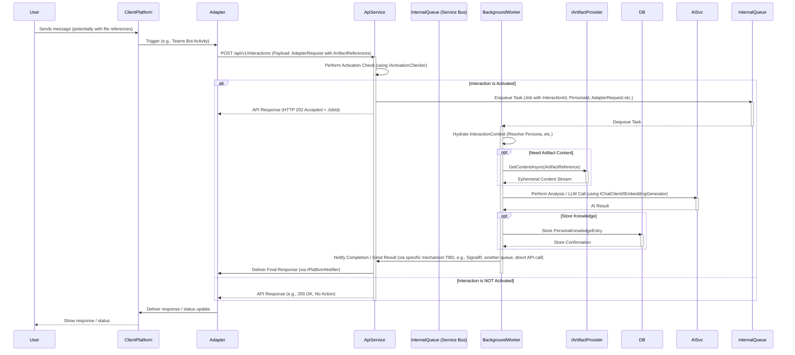

[<- System Architecture Overview](./00_ARCHITECTURE_OVERVIEW.md)

# Nucleus: Processing Architecture

This document outlines the architecture of the processing components in the Nucleus system, as introduced in the [System Architecture Overview](./00_ARCHITECTURE_OVERVIEW.md). It focuses on **artifact reference handling, ephemeral content retrieval, persona-driven analysis, and the storage of resulting knowledge entries** used for intelligent retrieval, all orchestrated via the central `Nucleus.Services.Api`.

## 1. Philosophy: Persona-Driven Meaning Extraction

A central tenet of the Nucleus architecture is that interpreting meaning from diverse artifacts is best achieved through specialized AI Personas (detailed in [02_ARCHITECTURE_PERSONAS.md](./02_ARCHITECTURE_PERSONAS.md)). Key principles guiding our approach:

1.  **No One-Size-Fits-All Interpretation**: Different artifacts, domains, and user goals require different analytical perspectives.
2.  **Persona-Centric Analysis**: Value is maximized when Personas analyze artifacts within their domain context, extracting relevant insights and summaries rather than relying on generic pre-chunking.
3.  **Contextual Relevance**: Personas determine what constitutes a relevant snippet or summary based on the artifact content and the persona's purpose.
4.  **Focus on Knowledge, Not Just Text**: The goal is to store structured knowledge ([`PersonaKnowledgeEntry`](../../src/Nucleus.Abstractions/Models/PersonaKnowledgeEntry.cs)) derived by personas, not just fragmented text.
5.  **Extensibility**: The architecture supports adding new personas and content extractors to handle evolving needs and artifact types.

## 2. Initial Artifact Content Extraction & Structuring

Before personas can analyze an artifact, its raw content needs to be retrieved ephemerally (based on an `ArtifactReference`) and potentially structured. This process is further detailed in [Processing/ARCHITECTURE_PROCESSING_INGESTION.md](./Processing/ARCHITECTURE_PROCESSING_INGESTION.md).

### 2.1 Abstraction: `IContentExtractor`

An `IContentExtractor` interface provides a standard way to handle the *initial parsing* of different file types *after* the content stream has been retrieved by an `IArtifactProvider`. Its purpose is to retrieve the raw content (e.g., text, metadata) from a source artifact stream before it's passed to subsequent processing stages.

The specific definition of this interface can be found in the [Shared Processing Interfaces document](./Processing/ARCHITECTURE_PROCESSING_INTERFACES.md#1-icontentextractor).

### 2.3 Handling Complex and Multimodal Content (Planned - see [Phase 2 Requirements](../Requirements/02_REQUIREMENTS_PHASE2_MULTI_PLATFORM.md))

While initial implementations may focus on standard text-based documents, the architecture must accommodate more complex scenarios. These extractors produce intermediate representations (e.g., text + image descriptions, structured table data) that are fed into the synthesis step.

## 3. Core Interaction & Processing Flow (API-First)

This diagram illustrates the fundamental sequence when a user interacts via a client platform. **Crucially, all interactions are mediated by the `Nucleus.Services.Api`, and file interactions rely on `ArtifactReference` objects passed in the API payload. Activated interactions are always processed asynchronously via a background queue.**



**Explanation:**

1.  The User interacts via a `ClientPlatform` (Teams, Console, etc.), potentially including references to files in their storage.
2.  The platform-specific `Adapter` receives the trigger.
3.  The `Adapter` constructs an [`AdapterRequest`](../../src/Nucleus.Abstractions/Models/AdapterRequest.cs) containing necessary context and `ArtifactReference` objects (NEVER raw content) and sends it to the central `Nucleus.Services.Api` endpoint (`/api/v1/interactions`).
4.  The `ApiService` performs an **Activation Check**. Based on rules (mentions, context, etc.), it decides if the interaction requires processing.
5.  **If Activated:**
    *   The `ApiService` packages the necessary identifiers (InteractionID, PersonaID, AdapterRequest details) into a job message.
    *   This job message is placed onto the `InternalQueue` (e.g., Azure Service Bus) managed by `IBackgroundTaskQueue`.
    *   The `ApiService` immediately returns an `HTTP 202 Accepted` response to the `Adapter`, possibly including a Job ID for tracking.
6.  **Asynchronous Processing:**
    *   A `BackgroundWorker` (e.g., `QueuedInteractionProcessorService` running as a hosted service) dequeues the job message.
    *   The worker hydrates the full `InteractionContext`.
    *   If needed, it uses `IArtifactProvider` to **ephemerally** fetch artifact content based on the `ArtifactReference`.
    *   It performs the core logic: analysis, synthesis, interacting with AI services (`IChatClient`, `IEmbeddingGenerator`), and potentially storing knowledge in the `DB` (`IPersonaKnowledgeRepository`).
    *   Upon completion, the worker notifies the system (e.g., updates status via API, sends result to `IPlatformNotifier` via the API service or another mechanism).
7.  **If Not Activated:** The `ApiService` returns a success response (e.g., `HTTP 200 OK`) indicating no action was taken.
8.  The `Adapter` receives the initial `202 Accepted` or final response/status update and delivers it back to the `ClientPlatform`/`User`.

This flow emphasizes the `ApiService` as the sole entry point, managing `ArtifactReference` objects, performing activation, and **reliably queueing all activated work** for robust, scalable background processing.

## 4. Content Synthesis to Standardized Format

Before a Persona can effectively analyze complex or non-text artifacts, their content often needs to be synthesized into a standardized format, typically Markdown. This synthesis occurs **within the background worker process** after the raw content streams have been retrieved ephemerally using `IContentExtractor` implementations.

The primary goals are:
*   **LLM Compatibility:** Provide content in a format that Large Language Models (LLMs) can easily understand.
*   **Structure Preservation:** Retain essential structural elements (headings, lists, tables) where possible.
*   **Multimodality Handling:** Incorporate descriptions or representations of non-text elements (images, diagrams) into the Markdown flow.

The synthesized Markdown becomes the primary input for the `IPersona`'s analysis logic.

Details on the specific synthesizer processors (like `PlaintextProcessor`, `FileCollectionsProcessor`) can be found in [Processing/ARCHITECTURE_PROCESSING_INGESTION.md](./Processing/ARCHITECTURE_PROCESSING_INGESTION.md).

## 5. Core Processing Stages (Conceptual Flow within Worker)

Once an interaction is dequeued and initial context is hydrated **by the background worker**, the core processing logic follows these conceptual stages:

```mermaid
graph LR
    A["Worker Dequeues Job (incl. ArtifactReferences)"] -- "Initiates Processing" --> B["1. Persona Analysis & Knowledge Check (Secure Index Query)"]
    B -- "Decision to Analyze Content?" --> C{"2. Need Artifact Content?"}
    C -- "Yes" --> D["3. Fetch Content via IArtifactProvider (Ephemeral)"]
    D -- "Raw Content Stream" --> E["4. Extract & Synthesize (IContentExtractor + Processor)"]
    E -- "Synthesized Markdown" --> G["7. Persona Analysis (Agentic Loop with LLM/IChatClient)"]
    C -- "No" --> F["6. Persona Analysis (Metadata Only)"]
    F -- "Metadata-Based Insights" --> H["8. Store Knowledge (IPersonaKnowledgeRepository)"]
    G -- "Analysis Results & Knowledge" --> H
    H -- "Knowledge Stored" --> I["9. Formulate & Send Response (IPlatformNotifier)"]
    I -- "Interaction Complete" --> J["Worker Acknowledges Job"]
```



## 6. Embedding Generation

Embeddings are crucial for semantic search. They are generated *by the pipeline* after a persona has analyzed the **synthesized Markdown** and identified the most relevant text snippet.

### 6.1 Abstraction Layer

Nucleus leverages the standard `Microsoft.Extensions.AI` abstractions:

```csharp
// Defined in Microsoft.Extensions.AI.Abstractions
public interface IEmbeddingGenerator<TData, TEmbedding>
{
    IReadOnlyList<int>? GetEmbeddingDimensions(string? modelId = null);
    Task<TEmbedding> GenerateEmbeddingAsync(TData data, CancellationToken cancellationToken = default, string? modelId = null, EmbeddingOptions? options = null);
    // ... other methods
}
```

### 6.2 Integration

*   An implementation of `IEmbeddingGenerator<string, Embedding<float>>` (e.g., using Google Gemini, Azure OpenAI) is registered in the DI container (likely within [`Nucleus.Services.Api`](../../src/Services/Nucleus.Services.Api/Nucleus.Services.Api.csproj) or [`Nucleus.AppHost`](../../Nucleus.AppHost/Nucleus.AppHost.csproj)).
*   This generator is used **by the Processing Pipeline** (not the persona) to create embeddings for:
    *   `PersonaKnowledgeEntry.relevantTextSnippetOrSummary` -> stored as `snippetEmbedding`.
    *   Optionally, a derived summary from `PersonaKnowledgeEntry.analysis` -> stored as `analysisSummaryEmbedding`.
*   These embeddings are stored within the `PersonaKnowledgeEntry` document in Cosmos DB (see [Database Architecture](./04_ARCHITECTURE_DATABASE.md)).

## 7. Retrieval Flow

Retrieval is typically initiated by a user query submitted through a client adapter, resulting in an **API call** to the `Nucleus.Services.Api`.

The **asynchronous retrieval process** generally follows these steps:

1.  The `ApiService` receives the query via `POST /api/v1/interactions`.
2.  The `ApiService` performs the **Activation Check**.
3.  If activated, it determines the relevant persona(s) (potentially using [`IPersonaResolver`](../../../src/Nucleus.Abstractions/Orchestration/IPersonaResolver.cs)).
4.  The `ApiService` **enqueues a retrieval task** onto the `InternalQueue`, including the query, persona ID, and context identifiers.
5.  The `ApiService` returns `HTTP 202 Accepted`.
6.  A `BackgroundWorker` dequeues the retrieval task.
7.  The worker uses an `IEmbeddingGenerator` to create an embedding for the user query.
8.  The worker queries the relevant `IPersonaKnowledgeRepository` (e.g., Cosmos DB) using the query embedding and filters (persona ID, time range, etc.) to find relevant `PersonaKnowledgeEntry` items (containing metadata and summaries/analysis, **not** raw user content).
9.  The worker may apply further ranking (e.g., the '4 R's: Recency, Relevancy, Richness, Reputation) to select the top-k knowledge entries.
10. If the persona logic determines full artifact content is needed *for the response generation* based on the retrieved knowledge, the worker *may* use `IArtifactProvider` to ephemerally fetch content for specific `ArtifactReference`s associated with the top knowledge entries.
11. The worker constructs a rich prompt using the user query, retrieved knowledge, and potentially fetched ephemeral content.
12. The worker uses an `IChatClient` (LLM) to generate the final, high-quality response based on the prompt.
13. The worker sends the generated response back (e.g., via `IPlatformNotifier` potentially invoked through the `ApiService` or directly).

This ensures that even retrieval follows the robust, scalable asynchronous pattern.

## 8. Configuration

*   **Content Extractors:** Configuration might specify preferred extractors or settings for specific MIME types.
*   **AI Providers:** Standard configuration for embedding generators and chat clients (API keys, endpoints, model IDs) via `appsettings.json`, environment variables, or a configuration provider like Azure App Configuration/Aspire.
*   **Database:** Connection strings and database/container names for Cosmos DB.
*   **Storage:** Configuration for accessing the storage mechanism where artifacts and [`ArtifactMetadata`](../../src/Nucleus.Abstractions/Models/ArtifactMetadata.cs) reside.
*   **Target Personas:** Configuration defining which personas should process which types of artifacts or based on user context.

## 9. Next Steps

1.  **Implement `IContentExtractor`:** Create initial implementations (PDF, DOCX, TXT, HTML).
2.  **Implement Synthesizer Processors:** Develop `PlaintextProcessor` (leveraging LLM for Markdown synthesis) and potentially `FileCollectionsProcessor`.
3.  **Implement `IArtifactMetadataService`:** Build the service for managing `ArtifactMetadata`.
4.  **Implement `IPersonaKnowledgeRepository`:** Create the repository for Cosmos DB.
5.  **Develop Orchestration Logic:** Design the pipeline flow (Functions, Service Bus, etc.) incorporating the synthesis step.
6.  **Refactor `IPersona` Interface/Implementations:** Ensure `AnalyzeContentAsync` accepts the synthesized content (Markdown) via an updated `ContentItem` record.
7.  **Implement Reply Event System:** Create message types and subscriptions.
8.  **Implement `IRetrievalService`:** Build the query service.
9.  **Testing:** Implement comprehensive integration tests.

---

### Key Services and Abstractions

*   **`IArtifactMetadataService`**: Manages CRUD operations for [`ArtifactMetadata`](../../src/Nucleus.Abstractions/Models/ArtifactMetadata.cs) in the central Storage repository. (Repository Interface: [`IArtifactMetadataRepository`](../../src/Nucleus.Abstractions/Repositories/IArtifactMetadataRepository.cs))
*   **`IContentExtractor`**: Interface for services that extract raw text/structured content from various artifact MIME types (PDF, DOCX, HTML, etc.). Implementations handle specific formats. Defined in [`ARCHITECTURE_PROCESSING_INTERFACES.md`](./Processing/ARCHITECTURE_PROCESSING_INTERFACES.md). Concrete implementations (e.g., `PlainTextContentExtractor`, `HtmlContentExtractor`) reside in the `Nucleus.Infrastructure.Providers.ContentExtraction` namespace.
*   **[`IPersona`](../../src/Nucleus.Abstractions/IPersona.cs)**: The core interface defining a persona's analytical capabilities, primarily through `AnalyzeContentAsync` (defined in the generic version `IPersona<TAnalysisData>`).
*   **`IChatClient` (from `Microsoft.Extensions.AI`)**: The standard abstraction for interacting with LLMs for chat completions. Implementations will handle provider-specific details, including context caching integration. Service registration for the underlying AI clients occurs in `Nucleus.Services.Api.WebApplicationBuilderExtensions.AddNucleusServices` (see [code](../../../src/Nucleus.Services/Nucleus.Services.Api/WebApplicationBuilderExtensions.cs)).
*   **`IEmbeddingGenerator` (from `Microsoft.Extensions.AI`)**: The standard abstraction for generating text embeddings.
*   **[`IPlatformNotifier`](../../../src/Nucleus.Abstractions/Adapters/IPlatformNotifier.cs)**: Defines the contract for sending notifications or responses back to the originating client platform (e.g., Teams, Slack, Console). The default implementation, `NullPlatformNotifier`, is registered in `Nucleus.Services.Api.WebApplicationBuilderExtensions.AddNucleusServices` (see [code](../../../src/Nucleus.Services/Nucleus.Services.Api/WebApplicationBuilderExtensions.cs#L254-L258) for registration details), primarily for API-direct interactions. Specific platform adapters provide their own implementations (e.g., `TeamsNotifier`).
*   **[`IPersonaResolver`](../../../src/Nucleus.Abstractions/Orchestration/IPersonaResolver.cs)**: Interface responsible for determining the canonical Persona ID based on the incoming request context. Its default implementation, [`DefaultPersonaResolver`](../../../src/Nucleus.Domain/Nucleus.Domain.Processing/DefaultPersonaResolver.cs), is registered in `Nucleus.Domain.Processing.ServiceCollectionExtensions.AddProcessingServices` (see [registration details](../../../src/Nucleus.Domain/Nucleus.Domain.Processing/ServiceCollectionExtensions.cs)). 
*   **[`IPersonaKnowledgeRepository`](../../../src/Nucleus.Abstractions/Repositories/IPersonaKnowledgeRepository.cs)**: Interface for services managing the storage and retrieval of `PersonaKnowledgeEntry` documents in the persona-specific data stores (Cosmos DB).
*   **`ICacheManagementService` (Planned for Phase 2+)**: Abstraction responsible for interacting with the underlying AI provider's prompt/context caching mechanisms. It handles creating, retrieving, and potentially managing the lifecycle (TTL) of cached content linked to a `SourceIdentifier`.
