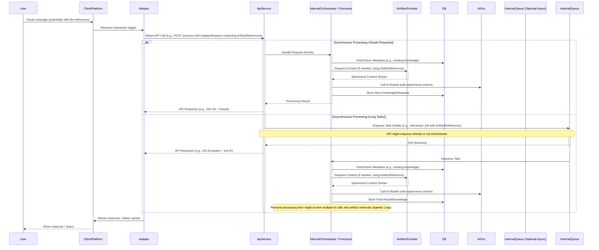

[<- System Architecture Overview](./00_ARCHITECTURE_OVERVIEW.md)

# Nucleus OmniRAG: Processing Architecture

This document outlines the architecture of the processing components in the Nucleus OmniRAG system, as introduced in the [System Architecture Overview](./00_ARCHITECTURE_OVERVIEW.md). It focuses on **artifact reference handling, ephemeral content retrieval, persona-driven analysis, and the storage of resulting knowledge entries** used for intelligent retrieval, all orchestrated via the central `Nucleus.Services.Api`.

## 1. Philosophy: Persona-Driven Meaning Extraction

A central tenet of the Nucleus OmniRAG architecture is that interpreting meaning from diverse artifacts is best achieved through specialized AI Personas (detailed in [02_ARCHITECTURE_PERSONAS.md](./02_ARCHITECTURE_PERSONAS.md)). Key principles guiding our approach:

1.  **No One-Size-Fits-All Interpretation**: Different artifacts, domains, and user goals require different analytical perspectives.
2.  **Persona-Centric Analysis**: Value is maximized when Personas analyze artifacts within their domain context, extracting relevant insights and summaries rather than relying on generic pre-chunking.
3.  **Contextual Relevance**: Personas determine what constitutes a relevant snippet or summary based on the artifact content and the persona's purpose.
4.  **Focus on Knowledge, Not Just Text**: The goal is to store structured knowledge ([`PersonaKnowledgeEntry`](cci:2://file:///d:/Projects/Nucleus/src/Abstractions/Nucleus.Abstractions/Repositories/IPersonaKnowledgeRepository.cs?symbol=PersonaKnowledgeEntry:0:0-0:0)) derived by personas, not just fragmented text.
5.  **Extensibility**: The architecture supports adding new personas and content extractors to handle evolving needs and artifact types.

## 2. Initial Artifact Content Extraction & Structuring

Before personas can analyze an artifact, its raw content needs to be retrieved ephemerally (based on an `ArtifactReference`) and potentially structured. This process is further detailed in [Processing/ARCHITECTURE_PROCESSING_INGESTION.md](./Processing/ARCHITECTURE_PROCESSING_INGESTION.md).

### 2.1 Abstraction: `IContentExtractor`

An `IContentExtractor` interface provides a standard way to handle the *initial parsing* of different file types *after* the content stream has been retrieved by an `IArtifactProvider`. Its purpose is to retrieve the raw content (e.g., text, metadata) from a source artifact stream before it's passed to subsequent processing stages.

The specific definition of this interface can be found in the [Shared Processing Interfaces document](./Processing/ARCHITECTURE_PROCESSING_INTERFACES.md#1-icontentextractor).

### 2.3 Handling Complex and Multimodal Content (Planned - see [Phase 2 Requirements](../Requirements/02_REQUIREMENTS_PHASE2_MULTI_PLATFORM.md))

While initial implementations may focus on standard text-based documents, the architecture must accommodate more complex scenarios. These extractors produce intermediate representations (e.g., text + image descriptions, structured table data) that are fed into the synthesis step.

## 3. Core Interaction & Processing Flow (API-First)

This diagram illustrates the fundamental sequence when a user interacts via a client platform. **Crucially, all interactions are mediated by the `Nucleus.Services.Api`, and file interactions rely on `ArtifactReference` objects passed in the API payload.**



**Explanation:**

1.  The User interacts via a `ClientPlatform` (Teams, Console, etc.), potentially including references to files in their storage.
2.  The platform-specific `Adapter` receives the trigger.
3.  The `Adapter` translates the request, ensuring any file references are packaged as `ArtifactReference` objects within the `AdapterRequest` payload sent to the `Nucleus.Services.Api`.
4.  The `ApiService` authenticates/authorizes, validates the request (including the `ArtifactReference` objects).
5.  **Decision Point:** Based on the request type and estimated duration:
    *   **Synchronous:** For quick operations, the API service might directly invoke internal processing logic (`InternalOrchestrator / Processor`). This logic may involve querying the `DB` for existing knowledge, potentially using an `IArtifactProvider` to **ephemerally retrieve content** based on an `ArtifactReference` if needed for analysis, calling `AISvc` with the context (including any retrieved ephemeral content), storing results in the `DB`, and returning the result immediately in the API response (e.g., `HTTP 200 OK`).
    *   **Asynchronous:** For longer tasks, the API service places a job (including the `AdapterRequest` with `ArtifactReference` objects) onto an `InternalQueue` and returns an `HTTP 202 Accepted`.
6.  **(Async Path)** A background worker (`InternalOrchestrator / Processor`) picks up the job. It interacts with the `DB` (e.g., checking existing knowledge) and, **if analysis requires file content**, uses the `ArtifactReference` objects with the appropriate `IArtifactProvider` to **ephemerally retrieve the full content**. This content, along with other context, is used in potentially **multiple agentic steps** involving `AISvc` calls and potentially further ephemeral content retrieval via `IArtifactProvider`. *This agentic nature means personas operate iteratively, reasoning about the task, using retrieved context to inform subsequent actions, potentially querying the secure metadata index and fetching more content ephemerally to build a deep understanding before generating a final output.*
7.  **(Async Path)** Upon completion, the background process updates the job status. Notification of completion might occur.
8.  The `Adapter` receives the API response and translates it back for the `ClientPlatform`.

This flow emphasizes the `ApiService` as the sole entry point, managing `ArtifactReference` objects and orchestrating the ephemeral retrieval and agentic processing of content.

## 4. Content Synthesis to Standardized Format

A crucial step after initial extraction is synthesizing the potentially disparate pieces of content (e.g., text from DOCX, XML structure, image descriptions) into a single, standardized format that Personas can reliably process. Currently, this standard format is **Markdown**.

*   **Role of Synthesizers:** Processors like `FileCollectionsProcessor` might aggregate components extracted by one or more `IContentExtractor` instances.
*   **Plaintext Processor:** The `PlaintextProcessor` (acting as a synthesizer in this context) takes the aggregated inputs and uses an LLM to generate a coherent Markdown representation.
*   **Ephemeral Nature:** This synthesized Markdown exists ephemerally during the processing session. It is not persisted by Nucleus itself but is passed directly to the Persona analysis step.

## 5. Processing Pipeline Stages (Managed by API Service)

Whether executed synchronously within an API request or asynchronously by a background worker/orchestrator, the core processing logic follows these conceptual stages, all managed under the control of the `Nucleus.Services.Api`.

```mermaid
graph LR
    A["API Request Received (incl. ArtifactReferences)"] -- "Initiates Processing" --> B["1. Persona Analysis & Knowledge Check (Secure Index Query)"]
    B -- "Decision to Analyze Content?" --> C{"2. Need Artifact Content?"}
    C -- "Yes (Use Reference)" --> D["3. Ephemeral Artifact Fetching (IArtifactProvider)"]
    D -- "Raw Content Stream" --> E["4. Content Extraction (IContentExtractor)"]
    E -- "Extracted Content" --> F["5. Content Synthesis (to Markdown)"]
    C -- "No (Metadata Sufficient)" --> G["6. Persona Analysis (Metadata Only)"]
    F -- "Standardized Ephemeral Content" --> H["7. Persona Analysis (Agentic Loop)"]
    G -- "Persona Knowledge" --> I["8. Persistence (Knowledge Entry)"]
    H -- "Persona Knowledge" --> I
    I -- "Completion Status" --> J["9. API Response / Status Update"]

    subgraph "Processing Stages (Orchestrated by ApiService)"
        B; C; D; E; F; G; H; I;
    end
```



**Stage Descriptions:**

*   **1. Persona Analysis & Knowledge Check:**
    *   The orchestrator determines the relevant persona(s).
    *   It checks existing `PersonaKnowledgeEntry` and `ArtifactMetadata` (the **Secure Index**) in the `DB` related to the interaction context and any provided `ArtifactReference` objects. *This allows the persona to leverage previously derived knowledge and metadata, answering the question "What do I already know about this?" before potentially fetching full content.*
*   **2. Need Artifact Content?:**
    *   Based on the persona's logic and existing knowledge, a decision is made whether the full content of an artifact (referenced by `ArtifactReference`) is required for deeper analysis.
*   **3. Ephemeral Artifact Fetching (IArtifactProvider):**
    *   **If content is needed**, the orchestrator uses the `ArtifactReference` to select the appropriate `IArtifactProvider`.
    *   The provider securely retrieves the raw artifact content stream *ephemerally* from the user's storage.
*   **4. Content Extraction (IContentExtractor):**
    *   The processing logic selects appropriate `IContentExtractor`(s) based on the artifact's MIME type (obtained from `ArtifactMetadata` or the stream).
    *   Extracts content (text, metadata, potentially image descriptions) from the ephemeral stream.
*   **5. Content Synthesis (Managed by API Service):**
    *   Aggregates outputs from one or more extractors.
    *   Invokes a synthesizer (e.g., `PlaintextProcessor` potentially using an LLM) to generate standardized **ephemeral Markdown content** suitable for persona analysis.
*   **6. Persona Analysis (Metadata Only):**
    *   If full content is *not* needed, the persona may perform analysis based solely on existing metadata, context, and the user's query.
*   **7. Persona Analysis (Agentic Loop):**
    *   The relevant `IPersona`'s `AnalyzeContentAsync` method (or similar) is called with the available context (query, metadata, potentially the ephemeral synthesized Markdown).
    *   This stage can be **iterative (Agentic)**: The persona might reason, call external tools (like `AISvc`), decide it needs *more* context, and trigger *additional ephemeral fetches* (Stage 3-5) for other referenced artifacts before completing its analysis. *This agentic loop allows for deeper understanding by building rich context from multiple full-content sources as needed, leading to higher-quality outputs.*
    *   Personas generate `PersonaKnowledgeEntry` data (analysis, summaries, extracted snippets, embeddings).
*   **8. Persistence (Managed by API Service):**
    *   The generated `PersonaKnowledgeEntry` objects are saved to the `DB`.
    *   The status of the overall processing job is updated.
*   **9. API Response / Status Update (Handled by API Service):**
    *   Handles returning results or status updates as described previously.

## 6. Embedding Generation

Embeddings are crucial for semantic search. They are generated *by the pipeline* after a persona has analyzed the **synthesized Markdown** and identified the most relevant text snippet.

### 6.1 Abstraction Layer

Nucleus OmniRAG leverages the standard `Microsoft.Extensions.AI` abstractions:

```csharp
// Defined in Microsoft.Extensions.AI.Abstractions
public interface IEmbeddingGenerator<TData, TEmbedding>
{
    IReadOnlyList<int>? GetEmbeddingDimensions(string? modelId = null);
    Task<TEmbedding> GenerateEmbeddingAsync(TData data, CancellationToken cancellationToken = default, string? modelId = null, EmbeddingOptions? options = null);
    // ... other methods
}
```

### 6.2 Integration

*   An implementation of `IEmbeddingGenerator<string, Embedding<float>>` (e.g., using Google Gemini, Azure OpenAI) is registered in the DI container (likely within [`Nucleus.Services.Api`](cci:2://file:///d:/Projects/Nucleus/src/Services/Nucleus.Services.Api/Nucleus.Services.Api.csproj:0:0-0:0) or [`Nucleus.AppHost`](cci:2://file:///d:/Projects/Nucleus/Nucleus.AppHost/Nucleus.AppHost.csproj:0:0-0:0)).
*   This generator is used **by the Processing Pipeline** (not the persona) to create embeddings for:
    *   `PersonaKnowledgeEntry.relevantTextSnippetOrSummary` -> stored as `snippetEmbedding`.
    *   Optionally, a derived summary from `PersonaKnowledgeEntry.analysis` -> stored as `analysisSummaryEmbedding`.
*   These embeddings are stored within the `PersonaKnowledgeEntry` document in Cosmos DB (see [Database Architecture](./04_ARCHITECTURE_DATABASE.md)).

## 7. Retrieval Flow

Retrieval is typically initiated by a user query submitted through a client adapter, resulting in an **API call** to the `Nucleus.Services.Api`.

1.  The `ApiService` receives the query.
2.  It determines the relevant persona(s).
3.  It potentially uses an `IEmbeddingGenerator` to create an embedding for the user query.
4.  It calls an internal `IRetrievalService` or directly uses `IPersonaKnowledgeRepository`.
5.  The retrieval service/repository queries the `DB` using the query embedding and filters to find relevant `PersonaKnowledgeEntry` documents (leveraging the **Secure Metadata Index**).
6.  The query performs a vector similarity search against stored embeddings.
7.  The repository returns ranked, relevant `PersonaKnowledgeEntry` documents.
8.  The `ApiService` (or the responding persona logic) uses these entries and associated `ArtifactMetadata`.
9.  **Rich Context Building:** Based on the retrieved knowledge entries, the persona may decide to fetch the full ephemeral content for *multiple* relevant source artifacts using `IArtifactProvider` and their `ArtifactReference` (stored in `ArtifactMetadata`) to build a comprehensive context window. *This step allows the persona to gather all necessary information to generate a high-quality response, potentially involving multiple artifacts and their associated metadata.*
10. The persona uses this rich ephemeral context with an `IChatClient` (LLM) to generate a final, high-quality response.
11. The `ApiService` returns the response to the calling adapter.

## 8. Configuration

*   **Content Extractors:** Configuration might specify preferred extractors or settings for specific MIME types.
*   **AI Providers:** Standard configuration for embedding generators and chat clients (API keys, endpoints, model IDs) via `appsettings.json`, environment variables, or a configuration provider like Azure App Configuration/Aspire.
*   **Database:** Connection strings and database/container names for Cosmos DB.
*   **Storage:** Configuration for accessing the storage mechanism where artifacts and [`ArtifactMetadata`](cci:2://file:///d:/Projects/Nucleus/src/Nucleus.Abstractions/Models/ArtifactMetadata.cs) reside.
*   **Target Personas:** Configuration defining which personas should process which types of artifacts or based on user context.

## 9. Next Steps

1.  **Implement `IContentExtractor`:** Create initial implementations (PDF, DOCX, TXT, HTML).
2.  **Implement Synthesizer Processors:** Develop `PlaintextProcessor` (leveraging LLM for Markdown synthesis) and potentially `FileCollectionsProcessor`.
3.  **Implement `IArtifactMetadataService`:** Build the service for managing `ArtifactMetadata`.
4.  **Implement `IPersonaKnowledgeRepository`:** Create the repository for Cosmos DB.
5.  **Develop Orchestration Logic:** Design the pipeline flow (Functions, Service Bus, etc.) incorporating the synthesis step.
6.  **Refactor `IPersona` Interface/Implementations:** Ensure `AnalyzeContentAsync` accepts the synthesized content (Markdown) via an updated `ContentItem` record.
7.  **Implement Reply Event System:** Create message types and subscriptions.
8.  **Implement `IRetrievalService`:** Build the query service.
9.  **Testing:** Implement comprehensive integration tests.

---

### Key Services and Abstractions

*   **`IArtifactMetadataService`**: Manages CRUD operations for [`ArtifactMetadata`](cci:2://file:///d:/Projects/Nucleus/src/Nucleus.Abstractions/Models/ArtifactMetadata.cs) in the central Storage repository. (Repository Interface: [`IArtifactMetadataRepository`](cci:2://file:///d:/Projects/Nucleus/src/Nucleus.Abstractions/Repositories/IArtifactMetadataRepository.cs))
*   **`IContentExtractor`**: Interface for services that extract raw text/structured content from various artifact MIME types (PDF, DOCX, HTML, etc.). Implementations handle specific formats. Defined in [`ARCHITECTURE_PROCESSING_INTERFACES.md`](./Processing/ARCHITECTURE_PROCESSING_INTERFACES.md).
*   **[`IPersona`](cci:2://file:///d:/Projects/Nucleus/src/Nucleus.Abstractions/IPersona.cs)**: The core interface defining a persona's analytical capabilities, primarily through `AnalyzeContentAsync` (defined in the generic version `IPersona<TAnalysisData>`).
*   **`IChatClient` (from `Microsoft.Extensions.AI`)**: The standard abstraction for interacting with LLMs for chat completions. Implementations will handle provider-specific details, including context caching integration.
*   **`IEmbeddingGenerator` (from `Microsoft.Extensions.AI`)**: The standard abstraction for generating text embeddings.
*   **[`IPersonaKnowledgeRepository`](cci:2://file:///d:/Projects/Nucleus/src/Nucleus.Abstractions/Repositories/IPersonaKnowledgeRepository.cs)**: Interface for services managing the storage and retrieval of `PersonaKnowledgeEntry` documents in the persona-specific data stores (Cosmos DB).
*   **`ICacheManagementService` (Planned for Phase 2+)**: Abstraction responsible for interacting with the underlying AI provider's prompt/context caching mechanisms. It handles creating, retrieving, and potentially managing the lifecycle (TTL) of cached content linked to a `SourceIdentifier`.
