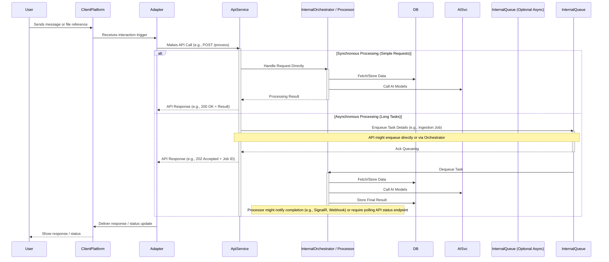
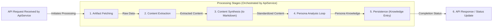

[<- System Architecture Overview](./00_ARCHITECTURE_OVERVIEW.md)

# Nucleus OmniRAG: Processing Architecture

This document outlines the architecture of the processing components in the Nucleus OmniRAG system, as introduced in the [System Architecture Overview](./00_ARCHITECTURE_OVERVIEW.md). It focuses on **artifact ingestion, content extraction, persona-driven analysis, and the storage of resulting knowledge entries** used for intelligent retrieval, all orchestrated via the central `Nucleus.Services.Api`.

## 1. Philosophy: Persona-Driven Meaning Extraction

A central tenet of the Nucleus OmniRAG architecture is that interpreting meaning from diverse artifacts is best achieved through specialized AI Personas (detailed in [02_ARCHITECTURE_PERSONAS.md](./02_ARCHITECTURE_PERSONAS.md)). Key principles guiding our approach:

1.  **No One-Size-Fits-All Interpretation**: Different artifacts, domains, and user goals require different analytical perspectives.
2.  **Persona-Centric Analysis**: Value is maximized when Personas analyze artifacts within their domain context, extracting relevant insights and summaries rather than relying on generic pre-chunking.
3.  **Contextual Relevance**: Personas determine what constitutes a relevant snippet or summary based on the artifact content and the persona's purpose.
4.  **Focus on Knowledge, Not Just Text**: The goal is to store structured knowledge ([`PersonaKnowledgeEntry`](cci:2://file:///d:/Projects/Nucleus/src/Abstractions/Nucleus.Abstractions/Repositories/IPersonaKnowledgeRepository.cs?symbol=PersonaKnowledgeEntry:0:0-0:0)) derived by personas, not just fragmented text.
5.  **Extensibility**: The architecture supports adding new personas and content extractors to handle evolving needs and artifact types.

## 2. Initial Artifact Content Extraction & Structuring

Before personas can analyze an artifact, its raw content needs to be extracted and potentially structured into an intermediate format usable by subsequent synthesis steps. This process is further detailed in [Processing/ARCHITECTURE_PROCESSING_INGESTION.md](./Processing/ARCHITECTURE_PROCESSING_INGESTION.md).

### 2.1 Abstraction: `IContentExtractor`

An `IContentExtractor` interface provides a standard way to handle the *initial parsing* of different file types. Its purpose is to retrieve the raw content (e.g., text, metadata) from a source artifact before it's passed to subsequent processing stages.

The specific definition of this interface can be found in the [Shared Processing Interfaces document](./Processing/ARCHITECTURE_PROCESSING_INTERFACES.md#1-icontentextractor).

### 2.3 Handling Complex and Multimodal Content (Planned - see [Phase 2 Requirements](../Requirements/02_REQUIREMENTS_PHASE2_MULTI_PLATFORM.md))

While initial implementations may focus on standard text-based documents, the architecture must accommodate more complex scenarios. These extractors produce intermediate representations (e.g., text + image descriptions, structured table data) that are fed into the synthesis step.

## 3. Core Interaction & Processing Flow (API-First)

This diagram illustrates the fundamental sequence when a user interacts via a client platform. **Crucially, all interactions are mediated by the `Nucleus.Services.Api`.**



**Explanation:**

1.  The User interacts via a `ClientPlatform` (Teams, Console, etc.).
2.  The platform-specific `Adapter` receives the trigger.
3.  The `Adapter` translates the request and makes a call to the `Nucleus.Services.Api`.
4.  The `ApiService` authenticates/authorizes, validates the request.
5.  **Decision Point:** Based on the request type and estimated duration:
    *   **Synchronous:** For quick operations (e.g., simple query retrieval), the API service might directly invoke internal processing logic (`InternalOrchestrator / Processor`), interact with `DB` and `AISvc`, and return the result immediately in the API response (e.g., `HTTP 200 OK`).
    *   **Asynchronous:** For longer tasks (e.g., document ingestion and analysis), the API service places a job onto an `InternalQueue` (like Azure Queue Storage or an in-memory queue managed by an orchestrator like Durable Functions) and returns an `HTTP 202 Accepted` response, possibly with a Job ID for status tracking.
6.  **(Async Path)** A background worker (`InternalOrchestrator / Processor`) picks up the job from the queue, performs the necessary steps (extraction, analysis, storage), interacting with `DB` and `AISvc`.
7.  **(Async Path)** Upon completion, the background process stores the final result. Notification of completion might occur via mechanisms like SignalR, Webhooks, or require the client adapter to poll a status endpoint on the `ApiService` using the Job ID.
8.  The `Adapter` receives the API response (synchronous result or async acceptance/status) and translates it back for the `ClientPlatform` to display to the `User`.

This flow emphasizes the `ApiService` as the sole entry point and orchestrator, decoupling clients from the internal processing mechanisms.

## 4. Content Synthesis to Standardized Format

A crucial step after initial extraction is synthesizing the potentially disparate pieces of content (e.g., text from DOCX, XML structure, image descriptions) into a single, standardized format that Personas can reliably process. Currently, this standard format is **Markdown**.

*   **Role of Synthesizers:** Processors like `FileCollectionsProcessor` might aggregate components extracted by one or more `IContentExtractor` instances.
*   **Plaintext Processor:** The `PlaintextProcessor` (acting as a synthesizer in this context, as per Memory `0cb7dbac`) takes the aggregated inputs and uses an LLM to generate a coherent Markdown representation.
*   **Ephemeral Nature:** This synthesized Markdown exists ephemerally during the processing session (Memory `08b60bec`). It is not persisted by Nucleus itself but is passed directly to the Persona analysis step.

## 5. Processing Pipeline Stages (Managed by API Service)

Whether executed synchronously within an API request or asynchronously by a background worker/orchestrator, the core processing logic follows these conceptual stages, all managed under the control of the `Nucleus.Services.Api`.



**Stage Descriptions:**

*   **1. Artifact Fetching (Triggered by API):**
    *   Based on the API request (containing artifact references), the API service (or a worker it triggers) securely retrieves the raw artifact data (e.g., from Blob Storage, SharePoint via Graph API adapter).
*   **2. Content Extraction (Managed by API Service):**
    *   The processing logic selects appropriate `IContentExtractor`(s) based on the artifact's MIME type.
    *   Extracts content (text, metadata, potentially image descriptions) from the fetched raw data.
*   **3. Content Synthesis (Managed by API Service):**
    *   Aggregates outputs from one or more extractors.
    *   Invokes a synthesizer (e.g., `PlaintextProcessor` potentially using an LLM) to generate standardized **Markdown content** suitable for persona analysis.
*   **4. Persona Analysis Loop (Managed by API Service):**
    *   Iterates through configured/relevant `IPersona` implementations.
    *   Each persona's `AnalyzeContentAsync` method is called with the synthesized Markdown content.
    *   Personas generate `PersonaKnowledgeEntry` data (analysis, summaries, extracted snippets, embeddings).
*   **5. Persistence (Managed by API Service):**
    *   The generated `PersonaKnowledgeEntry` objects are saved to the appropriate data store (e.g., Cosmos DB) via a repository pattern.
    *   The status of the overall processing job is updated.
*   **6. API Response / Status Update (Handled by API Service):**
    *   If synchronous, the final result or status is returned in the initial API call's response.
    *   If asynchronous, the API service provides mechanisms for status updates (e.g., status endpoint, webhooks, SignalR) based on the persisted job status.

## 6. Embedding Generation

Embeddings are crucial for semantic search. They are generated *by the pipeline* after a persona has analyzed the **synthesized Markdown** and identified the most relevant text snippet.

### 6.1 Abstraction Layer

Nucleus OmniRAG leverages the standard `Microsoft.Extensions.AI` abstractions:

```csharp
// Defined in Microsoft.Extensions.AI.Abstractions
public interface IEmbeddingGenerator<TData, TEmbedding>
{
    IReadOnlyList<int>? GetEmbeddingDimensions(string? modelId = null);
    Task<TEmbedding> GenerateEmbeddingAsync(TData data, CancellationToken cancellationToken = default, string? modelId = null, EmbeddingOptions? options = null);
    // ... other methods
}
```

### 6.2 Integration

*   An implementation of `IEmbeddingGenerator<string, Embedding<float>>` (e.g., using Google Gemini, Azure OpenAI) is registered in the DI container (likely within [`Nucleus.Services.Api`](cci:2://file:///d:/Projects/Nucleus/src/Services/Nucleus.Services.Api/Nucleus.Services.Api.csproj:0:0-0:0) or [`Nucleus.AppHost`](cci:2://file:///d:/Projects/Nucleus/Nucleus.AppHost/Nucleus.AppHost.csproj:0:0-0:0)).
*   This generator is used **by the Processing Pipeline** (not the persona) to create embeddings for:
    *   `PersonaKnowledgeEntry.relevantTextSnippetOrSummary` -> stored as `snippetEmbedding`.
    *   Optionally, a derived summary from `PersonaKnowledgeEntry.analysis` -> stored as `analysisSummaryEmbedding`.
*   These embeddings are stored within the `PersonaKnowledgeEntry` document in Cosmos DB (see [Database Architecture](./04_ARCHITECTURE_DATABASE.md)).

## 7. Retrieval Flow

Retrieval is typically initiated by a user query submitted through a client adapter, resulting in an **API call** to the `Nucleus.Services.Api` (e.g., `GET /query` or a specific persona endpoint).

1.  The `ApiService` receives the query.
2.  It determines the relevant persona(s) based on the query or context.
3.  It potentially uses an `IEmbeddingGenerator` to create an embedding for the user query.
4.  It calls an internal `IRetrievalService` or directly uses a repository (`IPersonaKnowledgeRepository`).
5.  The retrieval service/repository queries the appropriate data store (e.g., persona-specific Cosmos DB container) using the query embedding and potentially other filters (metadata, keywords).
6.  The query performs a vector similarity search against stored `PersonaKnowledgeEntry` embeddings.
7.  The repository returns ranked, relevant `PersonaKnowledgeEntry` documents.
8.  The `ApiService` uses these entries, potentially fetching related `ArtifactMetadata`, to construct a context for an `IChatClient` (LLM).
9.  The LLM generates a final response.
10. The `ApiService` returns the response to the calling adapter.

## 8. Configuration

*   **Content Extractors:** Configuration might specify preferred extractors or settings for specific MIME types.
*   **AI Providers:** Standard configuration for embedding generators and chat clients (API keys, endpoints, model IDs) via `appsettings.json`, environment variables, or a configuration provider like Azure App Configuration/Aspire.
*   **Database:** Connection strings and database/container names for Cosmos DB.
*   **Storage:** Configuration for accessing the storage mechanism where artifacts and [`ArtifactMetadata`](cci:2://file:///d:/Projects/Nucleus/src/Abstractions/Nucleus.Abstractions/Models/ArtifactMetadata.cs?symbol=ArtifactMetadata:0:0-0:0) reside.
*   **Target Personas:** Configuration defining which personas should process which types of artifacts or based on user context.

## 9. Next Steps

1.  **Implement `IContentExtractor`:** Create initial implementations (PDF, DOCX, TXT, HTML).
2.  **Implement Synthesizer Processors:** Develop `PlaintextProcessor` (leveraging LLM for Markdown synthesis) and potentially `FileCollectionsProcessor`.
3.  **Implement `IArtifactMetadataService`:** Build the service for managing `ArtifactMetadata`.
4.  **Implement `IPersonaKnowledgeRepository`:** Create the repository for Cosmos DB.
5.  **Develop Orchestration Logic:** Design the pipeline flow (Functions, Service Bus, etc.) incorporating the synthesis step.
6.  **Refactor `IPersona` Interface/Implementations:** Ensure `AnalyzeContentAsync` accepts the synthesized content (Markdown) via an updated `ContentItem` record.
7.  **Implement Reply Event System:** Create message types and subscriptions.
8.  **Implement `IRetrievalService`:** Build the query service.
9.  **Testing:** Implement comprehensive integration tests.

---

### Key Services and Abstractions

*   **`IArtifactMetadataService`**: Manages CRUD operations for `ArtifactMetadata` in the central Storage repository.
*   **`IContentExtractor`**: Interface for services that extract raw text/structured content from various artifact MIME types (PDF, DOCX, HTML, etc.). Implementations handle specific formats.
*   **`IPersona`**: The core interface defining a persona's analytical capabilities, primarily through `AnalyzeContentAsync`.
*   **`IChatClient` (from `Microsoft.Extensions.AI`)**: The standard abstraction for interacting with LLMs for chat completions. Implementations will handle provider-specific details, including context caching integration.
*   **`IEmbeddingGenerator` (from `Microsoft.Extensions.AI`)**: The standard abstraction for generating text embeddings.
*   **`IPersonaKnowledgeRepository`**: Interface for services managing the storage and retrieval of `PersonaKnowledgeEntry` documents in the persona-specific data stores (Cosmos DB).
*   **`ICacheManagementService` (Planned for Phase 2+)**: Abstraction responsible for interacting with the underlying AI provider's prompt/context caching mechanisms. It handles creating, retrieving, and potentially managing the lifecycle (TTL) of cached content linked to a `SourceIdentifier`.
