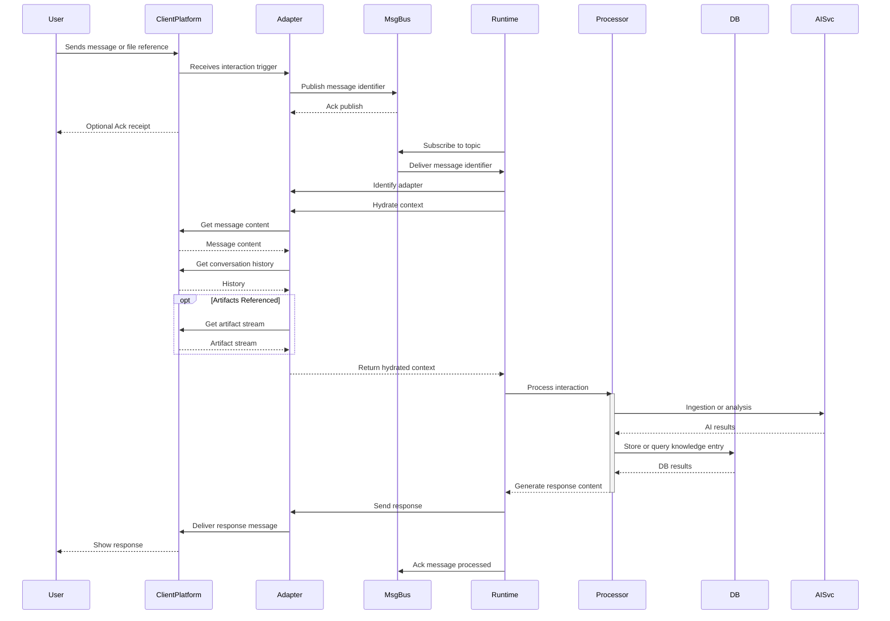

# Nucleus OmniRAG: Processing Architecture

This document outlines the architecture of the processing components in the Nucleus OmniRAG system, as introduced in the [System Architecture Overview](./00_ARCHITECTURE_OVERVIEW.md). It focuses on **artifact ingestion, content extraction, persona-driven analysis, and the storage of resulting knowledge entries** used for intelligent retrieval.

## 1. Philosophy: Persona-Driven Meaning Extraction

A central tenet of the Nucleus OmniRAG architecture is that interpreting meaning from diverse artifacts is best achieved through specialized AI Personas (detailed in [02_ARCHITECTURE_PERSONAS.md](./02_ARCHITECTURE_PERSONAS.md)). Key principles guiding our approach:

1.  **No One-Size-Fits-All Interpretation**: Different artifacts, domains, and user goals require different analytical perspectives.
2.  **Persona-Centric Analysis**: Value is maximized when Personas analyze artifacts within their domain context, extracting relevant insights and summaries rather than relying on generic pre-chunking.
3.  **Contextual Relevance**: Personas determine what constitutes a relevant snippet or summary based on the artifact content and the persona's purpose.
4.  **Focus on Knowledge, Not Just Text**: The goal is to store structured knowledge (`PersonaKnowledgeEntry`) derived by personas, not just fragmented text.
5.  **Extensibility**: The architecture supports adding new personas and content extractors to handle evolving needs and artifact types.

## 2. Initial Artifact Content Extraction & Structuring

Before personas can analyze an artifact, its raw content needs to be extracted and potentially structured into an intermediate format usable by subsequent synthesis steps. This process is further detailed in [Processing/ARCHITECTURE_PROCESSING_INGESTION.md](./Processing/ARCHITECTURE_PROCESSING_INGESTION.md).

### 2.1 Abstraction: `IContentExtractor`

An `IContentExtractor` interface provides a standard way to handle the *initial parsing* of different file types. Its purpose is to retrieve the raw content (e.g., text, metadata) from a source artifact before it's passed to subsequent processing stages.

The specific definition of this interface can be found in the [Shared Processing Interfaces document](./Processing/ARCHITECTURE_PROCESSING_INTERFACES.md#1-icontentextractor).

### 2.3 Handling Complex and Multimodal Content (Planned - see [Phase 2 Requirements](../Requirements/02_REQUIREMENTS_PHASE2_MULTI_PLATFORM.md))

While initial implementations may focus on standard text-based documents, the architecture must accommodate more complex scenarios. These extractors produce intermediate representations (e.g., text + image descriptions, structured table data) that are fed into the synthesis step.

## 3. Core Asynchronous Interaction Flow

This diagram illustrates the fundamental sequence of events when a user interacts with the system via a client platform, triggering the asynchronous processing pipeline.



This flow highlights the decoupling provided by the asynchronous messaging system and the role of the Client Adapter in hydrating the full context needed for processing.

## 4. Content Synthesis to Standardized Format

A crucial step after initial extraction is synthesizing the potentially disparate pieces of content (e.g., text from DOCX, XML structure, image descriptions) into a single, standardized format that Personas can reliably process. Currently, this standard format is **Markdown**.

*   **Role of Synthesizers:** Processors like `FileCollectionsProcessor` might aggregate components extracted by one or more `IContentExtractor` instances.
*   **Plaintext Processor:** The `PlaintextProcessor` (acting as a synthesizer in this context, as per Memory `0cb7dbac`) takes the aggregated inputs and uses an LLM to generate a coherent Markdown representation.
*   **Ephemeral Nature:** This synthesized Markdown exists ephemerally during the processing session (Memory `08b60bec`). It is not persisted by Nucleus itself but is passed directly to the Persona analysis step.

## 5. Processing Pipeline Flow (Modular Monolith ACA Pattern)

This flow assumes a single Azure Container App (ACA) instance hosting the API, Ingestion, Session Management (in-memory), and Processing logic (as background tasks), aligning with the 'Modular Monolith' preference (Memory `f210adc9`) detailed in the [Deployment Architecture](./07_ARCHITECTURE_DEPLOYMENT.md). It interacts with [Storage](./03_ARCHITECTURE_STORAGE.md) for ephemeral data and the [Database](./04_ARCHITECTURE_DATABASE.md) for persistent metadata and knowledge, triggered initially via [Client](./05_ARCHITECTURE_CLIENTS.md) interactions. **The detailed orchestration of handling user interactions and related processing tasks is described in the [Processing Orchestration Overview](./Processing/ARCHITECTURE_PROCESSING_ORCHESTRATION.md).**

**Note:** While this in-process background task model suits initial phases, scaling to handle more complex, stateful, or long-running workflows will necessitate adopting a dedicated orchestration engine (e.g., Azure Durable Functions) as outlined in the [Phase 4 Maturity Requirements](../Requirements/04_REQUIREMENTS_PHASE4_MATURITY.md#32-workflow-orchestration).

```mermaid
graph LR
    A["API Request and Session Context"] -- "Establishes Session" --> B["Ingestion Trigger and Triage"]
    B -- "Schedules Background Task" --> C["Background Task Scheduling"]
    C -- "Executes Task" --> D["Background Task Execution"]
    D -- "Fetches Artifact and Metadata" --> E["Content Extraction"]
    E -- "Synthesizes Content" --> F["Content Synthesis"]
    F -- "Analyzes Content" --> G["Persona Analysis Loop"]
    G -- "Stores Knowledge Entry" --> H["Finalization and Cleanup"]
```



*   **API Request & Session Context:**
    *   An API call (e.g., from a Client Adapter) arrives at the ACA instance.
    *   The API handler establishes the necessary session context *in the instance's memory*.
*   **Ingestion Trigger & Triage:**
    *   The API handler (or a service it calls) performs triage on the incoming artifact.
    *   Assigns a unique `IngestionID`.
    *   Stores the raw artifact data temporarily (e.g., short-term Blob, Cache accessible by the ACA instance).
    *   Creates a minimal `IngestionRecord` (containing `IngestionID`, `SourceType`, `Timestamp`, pointer to temporary data) in Cosmos DB.
*   **Background Task Scheduling (In-Process):**
    *   The API handler schedules a background processing task *within the same ACA instance*.
    *   This can be done using mechanisms like `System.Threading.Channels`, `BackgroundWorker`, `IHostedService`, or libraries like Hangfire/Quartz.NET configured for in-memory queuing.
    *   The `IngestionID` (and potentially essential, non-sensitive context identifiers from the session) is passed to the background task.
    *   The API handler can now return a response to the client (e.g., 'Accepted for processing').
*   **Background Task Execution:**
    *   The ACA's background task runner picks up the scheduled task.
    *   Retrieves the `IngestionRecord` from Cosmos DB using the `IngestionID`.
    *   Fetches the raw artifact data from ephemeral container storage.
    *   Accesses necessary configuration or *carefully managed* session context (if passed directly or accessible via a thread-safe in-memory store scoped to the instance/request).
    *   **Crucially, `ArtifactMetadata` creation/initialization begins *here*.**
*   **Content Extraction:**
    *   Selects appropriate `IContentExtractor`(s).
    *   Extracts content from the fetched raw data.
*   **Content Synthesis:**
    *   Aggregates extractor outputs.
    *   Invokes synthesizer (e.g., `PlaintextProcessor` with LLM) to generate standardized **Markdown content**.
*   **Persona Analysis Loop:**
    *   Determines target personas based on configuration/context.
    *   For each persona:
        *   Invokes `persona.AnalyzeContentAsync(synthesizedContent, artifactMetadata, sessionContext)`.
        *   Handles results, generates embeddings, stores `PersonaKnowledgeEntry`.
        *   Updates `ArtifactMetadata`.
*   **Finalization & Cleanup:**
    *   Updates the main `ArtifactMetadata` record (overall status).
    *   Cleans up/deletes the raw artifact data from ephemeral container storage.
    *   (No external queue message to acknowledge here for this internal flow).

## 6. Embedding Generation

Embeddings are crucial for semantic search. They are generated *by the pipeline* after a persona has analyzed the **synthesized Markdown** and identified the most relevant text snippet.

### 6.1 Abstraction Layer

Nucleus OmniRAG leverages the standard `Microsoft.Extensions.AI` abstractions:

```csharp
// Defined in Microsoft.Extensions.AI.Abstractions
public interface IEmbeddingGenerator<TData, TEmbedding>
{
    IReadOnlyList<int>? GetEmbeddingDimensions(string? modelId = null);
    Task<TEmbedding> GenerateEmbeddingAsync(TData data, CancellationToken cancellationToken = default, string? modelId = null, EmbeddingOptions? options = null);
    // ... other methods
}
```

### 6.2 Integration

*   An implementation of `IEmbeddingGenerator<string, Embedding<float>>` (e.g., using Google Gemini, Azure OpenAI) is registered in the DI container (see `Nucleus.Infrastructure`).
*   This generator is used **by the Processing Pipeline** (not the persona) to create embeddings for:
    *   `PersonaKnowledgeEntry.relevantTextSnippetOrSummary` -> stored as `snippetEmbedding`.
    *   Optionally, a derived summary from `PersonaKnowledgeEntry.analysis` -> stored as `analysisSummaryEmbedding`.
*   These embeddings are stored within the `PersonaKnowledgeEntry` document in Cosmos DB (see [Database Architecture](./04_ARCHITECTURE_DATABASE.md)).

## 7. Retrieval Flow

Retrieval leverages the structured knowledge and embeddings derived from the **synthesized Markdown**, primarily stored as `PersonaKnowledgeEntry` documents in the [Database](./04_ARCHITECTURE_DATABASE.md):

1.  User submits a query relevant to a specific persona's domain (e.g., asking EduFlow about student progress - see [Persona Architecture](./02_ARCHITECTURE_PERSONAS.md)).
2.  The application identifies the target persona (`personaName`).
3.  The query text is processed by an `IRetrievalService` implementation.
4.  The service calls the registered `IEmbeddingGenerator` to generate an embedding vector for the query.
5.  The service uses the `IPersonaKnowledgeRepository<TAnalysisData>` for the target persona.
6.  It performs a vector similarity search within the persona's specific Cosmos DB container (`{personaName}KnowledgeContainer`) against the `snippetEmbedding` (or `analysisSummaryEmbedding`, depending on the strategy). See [Database Architecture](./04_ARCHITECTURE_DATABASE.md) for container details.
The search likely includes metadata filters (e.g., `userId`, `tags` from related `ArtifactMetadata`).
7.  The repository returns ranked, relevant `PersonaKnowledgeEntry` documents.
8.  These entries (containing the persona's analysis and the relevant snippet) are used as context for generating a final response via an AI chat client, potentially after fetching the full `ArtifactMetadata` using the `sourceIdentifier` for more context.

## 8. Configuration

*   **Content Extractors:** Configuration might specify preferred extractors or settings for specific MIME types.
*   **AI Providers:** Standard configuration for embedding generators and chat clients (API keys, endpoints, model IDs) via `appsettings.json`, environment variables, or a configuration provider like Azure App Configuration/Aspire.
*   **Database:** Connection strings and database/container names for Cosmos DB.
*   **Storage:** Configuration for accessing the storage mechanism where artifacts and `ArtifactMetadata` reside.
*   **Target Personas:** Configuration defining which personas should process which types of artifacts or based on user context.

## 9. Next Steps

1.  **Implement `IContentExtractor`:** Create initial implementations (PDF, DOCX, TXT, HTML).
2.  **Implement Synthesizer Processors:** Develop `PlaintextProcessor` (leveraging LLM for Markdown synthesis) and potentially `FileCollectionsProcessor`.
3.  **Implement `IArtifactMetadataService`:** Build the service for managing `ArtifactMetadata`.
4.  **Implement `IPersonaKnowledgeRepository`:** Create the repository for Cosmos DB.
5.  **Develop Orchestration Logic:** Design the pipeline flow (Functions, Service Bus, etc.) incorporating the synthesis step.
6.  **Refactor `IPersona` Interface/Implementations:** Ensure `AnalyzeContentAsync` accepts the synthesized content (Markdown) via an updated `ContentItem` record.
7.  **Implement Reply Event System:** Create message types and subscriptions.
8.  **Implement `IRetrievalService`:** Build the query service.
9.  **Testing:** Implement comprehensive integration tests.

---

### Key Services and Abstractions

*   **`IArtifactMetadataService`**: Manages CRUD operations for `ArtifactMetadata` in the central Storage repository.
*   **`IContentExtractor`**: Interface for services that extract raw text/structured content from various artifact MIME types (PDF, DOCX, HTML, etc.). Implementations handle specific formats.
*   **`IPersona`**: The core interface defining a persona's analytical capabilities, primarily through `AnalyzeContentAsync`.
*   **`IChatClient` (from `Microsoft.Extensions.AI`)**: The standard abstraction for interacting with LLMs for chat completions. Implementations will handle provider-specific details, including context caching integration.
*   **`IEmbeddingGenerator` (from `Microsoft.Extensions.AI`)**: The standard abstraction for generating text embeddings.
*   **`IPersonaKnowledgeRepository`**: Interface for services managing the storage and retrieval of `PersonaKnowledgeEntry` documents in the persona-specific data stores (Cosmos DB).
*   **`ICacheManagementService` (Planned for Phase 2+)**: Abstraction responsible for interacting with the underlying AI provider's prompt/context caching mechanisms. It handles creating, retrieving, and potentially managing the lifecycle (TTL) of cached content linked to a `SourceIdentifier`.
