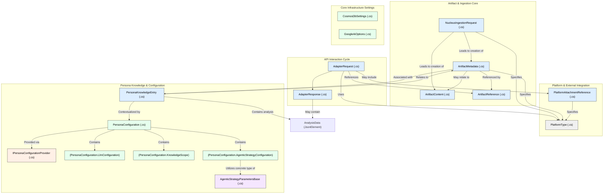

# Architecture: Abstractions

## Domain Models

### 1. Introduction

Domain models are the conceptual backbone of the Nucleus platform, representing the key entities, data structures, and their relationships. They are crucial for ensuring a clear, consistent, and maintainable codebase. This document outlines the primary domain models found within the `Nucleus.Abstractions.Models` namespace, their design philosophy, how they are categorized, and the strategy for their evolution.

A well-defined set of domain models facilitates clear communication between different components of the system and provides a stable foundation upon which business logic and application features are built.

### 2. Core Domain Model Overview

This section provides a structured overview of the data models within the `Nucleus.Abstractions.Models` namespace and its subdirectories.

#### 2.1. Top-Level Models (`Nucleus.Abstractions.Models/`)

*   **[`AdapterRequest.cs`](../../src/Nucleus.Abstractions/Models/AdapterRequest.cs)**:
    *   Purpose: Represents a request coming from a client adapter to the Nucleus API.
    *   Key Properties: `InteractionType`, `Query`, `EphemeralContent`, `ArtifactReference`, `TenantContext`, `UserContext`, `ClientState`.
    *   Type: Record.
*   **[`AdapterResponse.cs`](../../src/Nucleus.Abstractions/Models/AdapterResponse.cs)**:
    *   Purpose: Represents the immediate response from the Nucleus API to an adapter, primarily for acknowledging requests and providing job IDs for asynchronous operations.
    *   Key Properties: `Success`, `ResponseMessage`, `ErrorMessage`, `JobId`, `AnalysisData` (type: `JsonElement?` - for flexible, persona-defined analysis output directly from adapter-level processing if any was configured to be synchronous, though main analysis is async via `InteractionResponse`).
    *   Type: Record.
*   **[`ArtifactContent.cs`](../../src/Nucleus.Abstractions/Models/ArtifactContent.cs)**:
    *   Purpose: Represents the actual content of an artifact.
    *   Key Properties: `ArtifactId`, `MimeType`, `Content` (byte array), `TextContent` (string, for pre-extracted text).
    *   Type: Record.
*   **[`ArtifactMetadata.cs`](../../src/Nucleus.Abstractions/Models/ArtifactMetadata.cs)**:
    *   Purpose: Stores metadata about an artifact, such as its origin, type, and descriptive information.
    *   Key Properties: `Id`, `TenantId`, `UserId`, `SourcePlatform`, `SourceArtifactId`, `Name`, `MimeType`, `Size`, `CreatedAt`, `LastModifiedAt`, `Uri`, `Tags`, `Description`, `CustomMetadata` (Dictionary for extensibility).
    *   Type: Record.
*   **[`ArtifactReference.cs`](../../src/Nucleus.Abstractions/Models/ArtifactReference.cs)**:
    *   Purpose: Provides a reference to an artifact, used in requests when specific content needs to be processed.
    *   Key Properties: `SourcePlatform`, `ArtifactId`, `TenantId`, `UserId`. Can also include `ContentUri` or `MimeType` as hints.
    *   Type: Record.
*   **[`NucleusIngestionRequest.cs`](../../src/Nucleus.Abstractions/Models/NucleusIngestionRequest.cs)**:
    *   Purpose: Represents a request specifically for ingesting new content into Nucleus.
    *   Key Properties: `TenantId`, `UserId`, `SourcePlatform`, `SourceArtifactId`, `Name`, `MimeType`, `ContentUri`, `ContentBytes`, `InitialArtifactMetadata` (for providing metadata at ingestion time).
    *   Type: Record.
*   **[`PersonaKnowledgeEntry.cs`](../../src/Nucleus.Abstractions/Models/PersonaKnowledgeEntry.cs)**:
    *   Purpose: Stores knowledge extracted or generated by a persona in relation to a specific artifact. This is a key model for persona memory and learning.
    *   Key Properties: `Id`, `ArtifactId`, `TenantId`, `UserId`, `PersonaId`, `Timestamp`, `Summary`, `Keywords`, `EmbeddingVector`, `AnalysisData` (type: `JsonElement?` - for flexible, persona-defined structured analysis output).
    *   Type: Record.
    *   Architectural Note: The use of `JsonElement?` for `AnalysisData` is a significant design decision, allowing for diverse and evolving analysis schemas per persona without C# type changes.
*   **[`PlatformAttachmentReference.cs`](../../src/Nucleus.Abstractions/Models/PlatformAttachmentReference.cs)**:
    *   Purpose: Represents a reference to an attachment from a specific platform (e.g., a file attached to a Teams message).
    *   Key Properties: `Platform`, `AttachmentId`, `Name`, `ContentType`, `ContentUrl`.
    *   Type: Record.
*   **[`PlatformType.cs`](../../src/Nucleus.Abstractions/Models/PlatformType.cs)**:
    *   Purpose: Enum defining the different external platforms Nucleus can interact with.
    *   Values: `Unknown`, `Teams`, `Slack`, `Email`, `LocalFile`, `WebGeneric`.
    *   Type: Enum.

#### 2.2. Analysis Models (`Nucleus.Abstractions.Models/Analysis/`)

*   **General Note:** All models in this subdirectory (`BootstrapperAnalysisData.cs`, `EduFlowAnalysisData.cs`, `ProfessionalAnalysisData.cs`) have been identified as **DEPRECATED**.
*   **Architectural Shift:** The functionality previously intended for these specific C# record types is now handled by storing arbitrary JSON structures within the `AnalysisData` property (of type `System.Text.Json.JsonElement?`) in `PersonaKnowledgeEntry.cs` and potentially `AdapterResponse.cs`. Documentation has been updated to reflect this.

#### 2.3. Configuration Models (`Nucleus.Abstractions.Models/Configuration/`)

*   **[`AgenticStrategyParametersBase.cs`](../../src/Nucleus.Abstractions/Models/Configuration/AgenticStrategyParametersBase.cs)**:
    *   Purpose: Abstract base class for strategy-specific parameters. Allows `AgenticStrategyConfiguration` to hold different parameter types polymorphically.
    *   Type: Abstract Class (POCO).
*   **[`CosmosDbSettings.cs`](../../src/Nucleus.Abstractions/Models/Configuration/CosmosDbSettings.cs)**:
    *   Purpose: POCO for holding Azure Cosmos DB connection and container naming information.
    *   Key Properties: `ConnectionString`, `DatabaseName`, `MetadataContainerName`, `KnowledgeContainerName`, `PersonaContainerName`.
    *   Type: Class (POCO).
*   **[`GoogleAiOptions.cs`](../../src/Nucleus.Abstractions/Models/Configuration/GoogleAiOptions.cs)**:
    *   Purpose: POCO for holding configuration settings for Google AI services (e.g., Gemini API key, Model ID).
    *   Key Properties: `ApiKey`, `ModelId`. Includes `SectionName` constant for configuration binding.
    *   Type: Class (POCO).
*   **[`IPersonaConfigurationProvider.cs`](../../src/Nucleus.Abstractions/Models/Configuration/IPersonaConfigurationProvider.cs)**:
    *   Purpose: Interface defining a contract for retrieving `PersonaConfiguration` objects. *Full details are provided in the 'Interfaces' section below.*
    *   Key Methods: `Task<PersonaConfiguration?> GetConfigurationAsync(string personaId, CancellationToken cancellationToken)`, `Task<IEnumerable<PersonaConfiguration>> GetAllConfigurationsAsync(CancellationToken cancellationToken)`.
    *   Type: Interface.
*   **[`PersonaConfiguration.cs`](../../src/Nucleus.Abstractions/Models/Configuration/PersonaConfiguration.cs)**:
    *   Purpose: A comprehensive POCO defining the structure for how personas are configured. Includes settings for LLM, knowledge access, agentic capabilities, prompts, activation rules, etc.
    *   Key Nested Types: `LlmConfiguration` (class), `KnowledgeScope` (class), `AgenticStrategyConfiguration` (class), `KnowledgeScopeStrategy` (enum), `AgenticStrategyType` (enum). `ProcessingPreference` (enum) is also defined in this file, within the namespace.
    *   Type: Class (POCO).

### 3. Domain Model Relationships (Mermaid Diagram)

### 4. Design Philosophy & Model Categorization

The domain models in `Nucleus.Abstractions.Models` generally fall into the following categories based on their purpose and C# type:

*   **Records (Data Transfer Objects - DTOs):**
    *   Used for core data representation, especially for entities that are passed between layers or across service boundaries.
    *   Examples: `AdapterRequest`, `ArtifactMetadata`, `PersonaKnowledgeEntry`.
    *   Benefits: Promote immutability, provide value-based equality by default, and are concise for defining data structures.
*   **POCO Classes (Configuration & Settings):**
    *   Primarily used for configuration objects that are typically bound from external sources like `appsettings.json` or environment variables.
    *   Examples: `CosmosDbSettings`, `GoogleAiOptions`, `PersonaConfiguration`.
    *   Benefits: Simple, mutable (often necessary for binding frameworks), and familiar.
*   **Interfaces (Service Contracts):**
    *   Define contracts for services or providers, enabling dependency inversion and promoting loose coupling.
    *   *These are detailed in the 'Interfaces' section below. Example: `IPersonaConfigurationProvider`.*
*   **Enums (Enumerated Types):**
    *   Define a set of named constants for representing discrete states or types.
*   **Abstract Classes (Base Types):**
    *   Provide base types for polymorphism, allowing common functionality or structure to be shared.
    *   Example: `AgenticStrategyParametersBase`.

### 5. `AnalysisData` Strategy (Flexible JSON Structures)

A key architectural decision is the use of `System.Text.Json.JsonElement?` for the `AnalysisData` property in models like `PersonaKnowledgeEntry.cs` and `AdapterResponse.cs`. This approach was chosen over defining specific C# record types for each persona's analytical output for the following reasons:

*   **Flexibility & Extensibility:** Personas can generate diverse and evolving analytical outputs. Using `JsonElement?` allows these JSON structures to be stored and retrieved without requiring changes to the core C# models each time a persona's output schema changes or a new persona with a unique output is introduced.
*   **Decoupling:** The core system does not need to be tightly coupled to the specific analysis schemas of every persona. Personas (and their consumers) are responsible for understanding and interpreting their respective `AnalysisData` JSON structures.
*   **Reduced Boilerplate:** Avoids the proliferation of numerous small C# classes/records solely for representing varied analysis outputs.

While this approach offers flexibility, it implies that the definition and validation of these JSON structures are managed externally to the C# type system, typically through conventions, schema definitions (e.g., JSON Schema) documented per persona, or by the logic within the persona itself.

### 6. Evolving Domain Models: Rich vs. Anemic

The current domain models in Nucleus are largely "anemic," meaning they primarily serve as data containers with minimal behavior. This is a deliberate starting point, leveraging the strengths of C# records for DTOs and simple POCOs for configuration.

Our evolution strategy follows the principle: **"Start anemic, enrich as needed."**

*   **Initial State:** Models are simple data holders, easy to understand, serialize, and pass around.
*   **Selective Enrichment:** As the system develops, if clear benefits emerge from co-locating specific business logic, validation rules, or helper methods with the data they operate on, relevant models can be selectively enriched.
    *   This means transitioning a record to a class if mutable state or more complex behavior is required, or adding methods to existing classes.
    *   The decision to enrich a model will be based on whether it improves clarity, reduces coupling in service layers, and enhances encapsulation without unduly increasing the model's complexity or harming testability.

This pragmatic approach allows for agility while providing a path towards richer domain objects where they add the most value.

### 7. Related Documentation

*   [Code: `Nucleus.Abstractions.Models` Namespace](../../src/Nucleus.Abstractions/Models/)
*   [Architecture: Personas](./02_ARCHITECTURE_PERSONAS.md)
*   [Architecture: API](./10_ARCHITECTURE_API.md)

## Interfaces

### 1. Overview

Interfaces in Nucleus define contracts for services, providers, and data repositories. They are fundamental to achieving a modular, decoupled architecture by enabling dependency inversion. This allows for implementations to be swapped or extended with minimal impact on other parts of the system, promoting testability, maintainability, and flexibility.

### 2. General Design Principles for Interfaces

*   **Clarity and Conciseness:** Interfaces should be minimal, clearly defining only the essential methods and properties required for their specific purpose. This avoids burdening implementors with unnecessary complexity.
*   **Single Responsibility Principle (SRP):** While an interface might group related operations, its overall contract should focus on a single area of responsibility. Implementations should also adhere to SRP.
*   **Implementation Agnostic:** Interfaces define *what* functionality is offered, not *how* it's implemented. This allows diverse implementations (e.g., different database backends for a repository interface).
*   **Async by Default for I/O:** Operations that involve I/O (network calls, file system access, database interaction) should generally be defined as asynchronous (returning `Task` or `Task<T>`) to ensure non-blocking behavior.

### 3. Catalogue of `Nucleus.Abstractions` Interfaces

This section details the primary interfaces defined within the `Nucleus.Abstractions` project. These form the core contracts for services, data access, and orchestration across the Nucleus platform.

#### 3.1. [`IPersonaConfigurationProvider.cs`](../../src/Nucleus.Abstractions/Models/Configuration/IPersonaConfigurationProvider.cs)
*   **Purpose:** Defines the contract for retrieving persona configurations.
*   **Key Methods:** `Task<PersonaConfiguration?> GetConfigurationAsync(string personaId, CancellationToken cancellationToken)`, `Task<IEnumerable<PersonaConfiguration>> GetAllConfigurationsAsync(CancellationToken cancellationToken)`.
*   **Type:** Interface.

#### 3.2. Orchestration Interfaces (`Nucleus.Abstractions/Orchestration/`)

##### 3.2.1. [`IActivationChecker.cs`](../../src/Nucleus.Abstractions/Orchestration/IActivationChecker.cs)
*   **Purpose:** Defines a contract for determining if an incoming `AdapterRequest` meets the criteria to activate a persona or workflow, based on available `PersonaConfiguration`s.
*   **Key Methods:** `Task<ActivationResult> CheckActivationAsync(AdapterRequest request, IEnumerable<PersonaConfiguration> configurations, CancellationToken cancellationToken)`
*   **Type:** Interface.

##### 3.2.2. [`IBackgroundTaskQueue.cs`](../../src/Nucleus.Abstractions/Orchestration/IBackgroundTaskQueue.cs)
*   **Purpose:** Defines a contract for a specialized background task queue dedicated to processing `NucleusIngestionRequest` objects. It supports enqueuing ingestion requests, dequeuing them for processing, and explicitly marking them as completed or abandoned.
*   **Key Methods:** 
    *   `ValueTask QueueBackgroundWorkItemAsync(NucleusIngestionRequest request, CancellationToken cancellationToken)`: Queues a `NucleusIngestionRequest` for asynchronous background processing.
    *   `Task<DequeuedMessage<NucleusIngestionRequest>?> DequeueAsync(CancellationToken cancellationToken)`: Attempts to dequeue a `NucleusIngestionRequest`. Returns a `DequeuedMessage` (containing the request and an opaque context for completion/abandonment) if a message is available, or `null` if the queue is empty.
    *   `Task CompleteAsync(object messageContext, CancellationToken cancellationToken)`: Marks a message (retrieved via `DequeueAsync` and identified by its opaque `messageContext`) as successfully processed.
    *   `Task AbandonAsync(object messageContext, Exception? exception, CancellationToken cancellationToken)`: Abandons a message (retrieved via `DequeueAsync` and identified by its opaque `messageContext`), making it available for reprocessing. Optionally logs an `exception` if one occurred during processing.
*   **Type:** Interface.

##### 3.2.3. [`IOrchestrationService.cs`](../../src/Nucleus.Abstractions/Orchestration/IOrchestrationService.cs)
*   **Purpose:** Defines the central contract for orchestrating the processing of an interaction, from initial handling through to persona execution and result generation.
*   **Key Methods:** `Task<OrchestrationResult> ProcessInteractionAsync(AdapterRequest request, CancellationToken cancellationToken)`
*   **Type:** Interface.

##### 3.2.4. [`IPersonaResolver.cs`](../../src/Nucleus.Abstractions/Orchestration/IPersonaResolver.cs)
*   **Purpose:** Defines a contract for resolving a single, canonical Persona ID based on platform-specific identifiers and context provided in an incoming `AdapterRequest`.
*   **Key Methods:** `Task<string?> ResolvePersonaIdAsync(PlatformType platformType, AdapterRequest request, CancellationToken cancellationToken)`
*   **Type:** Interface.

#### 3.3. Repository Interfaces (`Nucleus.Abstractions/Repositories/`)

##### 3.3.1. [`IArtifactMetadataRepository.cs`](../../src/Nucleus.Abstractions/Repositories/IArtifactMetadataRepository.cs)
*   **Purpose:** Defines a contract for storing, retrieving, and deleting `ArtifactMetadata`. It supports specific lookups by ID (with partition key) and source identifier, and an upsert-style save operation.
*   **Key Methods:** 
    *   `Task<ArtifactMetadata?> GetByIdAsync(string id, string partitionKey)`: Retrieves metadata by its unique ID and partition key.
    *   `Task<ArtifactMetadata?> GetBySourceIdentifierAsync(string sourceIdentifier)`: Retrieves metadata by its logical source identifier.
    *   `Task<ArtifactMetadata> SaveAsync(ArtifactMetadata metadata)`: Creates a new metadata record or updates an existing one (upsert).
    *   `Task DeleteAsync(string id, string partitionKey)`: Deletes metadata by its unique ID and partition key.
    *   *Note: This interface does not currently define methods for broad querying or listing multiple `ArtifactMetadata` records.*
*   **Type:** Interface.

##### 3.3.2. [`IPersonaKnowledgeRepository.cs`](../../src/Nucleus.Abstractions/Repositories/IPersonaKnowledgeRepository.cs)
*   **Purpose:** Defines a contract for storing, retrieving, and deleting `PersonaKnowledgeEntry` records. These entries associate knowledge derived by specific personas with artifacts. Operations typically require a partition key.
*   **Key Methods:** 
    *   `Task<PersonaKnowledgeEntry?> GetByIdAsync(string id, string partitionKey)`: Retrieves a specific knowledge entry by its ID and partition key.
    *   `Task<IEnumerable<PersonaKnowledgeEntry>> GetByArtifactIdAsync(string artifactId, string partitionKey)`: Retrieves all knowledge entries associated with a specific artifact ID (scoped by partition key).
    *   `Task<PersonaKnowledgeEntry> SaveAsync(PersonaKnowledgeEntry entry)`: Creates a new knowledge entry or updates an existing one (upsert).
    *   `Task DeleteAsync(string id, string partitionKey)`: Deletes a specific knowledge entry by its ID and partition key.
    *   *Note: This interface does not currently define methods for querying knowledge entries directly by Persona ID without other context like `artifactId` or specific entry `id`.*
*   **Type:** Interface.

#### 3.4. Provider and Utility Interfaces (`Nucleus.Abstractions/`)

##### 3.4.1. [`IArtifactProvider.cs`](../../src/Nucleus.Abstractions/IArtifactProvider.cs)
*   **Purpose:** Defines the contract for components responsible for retrieving the actual content of an artifact based on an ArtifactReference.
*   **Key Methods:** `SupportsArtifactAsync`, `GetArtifactContentAsync`
*   **Design Notes:** Implementations are specific to source systems (e.g., local files, Microsoft Graph). Operates ephemerally.
*   **Type:** Interface.

##### 3.4.2. [`IMessageQueuePublisher.cs`](../../src/Nucleus.Abstractions/IMessageQueuePublisher.cs) (`IMessageQueuePublisher<in T>`)
*   **Purpose:** Defines a generic contract (`IMessageQueuePublisher<in T>`) for publishing messages of type `T` to a specified message queue or topic, facilitating asynchronous communication.
*   **Key Methods:** `Task PublishAsync(T messagePayload, string queueOrTopicName, CancellationToken cancellationToken)`
*   **Type:** Interface.

##### 3.4.3. [`IPlatformAttachmentFetcher.cs`](../../src/Nucleus.Abstractions/Adapters/IPlatformAttachmentFetcher.cs)
*   **Purpose:** Defines a contract for fetching an attachment's content (as a stream), filename, and content type from a specific platform, using a `PlatformAttachmentReference`. Implementations are platform-specific.
*   **Key Methods:** 
    *   `string SupportedPlatformType { get; }`: Gets the platform type (e.g., "Teams", "Console") this fetcher supports.
    *   `Task<(Stream? FileStream, string? FileName, string? ContentType, string? Error)> GetAttachmentStreamAsync(PlatformAttachmentReference reference, CancellationToken cancellationToken)`: Asynchronously retrieves the attachment content. Returns a tuple containing the `FileStream`, `FileName`, `ContentType`, and an `Error` message if retrieval failed.
*   **Type:** Interface.

##### 3.4.4. [`IPlatformNotifier.cs`](../../src/Nucleus.Abstractions/Adapters/IPlatformNotifier.cs)
*   **Purpose:** Defines a contract for sending notifications and acknowledgements back to an originating platform. Implementations are platform-specific and handle message delivery and simple feedback like typing indicators.
*   **Key Methods:** 
    *   `string SupportedPlatformType { get; }`: Gets the platform type (e.g., "Teams", "Console") this notifier supports.
    *   `Task<(bool Success, string? SentMessageId, string? Error)> SendNotificationAsync(string conversationId, string messageText, string? replyToMessageId, CancellationToken cancellationToken)`: Sends a message to the specified conversation. Returns success status, the ID of the sent message, and any error.
    *   `Task<bool> SendAcknowledgementAsync(string conversationId, string? replyToMessageId, CancellationToken cancellationToken)`: Sends a simple acknowledgement or typing indicator to the specified conversation. Returns true on success.
*   **Type:** Interface.

**Authors:** Cascade Agent (Initial Draft and Iterative Refinements), Jordan Farr (Guidance and Final Review)
