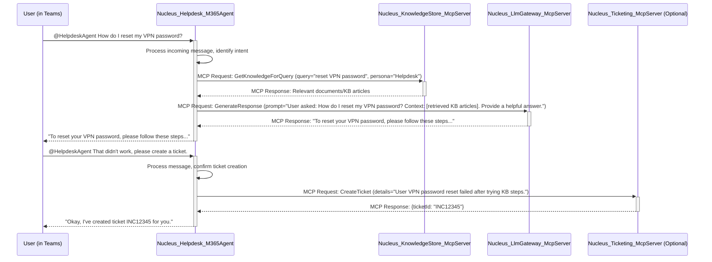

## 1. Overview

This document details the architecture of a specialized **Azure/.NET IT Helpdesk Assistant**. This assistant is implemented as a **Nucleus M365 Persona Agent application**, designed to operate within Microsoft Teams. It leverages backend **Nucleus MCP (Model Context Protocol) Tool applications** for knowledge retrieval, AI interaction, and other specialized tasks.

This persona helps IT support staff and end-users by:

*   Answering common questions about Azure services, .NET development, and internal IT procedures.
*   Retrieving information from knowledge bases, documentation, and past support tickets.
*   Providing links to relevant resources.
*   Potentially initiating simple diagnostic actions or creating support tickets via MCP Tools that integrate with other systems.

This architecture represents a shift from a monolithic API model to a distributed system where the M365 Persona Agent handles user interaction and orchestration, while backend MCP Tools provide specialized, context-aware functionalities.

## 2. Core Components & Interaction Flow

The IT Helpdesk Assistant comprises several key components:

1.  **`Nucleus_Helpdesk_M365Agent` (M365 Persona Agent Application):**
    *   **Platform Integration:** Deployed as a Microsoft Teams bot.
    *   **User Interaction:** Handles user messages, commands, and @mentions within Teams.
    *   **Orchestration:** Manages the conversation flow, state, and interaction logic.
    *   **MCP Client:** Makes requests to various backend Nucleus MCP Tool applications.
    *   **Configuration:** Uses `appsettings.json` and Azure App Configuration for its own settings and for discovering available MCP Tools. See [Persona Configuration](../../ARCHITECTURE_PERSONAS_CONFIGURATION.md) for details.

2.  **`Nucleus_KnowledgeStore_McpServer` (MCP Tool Application):**
    *   **Functionality:** Provides access to the Nucleus knowledge base (Cosmos DB).
    *   **MCP Interface:** Exposes MCP endpoints for querying documents, metadata, and persona knowledge entries.
    *   **Operations:**
        *   `GetKnowledgeForQuery`: Retrieves relevant information based on semantic search and metadata filters.
        *   `StorePersonaKnowledge`: Allows the M365 Agent to persist new insights or feedback.

3.  **`Nucleus_LlmGateway_McpServer` (MCP Tool Application):**
    *   **Functionality:** Provides a standardized interface to one or more LLM providers (e.g., Azure OpenAI, Google Gemini).
    *   **MCP Interface:** Exposes MCP endpoints for text generation, summarization, and other LLM tasks.
    *   **Operations:**
        *   `GenerateResponse`: Takes a prompt (potentially including retrieved context from `Nucleus_KnowledgeStore_McpServer`) and returns an LLM-generated response.
        *   `SummarizeContent`: Generates a summary for a given text.

4.  **(Optional) `Nucleus_Ticketing_McpServer` (MCP Tool Application):**
    *   **Functionality:** Integrates with an external IT ticketing system (e.g., Jira, ServiceNow).
    *   **MCP Interface:** Exposes MCP endpoints for creating, updating, or querying tickets.
    *   **Operations:**
        *   `CreateTicket`: Creates a new support ticket.
        *   `GetTicketStatus`: Retrieves the status of an existing ticket.

### 2.1. Typical Request Flow (User asks a question in Teams)



## 3. M365 Persona Agent Application (`Nucleus_Helpdesk_M365Agent`)

This is a .NET application built using the Microsoft 365 Agents SDK.

### 3.1. Key Responsibilities:

*   **Authentication & Authorization:** Handles authentication with Microsoft Teams and authorizes user requests.
*   **Conversation Management:** Manages the state of conversations with users.
*   **Intent Recognition:** Basic intent recognition (e.g., question, request for ticket) can be handled locally or by calling an LLM via `Nucleus_LlmGateway_McpServer`.
*   **MCP Tool Orchestration:**
    *   Discovers available MCP Tools (e.g., from configuration).
    *   Constructs and sends MCP requests to the appropriate tools.
    *   Handles MCP responses, including errors.
*   **Response Generation:** Formats responses for display in Microsoft Teams, potentially including adaptive cards.
*   **Logging & Telemetry:** Logs important events and telemetry for monitoring and debugging.

### 3.2. Configuration (`appsettings.json` / Azure App Config)

```json
{
  "Logging": { /* ... */ },
  "AllowedHosts": "*",
  "MicrosoftAppId": "YOUR_M365_AGENT_APP_ID",
  "MicrosoftAppTenantId": "YOUR_TENANT_ID",
  "MicrosoftAppPassword": "YOUR_M365_AGENT_APP_PASSWORD", // Store in Key Vault
  "NucleusMcpConfiguration": {
    "DefaultTimeoutSeconds": 30,
    "Tools": [
      {
        "ToolId": "Nucleus.KnowledgeStore",
        "DisplayName": "Nucleus Knowledge Store",
        "Description": "Provides access to the Nucleus knowledge base.",
        "BaseUrl": "https://nucleus-knowledgestore-mcpserver.azurewebsites.net/mcp", // Example URL
        "Endpoints": {
          "GetKnowledgeForQuery": "knowledge/query",
          "StorePersonaKnowledge": "knowledge/store"
        }
      },
      {
        "ToolId": "Nucleus.LlmGateway",
        "DisplayName": "Nucleus LLM Gateway",
        "Description": "Provides access to Large Language Models.",
        "BaseUrl": "https://nucleus-llmgateway-mcpserver.azurewebsites.net/mcp", // Example URL
        "Endpoints": {
          "GenerateResponse": "llm/generate",
          "SummarizeContent": "llm/summarize"
        },
        "LlmConfiguration": { // Specific to this LLM Gateway instance
            "Provider": "AzureOpenAI", // or "Gemini"
            "ModelName": "gpt-4", // or "gemini-1.5-pro-latest"
            "ApiKey": "LLM_API_KEY_FROM_KV"
        }
      },
      {
        "ToolId": "Nucleus.Ticketing",
        "DisplayName": "Nucleus Ticketing System",
        "Description": "Integrates with IT ticketing systems.",
        "BaseUrl": "https://nucleus-ticketing-mcpserver.azurewebsites.net/mcp", // Example URL
        "Endpoints": {
          "CreateTicket": "tickets/create",
          "GetTicketStatus": "tickets/status"
        }
        // Additional tool-specific configuration might go here
      }
    ]
  },
  "PersonaSettings": {
    "PersonaName": "AzureDotNetHelpdesk",
    "DefaultPrompt": "You are an IT Helpdesk assistant specializing in Azure and .NET. Be helpful and concise."
    // Other persona-specific settings
  }
}
```

*   **`MicrosoftAppId`, `MicrosoftAppTenantId`, `MicrosoftAppPassword`:** Standard M365 bot registration details.
*   **`NucleusMcpConfiguration`:**
    *   **`Tools` Array:** Defines the backend MCP Tools this M365 Agent can interact with.
        *   **`ToolId`:** A unique identifier for the MCP Tool.
        *   **`BaseUrl`:** The base URL for the MCP Tool's API.
        *   **`Endpoints`:** Relative paths for specific MCP operations offered by the tool.
        *   **`LlmConfiguration` (for LLM Gateway):** Specifies the LLM provider, model, and API key.
*   **`PersonaSettings`:** Contains settings specific to the Helpdesk persona.

## 4. Backend MCP Tool Applications

These are .NET applications (typically ASP.NET Core Web APIs or Azure Functions) that implement the Model Context Protocol. Each tool is responsible for a specific set of functionalities.

### 4.1. `Nucleus_KnowledgeStore_McpServer`

*   **Purpose:** Provides access to the Nucleus knowledge base (Cosmos DB).
*   **Key MCP Endpoints:**
    *   `POST /mcp/knowledge/query`:
        *   Request: `{ "queryText": "...", "personaContext": "...", "filters": { ... } }`
        *   Response: `{ "results": [ { "documentId": "...", "contentSnippet": "...", "score": 0.9, "metadata": {...} } ] }`
    *   `POST /mcp/knowledge/store`:
        *   Request: `{ "entries": [ { "personaId": "...", "artifactId": "...", "knowledge": "..." } ] }`
        *   Response: `{ "success": true, "storedCount": 1 }`
*   **Dependencies:** Azure Cosmos DB SDK.
*   **Configuration:** Cosmos DB connection string, database/container names.

### 4.2. `Nucleus_LlmGateway_McpServer`

*   **Purpose:** Standardized interface to LLM providers.
*   **Key MCP Endpoints:**
    *   `POST /mcp/llm/generate`:
        *   Request: `{ "prompt": "...", "llmConfigOverride": { "modelName": "gpt-3.5-turbo" } }`
        *   Response: `{ "responseText": "...", "usage": { "promptTokens": 100, "completionTokens": 200 } }`
    *   `POST /mcp/llm/summarize`:
        *   Request: `{ "textToSummarize": "...", "maxLength": 150 }`
        *   Response: `{ "summaryText": "..." }`
*   **Dependencies:** SDKs for configured LLM providers (e.g., `Azure.AI.OpenAI`, Google AI SDK).
*   **Configuration:** API keys for LLM providers, default model names. The M365 Agent can override some LLM parameters per request.

### 4.3. `Nucleus_Ticketing_McpServer` (Optional)

*   **Purpose:** Integrates with external IT ticketing systems.
*   **Key MCP Endpoints:**
    *   `POST /mcp/tickets/create`:
        *   Request: `{ "summary": "...", "description": "...", "priority": "High" }`
        *   Response: `{ "ticketId": "INC12345", "status": "Open" }`
    *   `GET /mcp/tickets/status?ticketId=INC12345`:
        *   Response: `{ "ticketId": "INC12345", "status": "In Progress", "assignee": "Jane Doe" }`
*   **Dependencies:** APIs/SDKs for the target ticketing system.
*   **Configuration:** Ticketing system API endpoint, authentication credentials.

## 5. Data Model & Storage

*   **M365 Persona Agent (`Nucleus_Helpdesk_M365Agent`):**
    *   May store conversation state temporarily (e.g., in memory, distributed cache, or a simple database if persistence across restarts is needed for long conversations).
    *   Does **not** store core Nucleus knowledge artifacts directly.
*   **`Nucleus_KnowledgeStore_McpServer`:**
    *   Interacts with Azure Cosmos DB, which stores:
        *   `ArtifactMetadata`: Factual data about source artifacts.
        *   `PersonaKnowledgeEntry<T>`: Persona-specific interpretations, analyses, and links related to artifacts.
        *   Vector embeddings for semantic search.
    *   See [Database Architecture](../../04_ARCHITECTURE_DATABASE.md) for details.

## 6. Security Considerations

*   **M365 Persona Agent:**
    *   Standard M365 bot authentication and authorization.
    *   Securely store `MicrosoftAppPassword` (e.g., Azure Key Vault).
*   **MCP Tool Applications:**
    *   Implement authentication/authorization for incoming MCP requests (e.g., API keys, Managed Identity if deployed in Azure and called by other Azure services, OAuth client credentials). This ensures only authorized M365 Agents can call them.
    *   Securely store their own secrets (e.g., Cosmos DB keys, LLM API keys) in Azure Key Vault.
*   **Network Security:**
    *   Use HTTPS for all communication.
    *   Consider network isolation (e.g., VNETs, private endpoints) for backend MCP Tools in Azure.
*   **Data Privacy:**
    *   The M365 Agent should only request and handle data necessary for the user's query.
    *   LLM interactions should be mindful of sending PII; consider redaction if necessary, though the primary PII handling is expected at the `Nucleus_KnowledgeStore_McpServer` level by not storing raw sensitive content.

## 7. Deployment

*   **`Nucleus_Helpdesk_M365Agent`:** Deployed as an Azure App Service or Azure Functions, registered as a Bot in the Azure Bot Framework.
*   **MCP Tool Applications (`..._McpServer`):**
    *   Typically deployed as Azure App Services, Azure Container Apps, or Azure Functions.
    *   Each MCP Tool can be scaled independently.
*   **Configuration Management:** Azure App Configuration and Azure Key Vault are recommended.
*   **CI/CD:** GitHub Actions can be used to build and deploy each application (M365 Agent and MCP Tools) as separate artifacts.
    *   See [CI/CD for OSS Projects](../../Deployment/ARCHITECTURE_DEPLOYMENT_CICD_OSS.md).

## 8. Scalability & Reliability

*   **M365 Persona Agent:** Can be scaled out by increasing instances of the Azure App Service / Functions.
*   **MCP Tool Applications:** Each can be scaled independently based on its specific load.
*   **Azure Cosmos DB:** Natively scalable.
*   **Azure Service Bus (Optional):** Can be introduced between the M365 Agent and MCP Tools for asynchronous processing of long-running MCP requests, improving resilience and responsiveness of the Agent. For example, if an MCP tool needs to perform a complex analysis, the Agent could submit a job and get a callback or poll for results.

## 9. Future Enhancements

*   **Proactive Assistance:** The M365 Agent could proactively offer help based on conversation context in Teams channels it's part of.
*   **Advanced Diagnostics:** MCP Tools could be developed to perform simple diagnostic checks (e.g., ping a server, check service status via Azure Management APIs).
*   **User Feedback Loop:** Implement mechanisms for users to rate answers and provide feedback, which can be stored via `Nucleus_KnowledgeStore_McpServer` to improve the persona over time.
*   **Multi-Lingual Support:** Leverage LLM capabilities for translation if needed.

This distributed architecture provides a flexible and scalable foundation for building sophisticated, persona-driven AI assistants within the Microsoft 365 ecosystem.
