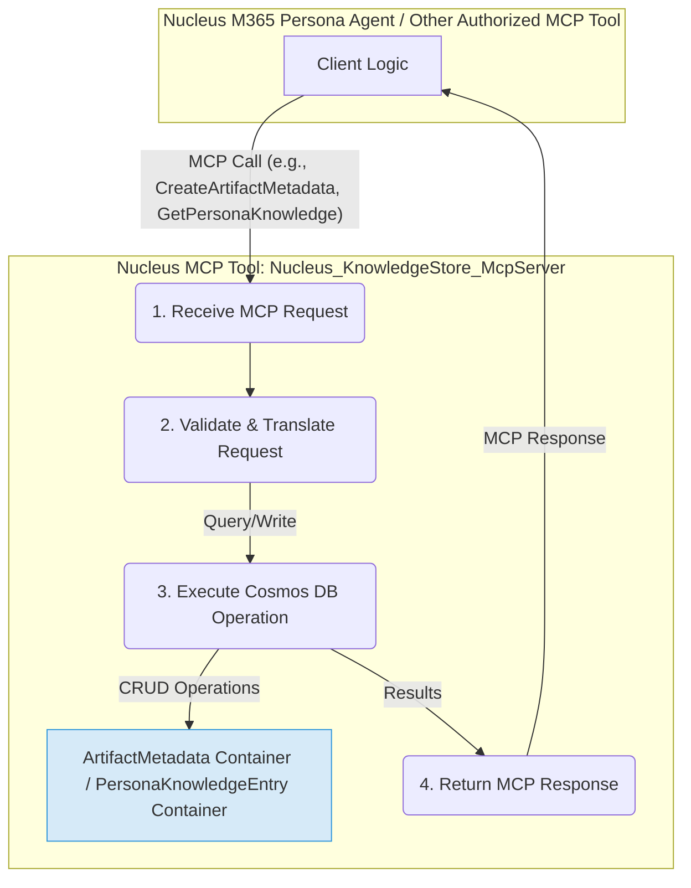

# Nucleus Data Persistence Strategy

## Introduction

This document defines the comprehensive strategy for how Nucleus manages data persistence. At its core, Nucleus leverages **Azure Cosmos DB for NoSQL** for storing metadata and derived knowledge. A fundamental aspect of this strategy is the **`Nucleus_KnowledgeStore_McpServer`**, a Model Context Protocol (MCP) Tool that serves as the exclusive gateway for all database interactions, ensuring a secure, abstracted, and manageable persistence layer.

This strategy is built upon principles of Zero Trust regarding original user content and emphasizes ephemeral processing, with only essential metadata and persona-generated insights being persisted.

## 1. Core Persistence Principles

The Nucleus data persistence strategy adheres to the following core principles:

*   **Zero Trust & Ephemeral Processing of Original Content:**
    *   **No Persistent Storage of Original User Artifacts:** Nucleus backend services, including the `Nucleus_KnowledgeStore_McpServer`, **do not** store copies of original user files (documents, emails, etc.).
    *   **Ephemeral Access for Processing:** Original file content is accessed ephemerally by the `Nucleus_FileAccess_McpServer` (an MCP Tool implementing `IArtifactProvider`) only when required for processing by an M365 Persona Agent. The content is not stored by any MCP tool beyond the scope of the immediate request.
*   **Persistence of Metadata and Derived Content Only:** The Nucleus backend database (Cosmos DB) stores:
    *   **`ArtifactMetadata`:** Factual, structured information *about* source artifacts.
    *   **`PersonaKnowledgeEntry<T>`:** Persona-specific interpretations, analyses, extracted text snippets, and vector embeddings *derived from* the original content.
*   **User Data Sovereignty:** Users retain full control over their original data in its source location. Nucleus only stores pointers (URIs, IDs) and the derived knowledge it generates.
*   **Centralized Database Access via MCP Tool:** All interactions with the Cosmos DB instance are exclusively mediated by the `Nucleus_KnowledgeStore_McpServer`. No other component has direct database access.

## 2. Key Data Structures Persisted

The primary data structures persisted by Nucleus are `ArtifactMetadata` and `PersonaKnowledgeEntry<T>`. These are created, managed, and retrieved via the `Nucleus_KnowledgeStore_McpServer`.

### 2.1. `ArtifactMetadata` - The Factual Record

*   **Purpose:** Provides a canonical, factual description of a source artifact, acting as the central hub for all information related to a specific piece of content.
*   **Key Attributes (Illustrative):** `Id`, `SourcePlatformId`, `SourceUri`, `InternalUri` (`cci:/artifactmetadata/{Id}`), `FileName`, `FileType`, `Author`, `CreationDate`, `LastModifiedDate`, `Size`, `Tags`, `ProcessingStatus`, `AccessControlInfo`.
*   **Creation/Update:**
    *   Typically initiated by a **Nucleus M365 Persona Agent** upon discovering a new or modified artifact.
    *   The M365 Persona Agent calls the `Nucleus_KnowledgeStore_McpServer` to persist or update the `ArtifactMetadata`. Basic file properties might be fetched via `Nucleus_FileAccess_McpServer` if not available from the platform event.

### 2.2. `PersonaKnowledgeEntry<T>` - The Interpretive Lens

*   **Purpose:** Stores the results of a specific Persona's analysis and interpretation of an artifact. Each Persona maintains its own set of `PersonaKnowledgeEntry` records.
*   **Key Attributes (Illustrative):** `Id`, `ArtifactMetadataId` (links to `ArtifactMetadata`), `PersonaId`, `ProcessingDate`, `Version` (of Persona/analysis logic), `ExtractedContentSnippets`, `VectorEmbeddings`, `StructuredAnalysisData<T>` (persona-specific), `Summary`, `Keywords`, `Relationships`.
*   **Creation/Update:**
    *   Created by a **Nucleus M365 Persona Agent** after:
        1.  Identifying/creating `ArtifactMetadata` (via `Nucleus_KnowledgeStore_McpServer`).
        2.  Ephemerally fetching content via `Nucleus_FileAccess_McpServer`.
        3.  Performing its `AnalyzeContentAsync` logic.
    *   The M365 Persona Agent then calls the `Nucleus_KnowledgeStore_McpServer` to persist the `PersonaKnowledgeEntry`.

## 3. Database Technology & Organization (Azure Cosmos DB)

Nucleus utilizes **Azure Cosmos DB for NoSQL** due to its scalability, flexible data model, rich querying, and managed service nature.

*   **`ArtifactMetadata` Container:**
    *   Stores `ArtifactMetadata` documents.
    *   Partition Key: `tenantId` (to support tenant-level data isolation and querying).
    *   Indexing: Comprehensive to support various queries by the `Nucleus_KnowledgeStore_McpServer`.
*   **`PersonaKnowledgeEntry` Container:**
    *   Stores `PersonaKnowledgeEntry<T>` documents.
    *   Partition Key: `tenantId_PersonaId` (a composite key to efficiently query by tenant and then by persona, or just by tenant if needed, supporting co-location of a tenant's persona data).
    *   Indexing: Supports queries on `ArtifactMetadataId`, `PersonaId`, `tenantId`, and vector properties.

All container interactions (CRUD, queries) are managed exclusively by the `Nucleus_KnowledgeStore_McpServer`.

## 4. `Nucleus_KnowledgeStore_McpServer` - The Persistence Gateway

This MCP Tool is the **sole component** responsible for all interactions with the Cosmos DB instance.

*   **Responsibilities:**
    *   Exposing clear MCP methods for CRUD operations on `ArtifactMetadata` and `PersonaKnowledgeEntry`.
    *   Translating MCP requests into Cosmos DB queries/operations.
    *   Managing database connections, retry logic, and error handling.
    *   Enforcing data validation rules.
    *   Abstracting the underlying database technology.
*   **Benefits:**
    *   **Centralized Data Access Logic:** Simplifies development and maintenance.
    *   **Enhanced Security:** Only the MCP Tool needs database credentials.
    *   **Improved Testability:** Clients mock the MCP Tool interface.
    *   **Flexibility:** Underlying database can be changed with minimal impact on clients.

## 5. Data Interaction Model for Persistence Operations

The flow for persisting data involves M365 Persona Agents orchestrating calls to the relevant MCP Tools:

1.  **Event Trigger & Orchestration (M365 Persona Agent):** An event in a host platform activates the M365 Persona Agent.
2.  **Metadata Management:** The Agent calls the `Nucleus_KnowledgeStore_McpServer` to create/update `ArtifactMetadata`.
3.  **Content Retrieval & Analysis:** The Agent uses `Nucleus_FileAccess_McpServer` to get content ephemerally, then performs its analysis, generating knowledge.
4.  **Storing Persona Knowledge:** The Agent calls `Nucleus_KnowledgeStore_McpServer` to persist the `PersonaKnowledgeEntry` objects, linking them to the `ArtifactMetadata`.

## 6. Vector Embeddings Management

Vector embeddings are critical for semantic search and are managed as follows:

*   **Generation:** Typically generated by an M365 Persona Agent during its `AnalyzeContentAsync` process, using an embedding model specified in its `PersonaConfiguration` (via `IChatClient` or a dedicated embedding client if separate).
*   **Storage:** Stored directly within `PersonaKnowledgeEntry.VectorEmbeddings` (or a dedicated field) in the `PersonaKnowledgeEntry` container in Cosmos DB. This is handled via an MCP call to the `Nucleus_KnowledgeStore_McpServer`.
*   **Querying:** The `Nucleus_KnowledgeStore_McpServer` exposes MCP methods for vector similarity searches (e.g., `SearchKnowledgeByVectorAsync`).
    *   Internally, the `Nucleus_KnowledgeStore_McpServer` translates these MCP requests into native vector queries against Azure Cosmos DB for NoSQL, leveraging its integrated vector search capabilities.
    *   The MCP tool handles the construction of the vector query, execution, and returning ranked results to the calling M365 Persona Agent.
*   **Abstraction:** The M365 Persona Agent is abstracted from the specifics of how vector search is performed; it only interacts with the `Nucleus_KnowledgeStore_McpServer` via defined MCP methods.

## 7. Change Feed & Real-time Processing

Azure Cosmos DB's Change Feed can be utilized by the `Nucleus_KnowledgeStore_McpServer` or other specialized backend MCP Tools for:

*   Real-time updates to auxiliary search indexes (if any).
*   Triggering downstream workflows (e.g., notifying Personas of new `ArtifactMetadata`).
*   Data aggregation or auditing.
Access to the change feed would also be exposed via MCP.

## 8. Security & Access Control for Persisted Data

*   **Database Credentials:** Secured within the `Nucleus_KnowledgeStore_McpServer`'s configuration; no other component has direct access.
*   **Authentication & Authorization:** Clients authenticate with the `Nucleus_KnowledgeStore_McpServer` via standard MCP security. The tool can implement further authorization.
*   **Data Encryption:** Azure Cosmos DB provides encryption at rest and in transit.

## Conclusion

The Nucleus data persistence strategy, centered around Azure Cosmos DB and the `Nucleus_KnowledgeStore_McpServer` MCP Tool, provides a secure, scalable, and flexible foundation for managing `ArtifactMetadata` and `PersonaKnowledgeEntry` data. By adhering to Zero Trust principles for original content and centralizing database access, this architecture supports the ephemeral processing model and the overall goals of the Nucleus platform.
