[<- System Architecture Overview](./00_ARCHITECTURE_OVERVIEW.md)

# Nucleus: Processing Architecture (Post-M365 Agent SDK Pivot)

This document outlines the architecture of the processing components in the Nucleus system, as introduced in the [System Architecture Overview](./00_ARCHITECTURE_OVERVIEW.md). It focuses on **artifact reference handling, ephemeral content retrieval and processing, persona-driven analysis by Nucleus M365 Persona Agents, and the storage of resulting knowledge entries** used for intelligent retrieval. This entire process is now orchestrated by **Nucleus M365 Persona Agents** interacting with backend **Nucleus MCP Tool/Server applications**. The previous model of a single, central `Nucleus.Services.Api` orchestrating client adapters is **deprecated**.

## 1. Philosophy: Persona-Driven Meaning Extraction

**[CONTENT LARGELY KEPT - This philosophy is still core to Nucleus]**

A central tenet of the Nucleus architecture is that interpreting meaning from diverse artifacts is best achieved through specialized AI Personas (now embodied as Nucleus M365 Persona Agents, detailed in [02_ARCHITECTURE_PERSONAS.md](./02_ARCHITECTURE_PERSONAS.md)). Key principles guiding our approach:

1.  **No One-Size-Fits-All Interpretation**: Different artifacts, domains, and user goals require different analytical perspectives.
2.  **Persona-Centric Analysis**: Value is maximized when Nucleus M365 Persona Agents (utilizing `IPersonaRuntime` with specific `PersonaConfiguration`) analyze artifacts ephemerally within their domain context, extracting relevant insights rather than relying on generic pre-chunking.
3.  **Contextual Relevance**: Persona Agents determine what constitutes a relevant snippet or summary based on the artifact content and the persona's purpose.
4.  **Focus on Knowledge, Not Just Text**: The goal is to store structured knowledge ([`PersonaKnowledgeEntry`](../../src/Nucleus.Abstractions/Models/PersonaKnowledgeEntry.cs)) derived by Persona Agents (via MCP calls to a `Nucleus_KnowledgeStore_McpServer`), not just fragmented text.
5.  **Extensibility**: The architecture supports adding new Persona Agent types and backend MCP Tools (e.g., new content extractors within a `Nucleus_ContentProcessing_McpServer`).

## 2. Initial Artifact Content Extraction & Structuring (via MCP Tools)

Before a Nucleus M365 Persona Agent can analyze an artifact, its raw content needs to be retrieved ephemerally (based on an `ArtifactReference`) and potentially structured. This process is now handled by dedicated backend MCP Tools.

*   **Ephemeral Content Retrieval:** The M365 Persona Agent, upon receiving file information from the M365 platform SDK, constructs an `ArtifactReference`. It then makes an MCP call to the **`Nucleus_FileAccess_McpServer`**. This MCP tool uses internal `IArtifactProvider` logic to ephemerally fetch the content stream from the user's M365 storage (leveraging the M365 Agent's Entra Agent ID context for permissions).
*   **Content Extraction & Structuring:** The `Nucleus_FileAccess_McpServer` (or a subsequent `Nucleus_ContentProcessing_McpServer` called by the M365 Agent) then uses `IContentExtractor` implementations to parse the ephemeral stream.
*   This process is detailed further in [Processing/ARCHITECTURE_PROCESSING_INGESTION.md](./Processing/ARCHITECTURE_PROCESSING_INGESTION.md).

### 2.1 Abstraction: `IContentExtractor`

**[CONTENT KEPT - Interface is still relevant, used by MCP Tool(s)]**

An `IContentExtractor` interface provides a standard way to handle the *initial parsing* of different file types *after* the content stream has been retrieved by the `Nucleus_FileAccess_McpServer` (via `IArtifactProvider`). Its purpose is to retrieve the raw content (e.g., text, metadata) from a source artifact stream before it's passed to subsequent processing stages (like synthesis to Markdown).

The specific definition of this interface can be found in the [Shared Processing Interfaces document](./Processing/ARCHITECTURE_PROCESSING_INTERFACES.md).

### 2.2 Handling Complex and Multimodal Content

**[CONTENT KEPT - Principles are sound, execution via MCP Tools]**

While initial implementations may focus on standard text-based documents, the architecture (now through MCP Tools) must accommodate more complex scenarios. These extractors (within `Nucleus_ContentProcessing_McpServer` or similar) produce intermediate representations (e.g., text + image descriptions from a multimodal LLM, structured table data) that are fed into the synthesis step.

## 3. Core Interaction & Processing Flow (Revised for M365 Agents & MCP)

This diagram illustrates the fundamental sequence when a user interacts via an M365 platform. **Crucially, interactions are now received by a Nucleus M365 Persona Agent, which then orchestrates calls to backend Nucleus MCP Tools. Asynchronous processing for long-running tasks is initiated by the M365 Agent enqueuing a message to Azure Service Bus.**

```mermaid
sequenceDiagram
    participant User
    participant M365Platform[MS Teams / M365 Copilot]
    participant AzureBotSvc[Azure Bot Service]
    participant NucleusM365Agent[Nucleus M365 Persona Agent App <br/> (Entra Agent ID, uses IPersonaRuntime)]
    participant NucleusServiceBus[Nucleus Service Bus Queue <br/> (IBackgroundTaskQueue)]
    participant NucleusBgWorker[Nucleus Background Worker <br/> (Processes Queue, Calls MCP Tools)]

    participant FileAccessMCP[Nucleus_FileAccess_McpServer <br/> (IArtifactProvider)]
    participant ContentProcMCP[(Optional) Nucleus_ContentProcessing_McpServer <br/> (IContentExtractor, Synthesizers)]
    participant KnowledgeStoreMCP[Nucleus_KnowledgeStore_McpServer <br/> (IRepositories for CosmosDB)]
    participant LLMService[Configured LLM Service <br/> (Azure OpenAI, Gemini, OpenRouter - via IChatClient)]

    User->>M365Platform: Sends message (potentially with file info)
    M365Platform->>AzureBotSvc: Routes Activity
    AzureBotSvc->>NucleusM365Agent: Delivers Activity

    activate NucleusM365Agent
    NucleusM365Agent->>NucleusM365Agent: Parse Activity, Identify Intent, Construct ArtifactReference(s)
    alt Short-lived Task (e.g., Simple Query)
        NucleusM365Agent-->>FileAccessMCP: MCP Call: GetEphemeralContent(ArtifactReference)
        FileAccessMCP-->>NucleusM365Agent: Ephemeral Content Stream
        NucleusM365Agent-->>ContentProcMCP: (If needed) MCP Call: ProcessContent(Stream)
        ContentProcMCP-->>NucleusM365Agent: Processed Ephemeral Content (e.g., Markdown)
        NucleusM365Agent-->>LLMService: Perform Analysis / LLM Call (using IChatClient)
        LLMService-->>NucleusM365Agent: AI Result
        NucleusM365Agent-->>KnowledgeStoreMCP: MCP Call: Store PersonaKnowledgeEntry
        KnowledgeStoreMCP-->>NucleusM365Agent: Store Confirmation
        NucleusM365Agent-->>AzureBotSvc: Send Response Activity
    else Long-running Task (e.g., Deep Analysis of Large File)
        NucleusM365Agent-->>AzureBotSvc: Send Ack Activity (e.g., "Processing your request...")
        NucleusM365Agent-->>NucleusServiceBus: Enqueue Task (Refs: Conversation, Artifacts, TenantId, PersonaId)
        activate NucleusServiceBus
        NucleusServiceBus-->>NucleusBgWorker: Dequeue Task
        deactivate NucleusServiceBus
        activate NucleusBgWorker
        NucleusBgWorker->>NucleusBgWorker: Hydrate Context, Load PersonaConfiguration
        NucleusBgWorker-->>FileAccessMCP: MCP Call: GetEphemeralContent(ArtifactReference)
        FileAccessMCP-->>NucleusBgWorker: Ephemeral Content Stream
        NucleusBgWorker-->>ContentProcMCP: (If needed) MCP Call: ProcessContent(Stream)
        ContentProcMCP-->>NucleusBgWorker: Processed Ephemeral Content
        NucleusBgWorker-->>LLMService: Perform Analysis / LLM Call
        LLMService-->>NucleusBgWorker: AI Result
        NucleusBgWorker-->>KnowledgeStoreMCP: MCP Call: Store PersonaKnowledgeEntry
        KnowledgeStoreMCP-->>NucleusBgWorker: Store Confirmation
        NucleusBgWorker-->>NucleusM365Agent: Trigger Proactive Message (with Result & ConversationReference)
        deactivate NucleusBgWorker
        NucleusM365Agent-->>AzureBotSvc: Send Proactive Response Activity
    end
    deactivate NucleusM365Agent
    AzureBotSvc-->>M365Platform: Delivers Response
    M365Platform-->>User: Shows Response
```

**Explanation (Revised):**

1.  The User interacts via an **M365 Platform** (Teams, Copilot).
2.  The platform and **Azure Bot Service** deliver an `Activity` to the appropriate **Nucleus M365 Persona Agent**.
3.  The M365 Agent (using its `IPersonaRuntime` and loaded `PersonaConfiguration`):
    *   Parses the `Activity`, identifies user intent, and constructs `ArtifactReference` objects if files are involved.
    *   **For short-lived tasks:**
        *   Makes MCP calls to `Nucleus_FileAccess_McpServer` for ephemeral content.
        *   Optionally calls `Nucleus_ContentProcessing_McpServer` for extraction/synthesis.
        *   Interacts with the configured **LLM Service** (via `IChatClient`).
        *   Makes MCP calls to `Nucleus_KnowledgeStore_McpServer` to store derived knowledge.
        *   Sends a response back via Azure Bot Service.
    *   **For long-running tasks:**
        *   Sends an immediate acknowledgment to the user.
        *   Enqueues a message to **Nucleus Service Bus** (`IBackgroundTaskQueue`) containing `ConversationReference`, `ArtifactReference`(s), `tenantId`, and `personaId`.
4.  **Asynchronous Processing (by `NucleusBgWorker`):**
    *   The worker dequeues the message.
    *   It hydrates context, loads the relevant `PersonaConfiguration`.
    *   It orchestrates MCP calls to `FileAccessMCP`, `ContentProcMCP` (if needed), the LLM Service, and `KnowledgeStoreMCP` to perform the core analysis and knowledge storage.
    *   Upon completion, the worker triggers the original M365 Agent to send a **proactive message** back to the user, using the stored `ConversationReference` and the M365 Agents SDK's proactive messaging capabilities.

This flow emphasizes M365 Agents as the user interaction front-end and orchestrator of MCP tool calls, with the Service Bus enabling robust background processing for complex tasks.

## 4. Content Synthesis to Standardized Format (via MCP Tool or Agent Logic)

**[CONTENT MODIFIED - Synthesis responsibility shifts]**

Before a Persona logic (within the M365 Agent) can effectively analyze complex or non-text artifacts, their content often needs to be synthesized into a standardized format, typically Markdown. This synthesis occurs **after the ephemeral raw content streams have been retrieved** by the `Nucleus_FileAccess_McpServer` (using `IArtifactProvider` and `IContentExtractor` implementations internally or via another chained MCP call to a `Nucleus_ContentProcessing_McpServer`).

The synthesized Markdown is then returned to the calling **Nucleus M365 Persona Agent** or the **`NucleusBgWorker`** and becomes the primary input for the `IPersonaRuntime`'s analysis logic.

The primary goals remain: LLM Compatibility, Structure Preservation, Multimodality Handling.

Details on specific synthesizer processors (like `PlaintextProcessor`, `FileCollectionsProcessor` within the `Nucleus_ContentProcessing_McpServer`) can be found in [Processing/ARCHITECTURE_PROCESSING_INGESTION.md](./Processing/ARCHITECTURE_PROCESSING_INGESTION.md).

## 5. Core Processing Stages (Conceptual Flow within M365 Agent or Background Worker)

**[DIAGRAM AND CONTENT MODIFIED]**

Once an interaction is received by the **M365 Agent** (for synchronous tasks) or a job is dequeued by the **Background Worker** (for asynchronous tasks), and initial context (including `PersonaConfiguration`) is hydrated, the core processing logic follows these conceptual stages:

```mermaid
graph LR
    A["M365 Agent Receives Activity <br/> OR <br/> Worker Dequeues Job (incl. ArtifactReferences, PersonaId, TenantId)"] -- "Initiates Processing" --> B["1. Persona Logic (IPersonaRuntime) & Knowledge Check <br/> (MCP Call to KnowledgeStoreMCP - Secure Index Query)"]
    B -- "Decision to Analyze Ephemeral Content?" --> C{"2. Need Artifact Content?"}
    C -- "Yes" --> D["3. Fetch Content (MCP Call to FileAccessMCP) <br/> (Uses IArtifactProvider internally)"]
    D -- "Ephemeral Content Stream" --> E["4. Extract & Synthesize <br/> (FileAccessMCP or ContentProcMCP uses IContentExtractor + Synthesizer)"]
    E -- "Synthesized Ephemeral Markdown" --> G["7. Persona Logic Analysis (Agentic Loop with LLM/IChatClient)"]
    C -- "No" --> F["6. Persona Logic Analysis (Metadata/Stored Knowledge Only)"]
    F -- "Metadata-Based Insights" --> H["8. Store Derived Knowledge <br/> (MCP Call to KnowledgeStoreMCP for PersonaKnowledgeEntry)"]
    G -- "Analysis Results & Knowledge" --> H
    H -- "Knowledge Stored" --> I["9. Formulate & Send Response <br/> (M365 Agent via M365 SDK <br/> or Worker triggers Proactive Message via Agent)"]
    I -- "Interaction Complete" --> J["Agent Turn Ends / Worker Acknowledges Job"]
```



## 6. Embedding Generation (by M365 Agent or MCP Tool)

**[CONTENT MODIFIED - Actor changes]**

Embeddings are crucial for semantic search. They are generated after a Nucleus M365 Persona Agent's logic (or a dedicated backend MCP Tool called by it) has analyzed the **synthesized ephemeral Markdown** and identified the most relevant text snippet.

### 6.1 Abstraction Layer

**[CONTENT KEPT - `Microsoft.Extensions.AI` is still the way]**
Nucleus leverages the standard `Microsoft.Extensions.AI` abstractions: ...

### 6.2 Integration (Revised)

*   An implementation of `ITextEmbeddingGenerator<string, Embedding<float>>` (e.g., using Azure OpenAI, Google Gemini, or OpenRouter.AI, configured via `IChatClient` patterns) is registered in the DI container of the **Nucleus M365 Persona Agent** or a relevant **backend Nucleus MCP Tool**.
*   This generator is used by the M365 Agent's persona logic or the MCP Tool to create embeddings for:
    *   `PersonaKnowledgeEntry.relevantTextSnippetOrSummary` -> stored as `snippetEmbedding`.
    *   Optionally, a derived summary from `PersonaKnowledgeEntry.analysis` -> stored as `analysisSummaryEmbedding`.
*   These embeddings, along with the `PersonaKnowledgeEntry`, are sent via an MCP call to the **`NucleUS_KnowledgeStore_McpServer`** for persistence in Cosmos DB.

## 7. Retrieval Flow (Revised)

Retrieval is typically initiated by a user query received by a **Nucleus M365 Persona Agent**.

The **asynchronous retrieval process** (if the query is complex or requires extensive backend work) or **synchronous process** (if quick) generally follows these steps within the M365 Agent:

1.  The M365 Agent receives the query `Activity`.
2.  The M365 Agent's internal logic (driven by `IPersonaRuntime` and `PersonaConfiguration`) determines the retrieval strategy.
3.  **(Optional Offload to Queue):** If complex, the M365 Agent enqueues a retrieval task to `NucleusServiceBus`, returning an ack. A `NucleusBgWorker` picks this up. (Steps below are then performed by the worker).
4.  The Agent/Worker uses an `ITextEmbeddingGenerator` (via `Microsoft.Extensions.AI`) to create an embedding for the user query.
5.  The Agent/Worker makes an MCP call to the **`Nucleus_KnowledgeStore_McpServer`** (or a dedicated `Nucleus_RAGPipeline_McpServer`) to query the relevant `IPersonaKnowledgeRepository` (Cosmos DB `{PersonaId}KnowledgeContainer`). The query uses the user query embedding and filters (`tenantId`, `personaId`, time range, etc.) to find relevant `PersonaKnowledgeEntry` items.
6.  The `Nucleus_RAGPipeline_McpServer` (if used) may apply further ranking (4 R's) to select top-k knowledge entries.
7.  If the M365 Agent's persona logic determines full artifact content is needed *for response generation* based on retrieved knowledge, the Agent/Worker makes an MCP call to the **`Nucleus_FileAccess_McpServer`** with `ArtifactReference`s (from the `PersonaKnowledgeEntry`'s link to `ArtifactMetadata`) to ephemerally fetch content.
8.  The Agent/Worker constructs a rich prompt using the user query, retrieved knowledge, and potentially fetched ephemeral content.
9.  The Agent/Worker uses its configured `IChatClient` (LLM) to generate the final, high-quality response.
10. The M365 Agent sends the response to the user via the M365 SDK. (If processed by a worker, it triggers a proactive message via the M365 Agent).

## 8. Configuration (Revised for Distributed System)

*   **Content Extractors & Synthesizers:** Configurations for these (used within `Nucleus_FileAccess_McpServer` or `Nucleus_ContentProcessing_McpServer`) will be managed by those services, likely via Azure App Configuration/Key Vault.
*   **AI Providers:** Each Nucleus M365 Persona Agent and any MCP Tool that directly calls LLMs will have its own configuration for `IChatClient` / `ITextEmbeddingGenerator` (API keys, endpoints, model IDs), managed via Azure App Configuration/Key Vault and accessible via its Managed Identity. This allows different Personas or tools to potentially use different LLM providers or models (e.g., Azure OpenAI for an enterprise-focused Persona, Google Gemini for another).
*   **Database:** The `Nucleus_KnowledgeStore_McpServer` is configured with the Cosmos DB connection string (from Key Vault).
*   **File Access:** The `Nucleus_FileAccess_McpServer` is configured with any necessary credentials or settings for its `IArtifactProvider` implementations (e.g., if it needs its own service principal for certain Graph operations beyond what the calling M365 Agent's identity provides).
*   **Target Personas (Now M365 Agent Registrations):** The "activation" of a specific Nucleus Persona M365 Agent is handled by the user interacting with that specific registered agent on the M365 platform. `PersonaConfiguration` (loaded by each agent, potentially from a shared App Config filtered by `PersonaId`, or from the `Nucleus_PersonaBehaviourConfig_McpServer`) defines its behavior.

## 9. Next Steps (Revised for New Architecture)

1.  **Implement Core MCP Tools:**
    *   `Nucleus_KnowledgeStore_McpServer` (implementing `IArtifactMetadataRepository`, `IPersonaKnowledgeRepository`).
    *   `Nucleus_FileAccess_McpServer` (implementing `IArtifactProvider` logic for M365 Graph and other sources).
    *   (Optional) `Nucleus_ContentProcessing_McpServer` (for `IContentExtractor` and synthesizers if not part of FileAccess).
    *   (Optional) `Nucleus_RAGPipeline_McpServer` (for advanced 4R ranking and hybrid search).
    *   (Optional) `Nucleus_PersonaBehaviourConfig_McpServer` (for dynamic persona config from DB).
2.  **Develop Nucleus M365 Persona Agent Application(s):**
    *   Implement agent logic using M365 Agents SDK.
    *   Integrate `IPersonaRuntime` and `PersonaConfiguration` loading.
    *   Implement MCP client logic to call the backend Nucleus MCP Tools.
    *   Implement logic to enqueue tasks to `IBackgroundTaskQueue` and handle proactive responses.
3.  **Refactor `IPersona` / `IPersonaRuntime` / `IAgenticStrategyHandler`:** Ensure these can operate within an M365 Agent, make MCP calls, and use `IChatClient` effectively with potentially different AI provider configurations.
4.  **Testing:** Implement comprehensive integration tests for M365 Agents calling MCP Tools, and for the background worker flows. Utilize .NET Aspire for orchestrating this distributed system locally.

---

### Key Services and Abstractions (Updated Roles)

*   **`IArtifactMetadataRepository`, `IPersonaKnowledgeRepository`**: Interfaces defining data access contracts, now implemented *within* the **`Nucleus_KnowledgeStore_McpServer`** (MCP Tool).
*   **`IContentExtractor`**: Interface for content extraction, implemented and used *within* a backend MCP Tool (e.g., `Nucleus_ContentProcessing_McpServer` or `Nucleus_FileAccess_McpServer`).
*   **[`IPersona`](../../src/Nucleus.Abstractions/IPersona.cs)**: **[DEPRECATED/REPLACED]** This interface is superseded by the `IPersonaRuntime` executing a `PersonaConfiguration` within a Nucleus M365 Persona Agent.
*   **`IPersonaRuntime`, `IAgenticStrategyHandler`**: Core components defining persona execution logic, now operating *within* each Nucleus M365 Persona Agent application.
*   **`IChatClient`, `ITextEmbeddingGenerator` (from `Microsoft.Extensions.AI`)**: Standard abstractions for LLM interaction, used by Nucleus M365 Persona Agents and potentially some backend MCP Tools. Configurable per service to support Azure OpenAI, Google Gemini, OpenRouter.AI.
*   **[`IPlatformNotifier`](../../../src/Nucleus.Abstractions/Adapters/IPlatformNotifier.cs)**: **[DEPRECATED]** Replaced by M365 Agents SDK's built-in mechanisms for sending activities and proactive messages.
*   **[`IPersonaResolver`](../../../src/Nucleus.Abstractions/Orchestration/IPersonaResolver.cs)**: **[DEPRECATED]** Persona resolution is now primarily handled by the user interacting with a specific deployed Nucleus M365 Persona Agent.
*   **`IArtifactProvider`**: Interface defining ephemeral content retrieval, implemented *within* the **`Nucleus_FileAccess_McpServer`** (MCP Tool).
*   **`ICacheManagementService`**: Still relevant, could be used by M365 Agents or MCP Tools for caching LLM calls or expensive computations.

This significantly reframes the processing architecture to be a distributed system of M365 Agents and specialized backend MCP Tools, rather than a monolithic API service. The core principles of persona-driven analysis and ephemeral content processing remain, but are now executed within this new structure.
