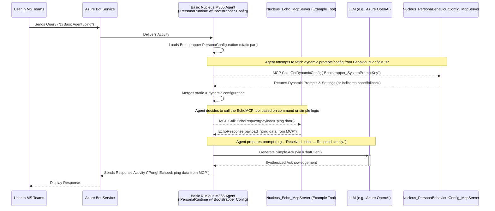

# Persona Configuration: Bootstrapper (M365 Agent)

## 1. Purpose

The Bootstrapper persona configuration represents the most fundamental level of interaction for a **Nucleus M365 Persona Agent**, as defined in the [Personas Architecture Overview](../02_ARCHITECTURE_PERSONAS.md). It defines a simple persona intended for:

*   **Initial Setup/Testing:** Provides a basic interaction layer for verifying core M365 Agent functionality, its ability to load configuration, make MCP calls to essential backend **Nucleus MCP Tools** (e.g., a simple echo tool, or a basic metadata query tool), and integrate with a configured LLM provider.
*   **Fallback Behavior:** Can act as a default persona configuration loaded by the `IPersonaRuntime` within an M365 Agent if a more specialized one is not specified or if dynamic configuration loading fails.
*   **Foundation:** Represents a minimal configuration demonstrating the core M365 Agent interaction pattern with backend MCP services.

This configuration results in minimal complex reasoning when executed by the `IPersonaRuntime` within the M365 Agent, but follows the standard architectural patterns for MCP tool invocation and LLM interaction.

## 2. Typical Request Flow (Simple Query - M365 Agent & MCP Tools)

**Purpose:** Illustrates how an M365 Agent (e.g., `BasicM365Agent`) loaded with the Bootstrapper configuration handles a basic query, making MCP calls.

**Explanation:**
1.  A user sends a simple command (e.g., `/ping`) to the `BasicM365Agent` in Microsoft Teams.
2.  The Azure Bot Service delivers the activity to the `BasicM365Agent`.
3.  The agent's `IPersonaRuntime` loads its foundational `Bootstrapper` persona configuration (static part from App Config/Key Vault).
4.  The agent calls the `Nucleus_PersonaBehaviourConfig_McpServer` to fetch any dynamic/behavioral aspects (e.g., a specific bootstrapper system prompt). Fallback prompts from static config are used if dynamic ones aren't found.
5.  The agent merges static and dynamic configurations.
6.  Based on the command and its simple logic, the agent decides to invoke a basic backend MCP Tool, such as `Nucleus_Echo_McpServer` (one of its `EnabledTools`).
7.  The agent makes an MCP call to `Nucleus_Echo_McpServer`.
8.  The `Nucleus_Echo_McpServer` processes the request and returns a response.
9.  The agent might then use its configured LLM (e.g., Azure OpenAI) with a very simple prompt (potentially from the dynamic configuration) to formulate a user-friendly acknowledgement.
10. The LLM returns the simple acknowledgement.
11. The `BasicM365Agent` sends the response back to the user via the Azure Bot Service.

## 3. Key Configuration Settings (Illustrative for Bootstrapper)

This section highlights how the [General Persona Configuration](./ARCHITECTURE_PERSONAS_CONFIGURATION.md) schema would be specialized for a `BasicM365Agent` using the Bootstrapper configuration.

*   **`PersonaId`**: `Bootstrapper_M365Agent_v1`
*   **`DisplayName`**: "Nucleus Bootstrapper Agent"
*   **`LlmConfiguration`**:
    *   `Provider`: `AzureOpenAI` (Example, could be any supported provider)
    *   `ChatModelId`: `gpt-35-turbo` (A less expensive model suitable for simple tasks)
    *   `EmbeddingModelId`: `text-embedding-ada-002`
    *   `ApiKeySecretName`: `AzureOpenAIApiKey` (If not using Managed Identity with Azure OpenAI)
    *   `EndpointUrl`: (Your Azure OpenAI endpoint)
*   **`EnabledTools`**: (MCP Tool IDs)
    *   `Nucleus.Echo.Ping` (A simple MCP tool for testing connectivity)
    *   `Nucleus.KnowledgeStore.GetServerStatus` (A basic MCP tool to check DB status)
*   **`KnowledgeScope`**:
    *   `Strategy`: `None` (Bootstrapper typically doesn't perform complex knowledge retrieval)
*   **Prompt Configuration (Keys for Dynamic Sourcing or Fallback Static Values)**:
    *   `SystemMessageKey`: `Bootstrapper_DefaultSystemPrompt_v1` (Key for dynamic lookup)
    *   *(Static fallback: "You are a simple bootstrapper agent. Respond concisely.")*
*   **Agentic Strategy Configuration**:
    *   `StrategyType`: `SimpleRag` (Or even a more basic direct tool call strategy if defined)

## 4. Use Cases

*   **Deployment Verification:** After deploying a new Nucleus M365 Agent and its dependent MCP Tools, interacting with the Bootstrapper persona can quickly verify that the agent is running, configuration is loaded, it can call basic MCP tools, and communicate with its configured LLM.
*   **Basic Diagnostics:** Can expose simple diagnostic commands that call status-checking MCP tools.
*   **Developer Onboarding:** Provides a very simple, working example of an M365 Agent interacting with the Nucleus backend via MCP.

This Bootstrapper M365 Agent configuration provides a minimal, testable entry point into the Nucleus ecosystem, updated to reflect the M365 Agent and MCP architecture.
