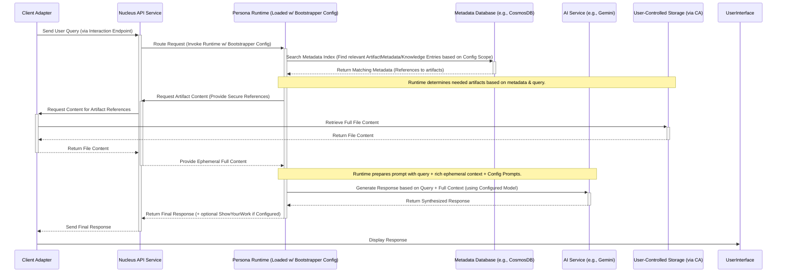

# Persona Configuration: Bootstrapper

## 1. Purpose

The Bootstrapper persona configuration represents the most fundamental level of interaction within the Nucleus system, as defined in the [Personas Architecture Overview](../02_ARCHITECTURE_PERSONAS.md). It defines a simple persona intended for:

*   **Initial Setup/Testing:** Provides a basic interaction layer for verifying core system functionality (API communication, database connectivity, basic metadata retrieval, AI service integration) without complex domain logic.
*   **Fallback Behavior:** Can act as a default persona configuration loaded by the [Persona Runtime/Engine](../02_ARCHITECTURE_PERSONAS.md#22-persona-runtimeengine) if a more specialized one is not specified or applicable during [Orchestration Routing](../Processing/Orchestration/ARCHITECTURE_ORCHESTRATION_ROUTING.md).
*   **Foundation:** Represents a minimal configuration demonstrating the core interaction pattern.

This configuration results in minimal complex reasoning when executed by the Persona Runtime, but follows the standard architectural patterns for data access and processing.

## 2. Typical Request Flow (Simple Query - Executed by Runtime)

**Purpose:** Illustrates how the Persona Runtime handles a basic query when loaded with the Bootstrapper configuration, following the standard Nucleus architectural pattern.

**Explanation:**
1.  The **Client Adapter** sends the user's query to the **Nucleus API Service**.
2.  The API routes the request, identifies the `PersonaId` as `Bootstrapper`, loads its configuration, and invokes the **Persona Runtime**.
3.  The Runtime, guided by the Bootstrapper configuration's `KnowledgeScope`, queries the **Metadata Database** to find relevant `ArtifactMetadata` or `PersonaKnowledgeEntry` records.
4.  Based on the query and metadata, the Runtime determines if full content is needed and requests it securely via the API -> Client Adapter -> **User-Controlled Storage** path.
5.  The Runtime constructs a prompt using the query, retrieved metadata/content, and prompts specified in the Bootstrapper configuration. It calls the **AI Service** specified in the configuration.
6.  The AI Service generates a response.
7.  The Runtime returns the final response (and potentially a `ShowYourWork` artifact if configured) to the API.
8.  The API sends the response back to the Client Adapter.

Even in its simplest configuration, the Runtime adheres to the core security and data flow principles.

## 3. Key Characteristics (Resulting from Configuration)

*   **Simplicity:** Configuration specifies minimal domain-specific logic or complex multi-step reasoning.
*   **Architectural Adherence:** Configuration defines parameters causing the Runtime to follow the standard Nucleus interaction pattern (Metadata Search -> Ephemeral Full Content Retrieval -> AI Synthesis).
*   **Foundation:** Serves as a basic example configuration.
*   **Low Overhead:** Requires minimal specific settings beyond standard persona configuration fields.

## 4. Core Functionality (Enabled by Configuration)

When the Persona Runtime executes with the Bootstrapper configuration, it primarily:

*   **Context Establishment:** Uses context provided by the orchestrator.
*   **Basic Retrieval:** Performs metadata lookups as defined by `KnowledgeScope`.
*   **Simple AI Interaction:** Uses configured prompts and AI model for basic synthesis or response generation.
*   **Adherence to Security:** Strictly follows secure data handling protocols, only triggering ephemeral content access if necessary and permitted by configuration.

## 5. Configuration Settings

This document describes the *intent* of the Bootstrapper configuration. The specific key-value pairs would be defined using the schema in [Persona Configuration](./ARCHITECTURE_PERSONAS_CONFIGURATION.md). Key settings would typically include:

*   **`PersonaId`**: `Bootstrapper` (or similar)
*   **`DisplayName`**: "Bootstrapper"
*   **`Description`**: "Basic interaction handler."
*   **`LlmConfiguration`**: Specifies a default chat model.
*   **`KnowledgeScope`**: Likely configured for broad access (`AllUserArtifacts`) or minimal access (`NoUserArtifacts`, `MetadataOnly`) depending on the testing/fallback scenario.
*   **`CorePrompt` / `SystemMessage`**: A very simple, generic prompt.
*   **`AgenticStrategy`**: Minimal (e.g., single-step query -> retrieve -> synthesize).
*   **`EnabledTools`**: Likely empty.

## 6. Next Steps

1.  **Define Formal Configuration:** Create the actual configuration entry (e.g., in `appsettings.json` or database) for `Bootstrapper` according to the `PersonaConfiguration` schema.
2.  **Test Runtime Execution:** Verify that the Persona Runtime executes correctly when loaded with the Bootstrapper configuration.
3.  **(Deprecation):** Remove the old `BootstrapperPersona.cs` class as its logic is superseded by the generic Runtime executing this configuration.
