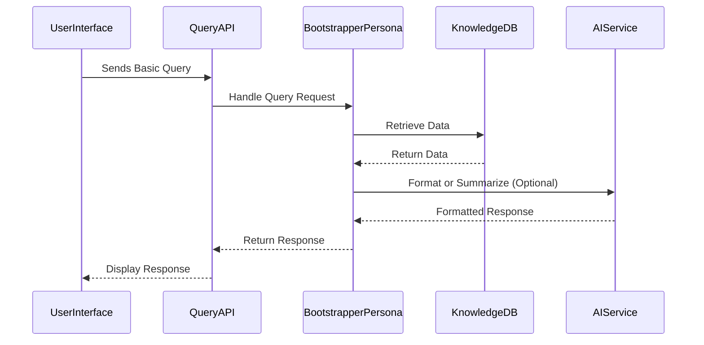

# Persona: Bootstrapper

## 1. Purpose

The Bootstrapper persona represents the most fundamental level of interaction within the Nucleus OmniRAG system, as defined in the [Personas Architecture Overview](../02_ARCHITECTURE_PERSONAS.md). It is designed to be simple and serve potentially as:

*   **Initial Setup/Testing:** Provides a basic interaction layer for verifying core system functionality (ingestion, storage, basic retrieval) without complex domain logic.
*   **Fallback Behavior:** Could act as a default persona if a more specialized one is not specified or applicable.
*   **Foundation:** Represents the core [`IPersona`](cci:2://file:///d:/Projects/Nucleus/src/Abstractions/Nucleus.Abstractions/IPersona.cs:0:0-0:0) implementation from which more complex personas can inherit or delegate.

It typically involves minimal analysis during ingestion and focuses on direct retrieval or simple query handling.

## 2. Typical Request Flow (Simple Query)

**Purpose:** Illustrates a basic query flow with minimal processing.

**Explanation:** A user sends a simple query. The Bootstrapper persona directly retrieves potentially relevant metadata or very basic stored knowledge entries (perhaps just text snippets). It might perform minimal formatting, possibly using an AI service, before returning the result. Deep analysis or complex synthesis is generally avoided.

## 3. Key Characteristics

*   **Simplicity:** Minimal domain logic and analysis.
*   **Directness:** Focuses on basic retrieval and interaction.
*   **Foundation:** Implements the core [`IPersona`](cci:2://file:///d:/Projects/Nucleus/src/Abstractions/Nucleus.Abstractions/IPersona.cs:0:0-0:0) contract.
*   **Low Overhead:** Requires minimal configuration and processing resources compared to specialized personas.
