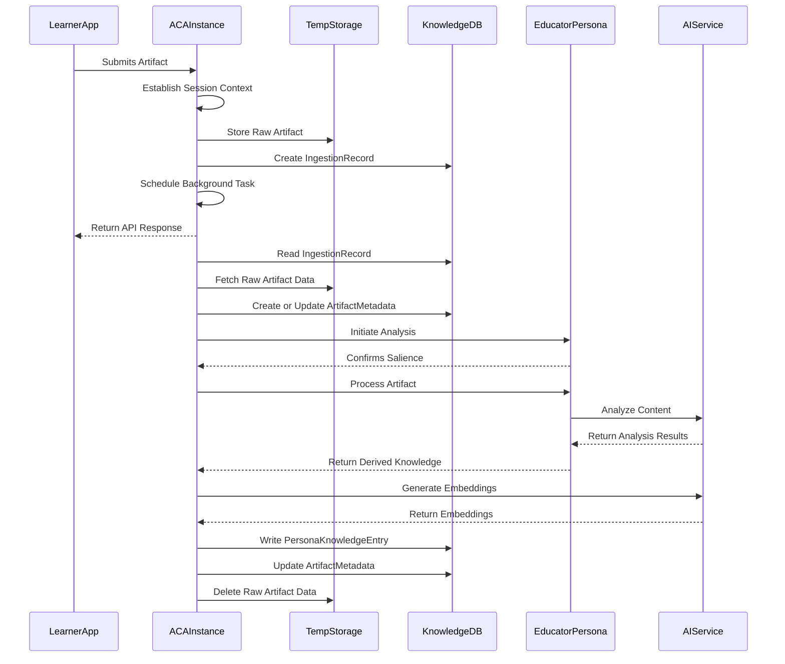

# Persona: Educator ('EduFlow OmniEducator')

## 1. Vision & Purpose

The Educator persona, initially conceived as EduFlow OmniEducator, is the flagship persona for Nucleus OmniRAG. It stems from the need to create a safer, more personalized, and authentic educational experience, particularly recognizing learning within digital creation and self-directed projects. Traditional educational models often fail to capture or support this intrinsic drive.

This persona aims to:

*   **Observe Authenticity:** Capture and understand learning as it happens naturally (e.g., coding projects, game modding, digital art).
*   **Document Process:** Analyze *how* learning occurs (capabilities, processes, cognitive depth) using its "Learning Facets" schema, alongside *what* subjects are touched upon.
*   **Build Understanding:** Create a dynamic, private knowledge base for each learner, mapping their unique trajectory.
*   **Provide Insight:** Enable querying of this knowledge base for meaningful progress reports and contextually relevant support.
*   **Foster Engagement:** Potentially leverage Nucleus capabilities (like dynamic content generation via tools) to create tailored micro-learning experiences.

It transforms ephemeral moments of creation into tangible evidence of learning, supporting learners, educators, and parents.

## 2. Typical Request Flow (Learning Artifact Analysis - Slow Path)

**Purpose:** Illustrates the asynchronous analysis of a submitted learning artifact (e.g., a screen recording of a coding session).

**Explanation:** A learner submits an artifact via an API call to the main Azure Container App (ACA) instance. The ACA handler establishes session context, creates an Ingestion Record, stores raw data temporarily, and schedules an in-process background task. The API responds quickly. The background task then executes within the same ACA instance, fetches the raw data using the Ingestion ID, accesses session context if needed, and invokes the Educator Persona. The Persona checks relevance (salience) and, if salient, orchestrates the analysis using AI services (like Gemini). The derived knowledge and embeddings are stored as a `PersonaKnowledgeEntry` in Cosmos DB. Finally, temporary data is cleaned up.

## 3. Interaction Example (Query - Fast Path)

(To be defined - would show querying the KnowledgeDB for insights about learner progress based on analyzed artifacts).

## Knowledge Framework: Pedagogical and Tautological Trees

The Educator persona operates with a sophisticated understanding of child development and learning, codified within two distinct knowledge frameworks:

1.  **Pedagogical Tree:** Maps learning activities and artifacts to specific subject domains and genuine skill acquisition (e.g., mastering algebraic concepts, understanding historical timelines, developing artistic techniques).
2.  **Tautological Tree:** Maps the same activities to underlying cognitive, social-emotional, and physical developmental processes (e.g., logical reasoning, collaborative problem-solving, fine motor control), often aligning with formal educational standards or reporting requirements.

This dual-lens approach allows the Educator to analyze learning comprehensively, supporting authentic skill development while also facilitating necessary documentation and reporting.

For a detailed explanation of this framework and links to the age-specific knowledge breakdowns (Ages 5-18), please see:

*   **[Educator Persona Knowledge Trees](./Educator/ARCHITECTURE_EDUCATOR_KNOWLEDGE_TREES.md)**

---

*Previous detailed tree definitions removed and consolidated into the linked document.*
