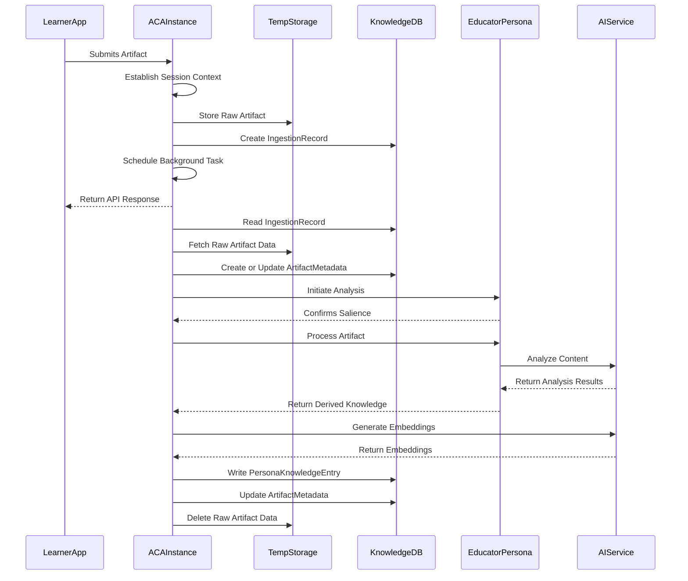

# Persona: Educator ('EduFlow OmniEducator')

**Version:** 1.5
**Date:** 2025-04-20

## 1. Vision & Purpose

The Educator persona, initially conceived as EduFlow OmniEducator, is the flagship persona for Nucleus OmniRAG. It stems from the need to create a safer, more personalized, and authentic educational experience, particularly recognizing learning within digital creation and self-directed projects. Traditional educational models often fail to capture or support this intrinsic drive.

This persona aims to:

*   **Observe Authenticity:** Capture and understand learning as it happens naturally (e.g., coding projects, game modding, digital art).
*   **Document Process:** Analyze *how* learning occurs (capabilities, processes, cognitive depth) using its "Learning Facets" schema, alongside *what* subjects are touched upon.
*   **Build Understanding:** Create a dynamic, private knowledge base for each learner, mapping their unique trajectory.
*   **Provide Insight:** Enable querying of this knowledge base for meaningful progress reports and contextually relevant support.
*   **Foster Engagement:** Potentially leverage Nucleus capabilities (like dynamic content generation via tools) to create tailored micro-learning experiences.

It transforms ephemeral moments of creation into tangible evidence of learning, supporting learners, educators, and parents.

## 2. Typical Request Flow (Learning Artifact Analysis - Slow Path)

**Purpose:** Illustrates the asynchronous analysis of a submitted learning artifact (e.g., a screen recording of a coding session).

**Explanation:** A learner submits an artifact via an API call to the main Azure Container App (ACA) instance. The ACA handler establishes session context, creates an Ingestion Record, stores raw data temporarily, and schedules an in-process background task. The API responds quickly. The background task then executes within the same ACA instance, fetches the raw data using the Ingestion ID, accesses session context if needed, and invokes the Educator Persona. The Persona checks relevance (salience) and, if salient, orchestrates the analysis using AI services (like Gemini). The derived knowledge and embeddings are stored as a `PersonaKnowledgeEntry` in Cosmos DB. Finally, temporary data is cleaned up.

## 3. Core Functionality

The Educator persona implements the [IPersona](../../../Nucleus.Abstractions/IPersona.cs) interface defined in the `Nucleus.Abstractions` project.

### 3.1 Ingestion / Analysis

*   **Salience Check:** Determines if an artifact is relevant to the Educator's domain (e.g., identifying educational content vs. casual chat).
*   **Content Analysis:** Utilizes external AI services (e.g., Gemini, Azure AI) to:
    *   Extract key concepts, skills demonstrated, and learning objectives met.
    *   Summarize the artifact's educational significance.
    *   Map the content to its internal knowledge frameworks (Pedagogical & Tautological Trees).
*   **Knowledge Entry Generation:** Creates a `PersonaKnowledgeEntry<EduFlowAnalysis>` record containing the structured analysis.
*   **Embedding Generation:** Calculates vector embeddings for relevant text snippets and the overall analysis summary to facilitate RAG.

### 3.2 Query Handling

*   **Knowledge Retrieval:** Queries its specific `EduFlow_v1KnowledgeContainer` in [Cosmos DB](../04_ARCHITECTURE_DATABASE.md) using vector search and keyword filtering based on the user's prompt.
*   **Synthesis:** Combines retrieved knowledge entries with the user's query context.
*   **Response Generation:** Leverages an LLM (via `IChatClient`) to generate a coherent, informative response based on the synthesized information, potentially citing source artifacts.

## 4. Data Schema (`PersonaKnowledgeEntry<EduFlowAnalysis>`)

The specific data structure stored by the Educator persona in its dedicated Cosmos DB container ([`EduFlow_v1KnowledgeContainer`](../04_ARCHITECTURE_DATABASE.md#4-personaidknowledgecontainer-schema)).

*   **Extends Base PKE:** Includes standard fields like `id`, `artifactId`, `tenantId`, `userId`, `personaId`, `createdAt`, `analysisSummaryEmbedding`, etc.
*   **`analysisData` (Type: `EduFlowAnalysis`):** Contains the detailed educational analysis:
    *   `subjects`: List of identified academic subjects.
    *   `skills`: List of skills demonstrated (mapped to pedagogical tree).
    *   `developmentalAreas`: List of cognitive/social-emotional processes involved (mapped to tautological tree).
    *   `learningObjectives`: Identified or inferred learning goals.
    *   `keyConcepts`: Extracted core ideas or topics.
    *   `summary`: Detailed narrative summary of the analysis.
    *   `suggestedNextSteps`: Potential follow-up activities or learning paths.
    *   `originalityScore`: (If applicable) Assessment of work originality.
*   **`relevantTextSnippets`:** List of objects, each containing:
    *   `text`: The extracted text snippet.
    *   `embedding`: Vector embedding of the snippet.
    *   `sourceLocation`: Pointer to the snippet's location within the original artifact (e.g., timestamp, page number).

*(Note: The exact `EduFlowAnalysis` structure is defined in the `Nucleus.Abstractions` project and may evolve.)*

## 5. Configuration

*   **AI Service Endpoints/Keys:** Credentials for accessing Gemini, Azure AI, etc.
*   **Prompt Engineering:** Specific prompts used for analysis, synthesis, and response generation.
*   **Knowledge Tree Definitions:** Loading or referencing the pedagogical and tautological tree structures.
*   **Salience Thresholds:** Parameters defining relevance for artifact analysis.

## 6. Dependencies

*   **`Nucleus.Abstractions`:** Uses `IPersona`, `ArtifactMetadata`, `PersonaKnowledgeEntry<T>`, `IArtifactMetadataRepository`, `IPersonaKnowledgeRepository<T>`, potentially shared DTOs.
*   **`Microsoft.Extensions.AI`:** Uses `IChatClient` for LLM interactions.
*   **Azure Cosmos DB SDK:** For interacting with the knowledge container.
*   **External AI SDKs:** (e.g., Google.Cloud.AIPlatform.V1, Azure.AI.OpenAI) for specific analysis tasks.

## 7. Knowledge Framework: Pedagogical and Tautological Trees

The Educator persona operates with a sophisticated understanding of child development and learning, codified within two distinct knowledge frameworks:

1.  **Pedagogical Tree:** Maps learning activities and artifacts to specific subject domains and genuine skill acquisition (e.g., mastering algebraic concepts, understanding historical timelines, developing artistic techniques).
2.  **Tautological Tree:** Maps the same activities to underlying cognitive, social-emotional, and physical developmental processes (e.g., logical reasoning, collaborative problem-solving, fine motor control), often aligning with formal educational standards or reporting requirements.

This dual-lens approach allows the Educator to analyze learning comprehensively, supporting authentic skill development while also facilitating necessary documentation and reporting.

For a detailed explanation of this framework and links to the age-specific knowledge breakdowns (Ages 5-18), please see:

*   **[Educator Persona Knowledge Trees](./Educator/ARCHITECTURE_EDUCATOR_KNOWLEDGE_TREES.md)**

## 8. Next Steps

1.  **Implement `EducatorPersona.cs`:** Create the concrete class implementing [IPersona](../../../Nucleus.Abstractions/IPersona.cs) within a `Nucleus.Personas` project.
2.  **Define `EduFlowAnalysis`:** Finalize the C# record/class structure for the analysis data within `Nucleus.Abstractions`.
3.  **Implement `IPersonaKnowledgeRepository<EduFlowAnalysis>`:** Develop the specific repository interface (planned for `Nucleus.Abstractions`) and implementation (planned for `Nucleus.Infrastructure`/`Persistence`) for storing/retrieving educator knowledge entries.
4.  **Integrate AI Services:** Connect the persona logic to the chosen AI services for analysis and generation.
5.  **Develop Query Logic:** Implement the RAG pattern for handling user queries.
6.  **Unit & Integration Testing:** Thoroughly test analysis and query pathways.

---

*Previous detailed tree definitions removed and consolidated into the linked document.*
