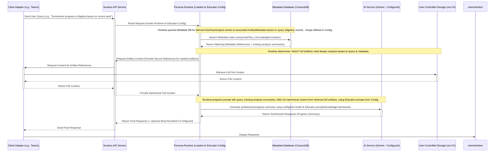

# Persona Configuration: Educator

## 1. Vision & Purpose

The Educator configuration defines a key persona for Nucleus, detailed within the overall [Personas Architecture Overview](../02_ARCHITECTURE_PERSONAS.md). It enables the [Persona Runtime/Engine](../02_ARCHITECTURE_PERSONAS.md#22-persona-runtimeengine) to act as a specialized assistant for educational use cases, stemming from the need to create safer, personalized, and authentic learning experiences, particularly recognizing learning within digital creation and self-directed projects ([Security Considerations](../06_ARCHITECTURE_SECURITY.md#2-data-governance--boundaries)).

When executed by the Runtime, this configuration aims to:

*   **Observe Authenticity:** Understand learning from artifacts referenced by metadata (e.g., coding projects, digital art).
*   **Document Process:** Analyze *how* learning occurs using configured knowledge frameworks (see Section 7) based on retrieved artifact content.
*   **Build Understanding:** Contribute to the dynamic, private knowledge base (metadata) for each learner by storing derived analysis (e.g., `PersonaKnowledgeEntry<EduFlowAnalysis>`).
*   **Provide Insight:** Enable querying of this knowledge base (via metadata search + ephemeral content retrieval) for progress reports and support.
*   **Foster Engagement:** Potentially leverage Nucleus capabilities to create tailored micro-learning experiences based on analysis.

It transforms ephemeral moments of creation (accessed securely by the Runtime) into tangible evidence of learning stored as secure metadata.

## 2. Typical Request Flow (Query about Learner Progress - Executed by Runtime)

**Purpose:** Illustrates how the Persona Runtime handles a query requesting analysis or summary of a learner's progress when loaded with the Educator configuration, referencing stored metadata and retrieving artifact content securely.

**Explanation:**
1.  A user sends a query via the **Client Adapter**.
2.  The API routes the request, identifies the `PersonaId` (e.g., `Educator_Grade5`), loads the corresponding Educator configuration, and invokes the **Persona Runtime**.
3.  The Runtime, guided by the Educator configuration, queries the **Metadata Database** (specifically the configured `EduFlow_v1KnowledgeContainer`) to find relevant `PersonaKnowledgeEntry<EduFlowAnalysis>` records and associated `ArtifactMetadata`.
4.  Based on the query and retrieved metadata, the Runtime identifies which original artifacts require retrieval of their **full content**.
5.  The Runtime requests this content securely via the standard API -> Adapter -> **User-Controlled Storage** flow.
6.  The Runtime receives the ephemeral content.
7.  The Runtime constructs a detailed prompt for the **AI Service** (using the model and specific educational prompts defined in the Educator configuration). This includes the query, metadata summaries, and the **rich, ephemeral context** from the full artifacts.
8.  The AI Service generates a synthesized response.
9.  The Runtime returns the final response to the API.
10. The API sends the response back to the Client Adapter.

## 3. Core Functionality (Enabled by Configuration)

When the Persona Runtime executes with an Educator configuration, it performs the following functions based on the configuration settings:

### 3.1 Interaction Processing & Analysis

*   **Contextual Understanding:** Interprets user queries within the educational domain (guided by configured prompts).
*   **Metadata-Driven Retrieval:** Identifies relevant knowledge entries (`PersonaKnowledgeEntry<EduFlowAnalysis>`) and source artifacts (`ArtifactMetadata`) via database queries, scoped by the configuration.
*   **Secure Content Access:** Orchestrates the retrieval of ephemeral, full artifact content via the Client Adapter when deeper context is needed.
*   **Content Analysis (On-Demand):** When processing requires analyzing newly retrieved artifact content, it utilizes the configured AI service (e.g., Gemini) guided by specific prompts and knowledge frameworks (referenced in the config) to:
    *   Extract key concepts, skills, objectives relevant to the query.
    *   Map content to configured knowledge frameworks.
    *   Generate insights.
*   *(Note: The initial creation of `PersonaKnowledgeEntry<EduFlowAnalysis>` still likely happens via a separate, specialized ingestion process/tool invoked by the user/adapter, ensuring security protocols are followed.)*

### 3.2 Query Handling & Synthesis

*   **Knowledge Retrieval:** Queries the configured `EduFlow_v1KnowledgeContainer` in Cosmos DB.
*   **Ephemeral Context Augmentation:** Combines retrieved metadata/analysis summaries with ephemerally retrieved full artifact content.
*   **Synthesis:** Uses the combined context, query, and configured prompts.
*   **Response Generation:** Leverages the configured LLM (via `IChatClient`) with Educator-specific prompts to generate a coherent response.

## 4. Data Schema (`PersonaKnowledgeEntry<EduFlowAnalysis>`)

(Schema definition remains unchanged - describes the data *stored* as a result of processes potentially initiated via the Educator persona configuration)

*   **Extends Base PKE:** Includes standard fields like `id`, `artifactId`, `tenantId`, `userId`, `personaId`, `createdAt`, `analysisSummaryEmbedding`, etc.
*   **`analysisData` (Type: `EduFlowAnalysis`):** Contains the detailed educational analysis:
    *   `subjects`: List of identified academic subjects.
    *   `skills`: List of skills demonstrated (mapped to pedagogical tree).
    *   `developmentalAreas`: List of cognitive/social-emotional processes involved (mapped to tautological tree).
    *   `learningObjectives`: Identified or inferred learning goals.
    *   `keyConcepts`: Extracted core ideas or topics.
    *   `summary`: Detailed narrative summary of the analysis.
    *   `suggestedNextSteps`: Potential follow-up activities or learning paths.
    *   `originalityScore`: (If applicable) Assessment of work originality.
*   **`relevantTextSnippets`:** List of objects, each containing:
    *   `text`: The extracted text snippet.
    *   `embedding`: Vector embedding of the snippet.
    *   `sourceLocation`: Pointer to the snippet's location within the original artifact (e.g., timestamp, page number).
    *   **Security Note:** Storing even sanitized text snippets derived from user content carries risk ([Data Governance Principles](../06_ARCHITECTURE_SECURITY.md#2-data-governance--boundaries)). The process creating these snippets MUST rigorously prevent inclusion of PII or sensitive data. Consider storing only embeddings and source locations if sanitization cannot be guaranteed.

*(Note: The exact `EduFlowAnalysis` structure is defined in the `Nucleus.Abstractions` project and may evolve.)*

## 5. Configuration Settings

Refers to settings defined in [Persona Configuration](./ARCHITECTURE_PERSONAS_CONFIGURATION.md), with Educator-specific values/types:

*   **`PersonaId`**: e.g., `Educator_Grade5`, `Educator_General`
*   **`DisplayName`**: e.g., "Educator (Grade 5)"
*   **`LlmConfiguration`**: Specifies models tuned or appropriate for educational analysis and response generation.
*   **`KnowledgeScope`**: Typically configured to access all user artifacts (`AllUserArtifacts`) or specific educational collections, targeting the `EduFlow_v1KnowledgeContainer`.
*   **`CorePrompt` / `SystemMessage`**: Tailored prompts emphasizing educational context, helpfulness, safety, and potentially referencing knowledge frameworks.
*   **`AgenticStrategy`**: May define specific steps for analysis or progress reporting.
*   **Educator-Specific Settings (Potentially via `CustomProperties` in config):**
    *   Specific prompt templates for analysis and synthesis.
    *   References to or identifiers for the Knowledge Trees (Pedagogical/Tautological).
    *   Configuration for specific analysis tasks.

## 6. Dependencies (for Runtime executing this config)

*   **`Nucleus.Abstractions`:** Uses `ArtifactMetadata`, `PersonaKnowledgeEntry<EduFlowAnalysis>`, `IArtifactMetadataRepository`, `IPersonaKnowledgeRepository<EduFlowAnalysis>`, `IChatClient`.
*   **Azure Cosmos DB SDK:** For interacting with the knowledge container.
*   **External AI SDKs:** (e.g., Google.Cloud.AIPlatform.V1) as invoked via `IChatClient` based on config.

## 7. Knowledge Framework: Pedagogical and Tautological Trees

(Content unchanged - remains valid description of the framework referenced in the configuration)

...

## 8. Next Steps

1.  **Define Formal Educator Configuration(s):** Create the actual configuration entries (e.g., in `appsettings.json` or database) for specific Educator personas (e.g., `Educator_Grade5`) according to the `PersonaConfiguration` schema, including custom properties for prompts and framework references.
2.  **Ensure Runtime Support:** Verify the generic Persona Runtime can correctly load and execute the Educator configuration, including accessing the `EduFlow_v1KnowledgeContainer` and using Educator-specific prompts.
3.  **Implement `IPersonaKnowledgeRepository<EduFlowAnalysis>`:** Develop the repository for educator knowledge entries if not already present.
4.  **Develop Query/Analysis Logic (within Runtime):** Ensure the Runtime's logic can handle the steps implied by the Educator configuration (metadata search, ephemeral content request, AI synthesis using specific prompts).
5.  **Refine Prompts:** Develop and test Educator-specific prompts to be included in the configuration.
6.  **Testing:** Test interaction flows thoroughly with the Runtime using Educator configurations.
7.  **(Deprecation):** Remove any old `EducatorPersona.cs` class attempting to implement core logic directly.
