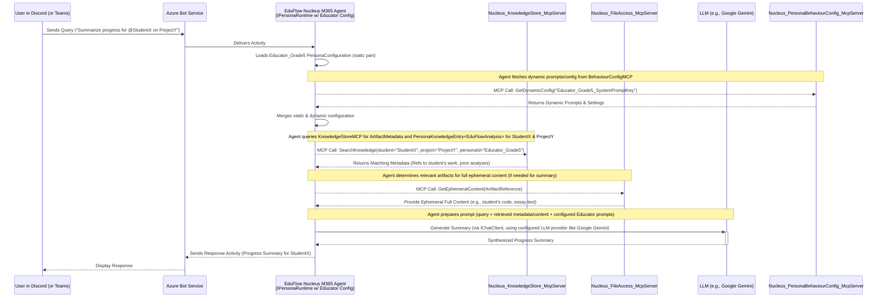

# Persona Configuration: Educator (M365 Agent)

## 1. Vision & Purpose

The Educator configuration defines a key persona for Nucleus, detailed within the overall [Personas Architecture Overview](../02_ARCHITECTURE_PERSONAS.md). It enables a **Nucleus M365 Persona Agent** (e.g., `EduFlowM365Agent`) to act as a specialized assistant for educational use cases. This stems from the need to create safer, personalized, and authentic learning experiences, particularly recognizing learning within digital creation and self-directed projects ([Security Considerations](../06_ARCHITECTURE_SECURITY.md#2-data-governance--boundaries)).

When this configuration is loaded by the `IPersonaRuntime` within the `EduFlowM365Agent`, it aims to:

*   **Observe Authenticity:** Understand learning from artifacts referenced by metadata (e.g., coding projects, digital art), accessed via MCP calls to `Nucleus_FileAccess_McpServer`.
*   **Document Process:** Analyze *how* learning occurs using configured knowledge frameworks (see Section 7 of [Persona Configuration](./ARCHITECTURE_PERSONAS_CONFIGURATION.md)) based on retrieved artifact content and analysis by its configured LLM (e.g., Gemini, Azure OpenAI).
*   **Build Understanding:** Contribute to the dynamic, private knowledge base for each learner by storing derived analysis (e.g., `PersonaKnowledgeEntry<EduFlowAnalysis>`) via MCP calls to `Nucleus_KnowledgeStore_McpServer`.
*   **Provide Insight:** Enable querying of this knowledge base (via MCP calls for metadata search + ephemeral content retrieval) for progress reports and support.
*   **Foster Engagement:** Potentially leverage Nucleus capabilities to create tailored micro-learning experiences based on analysis.

It transforms ephemeral moments of creation (accessed securely by the M365 Agent via MCP Tools) into tangible evidence of learning stored as secure metadata.

## 2. Typical Request Flow (Query about Learner Progress - M365 Agent & MCP Tools)

**Purpose:** Illustrates how the `EduFlowM365Agent` handles a query requesting analysis or summary of a learner's progress, using its configuration to invoke backend MCP Tools and an LLM.

**Explanation:**
1.  A user (e.g., a teacher) sends a query via a platform like Discord or Teams, mentioning the `EduFlowM365Agent`.
2.  The Azure Bot Service delivers the activity to the `EduFlowM365Agent`.
3.  The agent's `IPersonaRuntime` loads its foundational `Educator` persona configuration (e.g., `Educator_Grade5_Config`).
4.  The agent calls the `Nucleus_PersonaBehaviourConfig_McpServer` to fetch dynamic/behavioral aspects of its configuration (e.g., specific system prompts, response guidelines for "Educator_Grade5").
5.  The agent merges static and dynamic configurations.
6.  Guided by the merged configuration (e.g., `KnowledgeScope`), the agent invokes the `Nucleus_KnowledgeStore_McpServer` (an MCP Tool) to search for relevant `ArtifactMetadata` and `PersonaKnowledgeEntry<EduFlowAnalysis>` records related to the student and project.
7.  The `Nucleus_KnowledgeStore_McpServer` returns metadata, including references to the student's actual work artifacts.
8.  If the summary requires deeper context than available in metadata, the agent invokes the `Nucleus_FileAccess_McpServer` (an MCP Tool) to securely and ephemerally retrieve the content of specific artifacts.
9.  The agent constructs a detailed prompt using the user's query, the retrieved metadata, any ephemerally fetched content, and the (dynamically sourced) prompts from its `Educator` configuration.
10. The agent calls its configured LLM (e.g., Google Gemini, via `IChatClient` and the settings in `LlmConfiguration`) to generate a progress summary.
11. The LLM returns the synthesized summary.
12. The `EduFlowM365Agent` formats the response and sends it back to the user via the Azure Bot Service.

## 3. Key Configuration Settings (Illustrative for Educator)

This section highlights how the [General Persona Configuration](./ARCHITECTURE_PERSONAS_CONFIGURATION.md) schema would be specialized for an `EduFlowM365Agent`.

*   **`PersonaId`**: `EduFlow_Grade5_M365Agent` (Example)
*   **`DisplayName`**: "EduFlow Learning Assistant (Grade 5)"
*   **`LlmConfiguration`**:
    *   `Provider`: `GoogleGemini` (Example, could also be `AzureOpenAI`, `OpenRouterAI`)
    *   `ChatModelId`: `gemini-1.5-pro-latest` (Example)
    *   `EmbeddingModelId`: `text-embedding-004` (Example)
    *   `ApiKeySecretName`: `GoogleAIStudioApiKey` (Stored in Azure Key Vault, referenced by App Config)
    *   `EndpointUrl`: (Optional, if not using default Google AI endpoint)
*   **`EnabledTools`**: (MCP Tool IDs)
    *   `Nucleus.KnowledgeStore.Search`
    *   `Nucleus.KnowledgeStore.StoreEntry`
    *   `Nucleus.FileAccess.GetEphemeralContent`
    *   `Nucleus.AiAnalysis.GenerateEduInsight` (A hypothetical specialized MCP tool for educational analysis)
*   **`KnowledgeScope`**:
    *   `Strategy`: `TargetedLearnerAndSubject` (A custom strategy for educators)
    *   `TargetKnowledgeContainerId`: `EduFlow_Grade5_KB` (Points to a specific Cosmos DB container for Grade 5 learning data, accessed via `Nucleus_KnowledgeStore_McpServer`)
*   **Prompt Configuration (Keys for Dynamic Sourcing)**:
    *   `SystemMessageKey`: `EduFlow_Grade5_SystemPrompt_v2`
    *   `ResponseGuidelinesKey`: `EduFlow_GeneralResponseGuidelines_v1`
*   **Agentic Strategy Configuration**:
    *   `StrategyType`: `ToolUsing` (To allow explicit calls to `Nucleus.AiAnalysis.GenerateEduInsight` MCP Tool)
*   **Custom Properties (Keys for Dynamic Sourcing)**:
    *   `CustomPropertiesKeys`: [`EduFlow_LearningFacetsSchema_v1`, `EduFlow_Grade5CurriculumTags_v1.2`] (Keys to fetch specific schemas or tags from `Nucleus_PersonaBehaviourConfig_McpServer` to guide analysis)

## 4. Security & Data Handling

*   The `EduFlowM365Agent` operates with M365 permissions, accessing student data (files, conversations) only as permitted by its Entra ID configuration and user consent.
*   MCP Tool calls (e.g., to `Nucleus_FileAccess_McpServer`) are made securely, and these tools enforce their own access controls, often inheriting or validating M365 context.
*   Sensitive data (student work) is processed ephemerally. Only derived metadata and `PersonaKnowledgeEntry` analyses are stored persistently by `Nucleus_KnowledgeStore_McpServer`.
*   All configurations, especially API keys (`ApiKeySecretName`), are managed securely via Azure App Configuration and Key Vault.

This revised structure aligns the Educator persona with the M365 Agent and MCP architecture, emphasizing dynamic configuration, multi-LLM support, and clear separation of concerns between the agent's orchestration logic and the specialized functions of backend MCP Tools.
