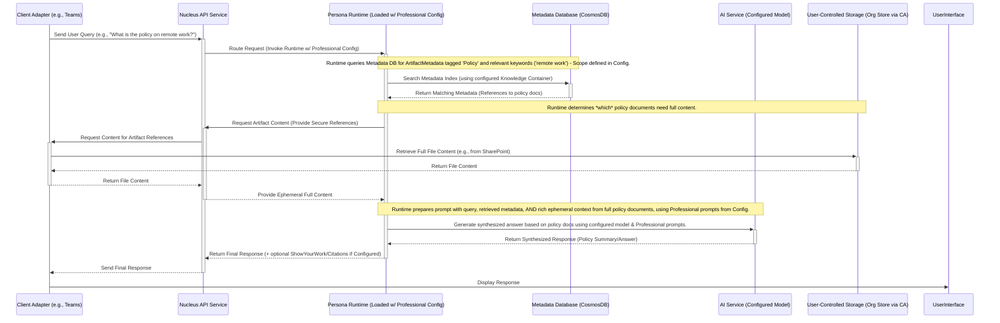

# Persona Configuration: Professional Colleague

## 1. Vision & Purpose

The Professional Colleague configuration defines a persona tailored for workplace environments, as outlined in the [Personas Architecture Overview](../02_ARCHITECTURE_PERSONAS.md). It enables the [Persona Runtime/Engine](../02_ARCHITECTURE_PERSONAS.md#22-persona-runtimeengine) to act as a knowledgeable and helpful assistant, capable of leveraging organizational knowledge and adhering to professional communication standards and security protocols ([Security Considerations](../06_ARCHITECTURE_SECURITY.md#2-data-governance--boundaries)).

When executed by the Runtime, this configuration aims to:

*   **Provide Contextual Assistance:** Answer questions, summarize documents, and provide information based on organizational artifacts (referenced via metadata).
*   **Facilitate Knowledge Discovery:** Help users find relevant documents, policies, or previous discussions stored within the organization's knowledge base (metadata).
*   **Maintain Professionalism:** Interact in a manner suitable for a corporate setting (guided by configured prompts).
*   **Adhere to Security:** Strictly follow protocols for accessing potentially sensitive corporate data ephemerally and securely.
*   **Support Specific Workflows:** Configurations can be specialized for roles like IT Helpdesk (see [Azure/.NET Helpdesk Example](./Professional/ARCHITECTURE_AZURE_DOTNET_HELPDESK.md)) or project management support.

## 2. Typical Request Flow (Query about Company Policy - Executed by Runtime)

**Purpose:** Illustrates how the Persona Runtime handles a query about a specific company policy when loaded with a Professional Colleague configuration, retrieving relevant documents securely.

**Explanation:**
1.  A user asks a question via the **Client Adapter** (e.g., Teams).
2.  The API routes the request, identifies the `PersonaId` (e.g., `Professional_Helpdesk`), loads the corresponding Professional configuration, and invokes the **Persona Runtime**.
3.  The Runtime, guided by the Professional configuration, queries the **Metadata Database** (using the configured Knowledge Container) to find relevant `ArtifactMetadata` (e.g., documents tagged as 'Policy' matching keywords).
4.  Based on the query and retrieved metadata, the Runtime identifies which policy documents require retrieval of their **full content**.
5.  The Runtime requests this content securely via the standard API -> Adapter -> **User-Controlled Storage** (e.g., Org SharePoint) flow.
6.  The Runtime receives the ephemeral content.
7.  The Runtime constructs a prompt for the **AI Service** (using the model and specific professional/helpful prompts defined in the configuration). This includes the query, metadata, and the **rich, ephemeral context** from the full policy documents.
8.  The AI Service generates a synthesized response summarizing the policy.
9.  The Runtime returns the final response (potentially with citations if configured) to the API.
10. The API sends the response back to the Client Adapter.

## 3. Core Functionality (Enabled by Configuration)

When the Persona Runtime executes with a Professional Colleague configuration, it performs the following based on settings:

*   **Domain-Specific Context:** Interprets queries within a professional/workplace context (guided by configured prompts).
*   **Targeted Knowledge Retrieval:** Queries specified Knowledge Containers in the **Metadata Database** for relevant `ArtifactMetadata` or `PersonaKnowledgeEntry` records based on user query and configuration scope (e.g., specific project folders, company-wide policies).
*   **Secure Artifact Access:** Orchestrates ephemeral retrieval of full document content from **User-Controlled Storage** (like SharePoint, OneDrive) when required for accurate answers, strictly adhering to security protocols ([Security Principles](../06_ARCHITECTURE_SECURITY.md#2-data-governance--boundaries)).
*   **Synthesis and Summarization:** Uses the configured AI Service with tailored prompts to analyze retrieved ephemeral content and metadata, summarizing information or answering specific questions.
*   **Professional Response Generation:** Crafts responses appropriate for a workplace setting, potentially including citations to source documents (based on metadata).

## 4. Configuration Settings

Refers to settings defined in [Persona Configuration](./ARCHITECTURE_PERSONAS_CONFIGURATION.md), with Professional Colleague-specific values:

*   **`PersonaId`**: e.g., `Professional_General`, `Helpdesk_IT`, `Project_Alpha_Support`
*   **`DisplayName`**: e.g., "Professional Assistant", "IT Helpdesk Bot"
*   **`LlmConfiguration`**: Specifies models suitable for professional communication, summarization, and potentially code understanding (if applicable to the role).
*   **`KnowledgeScope`**: Configured to access specific organizational data sources (e.g., specific SharePoint sites, project folders identified by metadata tags) or broader company knowledge, targeting specific Knowledge Containers.
*   **`CorePrompt` / `SystemMessage`**: Tailored prompts emphasizing helpfulness, professionalism, accuracy, data privacy awareness, and potentially role-specific instructions (e.g., IT Helpdesk troubleshooting steps).
*   **`AgenticStrategy`**: May define workflows for common tasks like information retrieval, summarization, or routing to human experts if configured.
*   **`EnabledTools`**: Could potentially include tools for interacting with other enterprise systems (e.g., ticketing systems) if the Runtime architecture supports tool use.
*   **Professional-Specific Settings (Potentially via `CustomProperties`):**
    *   Specific prompt templates for different query types (e.g., policy lookup, document summary).
    *   Configuration for citation generation.
    *   Mappings or keywords relevant to the specific professional domain (e.g., IT terms, project names).

## 5. Specializations

Specific Professional Colleague configurations can be created for specialized roles:

*   **IT Helpdesk:** Configured with prompts and knowledge scopes relevant to common IT issues, software documentation, and troubleshooting guides. See [Azure/.NET Helpdesk Example](./Professional/ARCHITECTURE_AZURE_DOTNET_HELPDESK.md).
*   **Project Assistant:** Configured to access project-specific documents, meeting notes, and task lists, with prompts tailored for project status updates or finding specific requirements.
*   **HR Assistant:** Configured with knowledge scope limited to HR policies and FAQs, using prompts focused on answering employee questions accurately and confidentially.

## 6. Dependencies (for Runtime executing this config)

*   **`Nucleus.Abstractions`:** Uses `ArtifactMetadata`, `PersonaKnowledgeEntry` (if applicable), `IArtifactMetadataRepository`, `IPersonaKnowledgeRepository` (if applicable), `IChatClient`.
*   **Azure Cosmos DB SDK:** For interacting with metadata/knowledge containers.
*   **External AI SDKs:** As invoked via `IChatClient` based on config.
*   **(Potential):** SDKs for interacting with other enterprise systems if configured with tools.

## 7. Next Steps

1.  **Define Formal Professional Configuration(s):** Create actual configuration entries for general and specialized Professional personas (e.g., `Helpdesk_IT`) using the `PersonaConfiguration` schema.
2.  **Ensure Runtime Support:** Verify the generic Persona Runtime can correctly load and execute Professional configurations, including accessing specified knowledge scopes and using appropriate prompts.
3.  **Implement Repositories:** Ensure `IArtifactMetadataRepository` and potentially `IPersonaKnowledgeRepository` are implemented and accessible.
4.  **Develop Runtime Logic:** Ensure Runtime logic supports professional workflows (e.g., citation generation, potentially tool use if planned).
5.  **Refine Prompts:** Develop and test prompts tailored for professional interaction and specific roles.
6.  **Testing:** Thoroughly test interaction flows, focusing on accuracy, security, and professional tone.
7.  **(Deprecation):** Remove any old `ProfessionalPersona.cs` class.