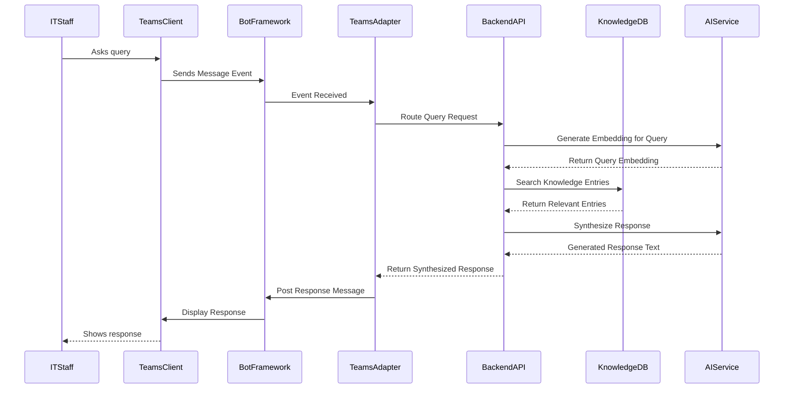

# Persona: Professional Colleague

## 1. Vision & Purpose

The Professional Colleague persona aims to seamlessly integrate into a user's workflow, acting as a knowledgeable and efficient digital teammate, as outlined in the [Personas Architecture Overview](../02_ARCHITECTURE_PERSONAS.md). Its purpose is to assist with common professional tasks, such as retrieving information from connected enterprise systems (e.g., knowledge bases, ticketing systems, project trackers), summarizing documents or conversations, drafting communications, and providing contextual insights relevant to ongoing work. Unlike specialized personas, the Professional Colleague offers broad, generalist support, reducing friction in daily tasks and augmenting the user's productivity by acting as an readily available assistant that understands the work context. It leverages organizational knowledge passively ingested or actively queried through tools to provide relevant and timely help.

## 2. Typical Request Flow (IT Helpdesk)

**Purpose:** Illustrates the sequence of interactions when an IT staff member queries the Helpdesk persona via Teams.

**Explanation:** This sequence shows a query originating from an IT staff member in Teams. The message flows through the Bot Framework to the Nucleus Teams Adapter. The adapter forwards the query to the backend API/handler. The backend generates a vector embedding for the query, searches the `PersonaKnowledgeEntry` data in Cosmos DB using the embedding and any relevant filters (like detected error codes), retrieves the most relevant derived knowledge (structured data, snippets, vectors), and uses the AI service to synthesize a user-friendly response based on those retrieved items. The response is then sent back through the layers to the user in Teams.

See [Azure .NET IT Helpdesk Reference Implementation](./Professional/ARCHITECTURE_AZURE_DOTNET_HELPDESK.md) for a specific deployment example of this flow.

## 3. Core Functionality

The Professional Colleague persona implements the [`IPersona`](cci:2://file:///d:/Projects/Nucleus/src/Abstractions/Nucleus.Abstractions/IPersona.cs:0:0-0:0) interface defined in the `Nucleus.Abstractions` project.

### 3.1 Ingestion / Analysis (Optional)

*   Unlike the Educator, the Professional Colleague might not perform deep analysis on every artifact during ingestion. Its focus is often more on the immediate query context.
*   However, it *could* be configured to analyze specific types of work artifacts (e.g., meeting transcripts, project documents) to build a background knowledge base.
*   If analysis occurs, it would likely focus on extracting entities, summaries, action items, and project relevance.

### 3.2 Query Handling

*   **Contextual Retrieval:** Accesses relevant `ArtifactMetadata` and potentially its own `ProfessionalColleagueKnowledgeContainer` (if background analysis is enabled) based on the query.
*   **Tool Use (Future):** May leverage tools to interact with enterprise systems (e.g., query a ticketing system, check project status in Jira).
*   **Synthesis & Response:** Combines retrieved information, tool results, and user context to generate a helpful, professional response using an LLM.

## 4. Data Schema (`PersonaKnowledgeEntry<ProfessionalAnalysis>` - If Applicable)

If background analysis is implemented, the schema might include:

*   **Extends Base PKE:** Standard fields.
*   **`analysisData` (Type: `ProfessionalAnalysis`):**
    *   `mentionedPeople`: List of individuals referenced.
    *   `mentionedProjects`: List of projects or workstreams.
    *   `keyTopics`: Extracted subjects or themes.
    *   `actionItems`: Identified tasks or follow-ups.
    *   `sentiment`: Overall tone or sentiment.
    *   `summary`: Narrative summary of the artifact's professional context.
*   **`relevantTextSnippets`:** Standard snippet structure with embeddings.

*(Note: This schema is conceptual and depends on enabling background analysis.)*

## 5. Configuration

*   **AI Service Endpoints/Keys.**
*   **Prompts:** Tailored for professional communication, task assistance, and information synthesis.
*   **Tool Integration Settings (Future):** Configuration for accessing enterprise APIs.
*   **Background Analysis Rules (Optional):** Triggers and scope for analyzing work artifacts.

## 6. Dependencies

*   **`Nucleus.Abstractions`:** Uses `IPersona`, `ArtifactMetadata`, potentially `PersonaKnowledgeEntry<T>`, repositories, DTOs.
*   **`Microsoft.Extensions.AI`:** Uses `IChatClient`.
*   **Azure Cosmos DB SDK.**
*   **External AI SDKs.**
*   **Enterprise Tool SDKs (Future):** (e.g., Atlassian.Jira, Microsoft.Graph).

## 7. Next Steps

1.  **Implement `ProfessionalColleaguePersona.cs`:** Create the concrete class implementing [`IPersona`](cci:2://file:///d:/Projects/Nucleus/src/Abstractions/Nucleus.Abstractions/IPersona.cs:0:0-0:0).
2.  **Define `ProfessionalAnalysis` (Optional):** If background analysis is desired, define the C# structure in `Nucleus.Abstractions`.
3.  **Implement Knowledge Repository (Optional):** If background analysis is desired, implement `IPersonaKnowledgeRepository<ProfessionalAnalysis>`.
4.  **Develop Core Query Logic:** Implement the primary request/response flow, focusing initially on stateless interaction or simple `ArtifactMetadata` retrieval.
5.  **Integrate LLM:** Connect to `IChatClient` for response generation.
6.  **Plan Tool Integration (Future):** Design the architecture for incorporating enterprise tool access.