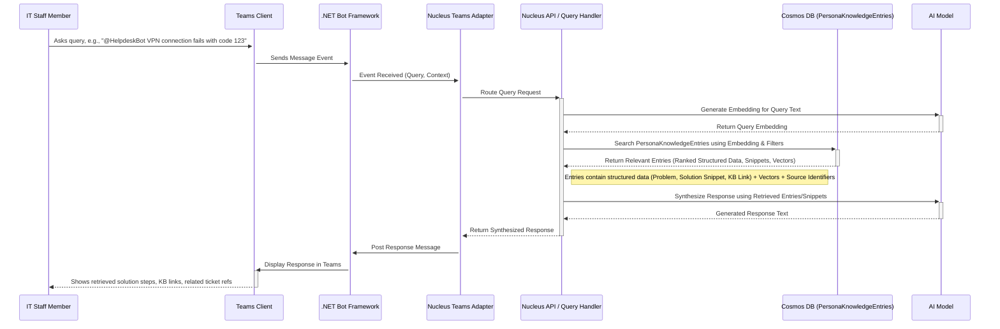

# Persona: Professional Colleague

## Typical Request Flow (IT Helpdesk)

**Purpose:** Illustrates the sequence of interactions when an IT staff member queries the Helpdesk persona via Teams.

**Explanation:** This sequence shows a query originating from an IT staff member in Teams. The message flows through the Bot Framework to the Nucleus Teams Adapter. The adapter forwards the query to the backend API/handler. The backend generates a vector embedding for the query, searches the `PersonaKnowledgeEntry` data in Cosmos DB using the embedding and any relevant filters (like detected error codes), retrieves the most relevant derived knowledge (structured data, snippets, vectors), and uses the AI service to synthesize a user-friendly response based on those retrieved items. The response is then sent back through the layers to the user in Teams.