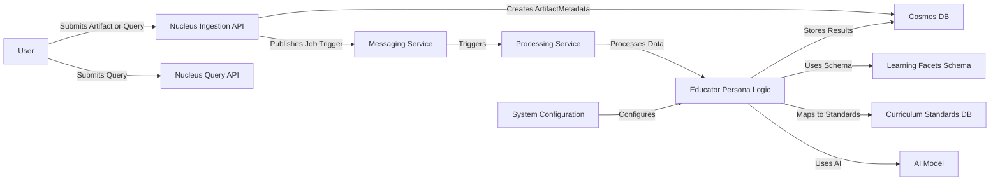
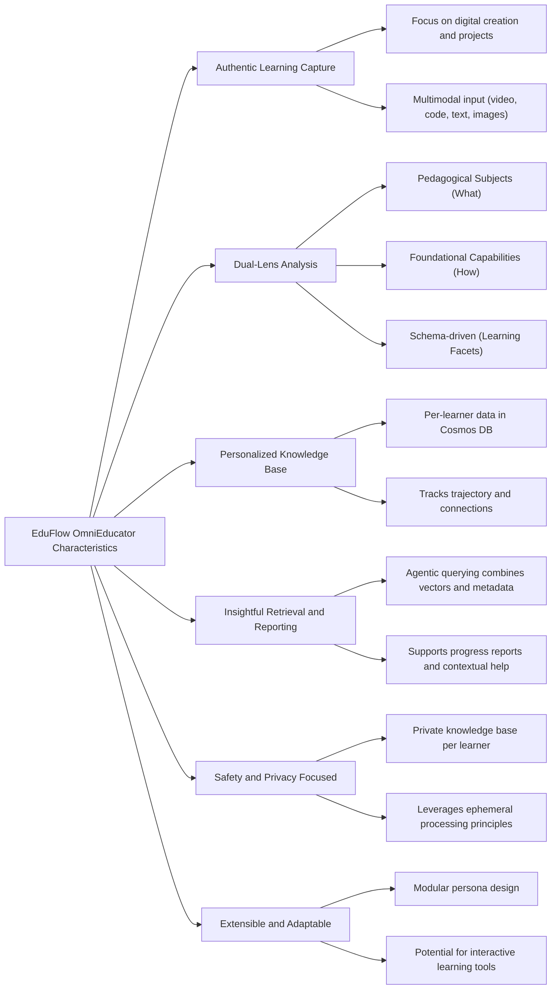

# Reference Implementation: Educator Persona

This document outlines conceptual architecture, data flow, and key models for implementing the Educator (EduFlow OmniEducator) persona, as described in the main [Educator Persona Overview](../ARCHITECTURE_PERSONAS_EDUCATOR.md).

## 1. High-Level Component Architecture (Conceptual)

**Purpose:** Shows the interaction of components specifically focused on the Educator persona's functions, assuming deployment within a cloud environment (e.g., Azure).

**Explanation:** User interactions (submitting artifacts or querying) go through dedicated APIs. Artifact ingestion triggers asynchronous processing via a messaging service. The Processing Service coordinates with the Educator Persona Module, which utilizes AI services, internal schemas (Learning Facets), and potentially external standards databases to analyze content. Results (`PersonaKnowledgeEntry`) are stored in Cosmos DB. Queries are handled more directly, retrieving stored knowledge and synthesizing answers.

## 2. Core Data Model Summary

This persona relies heavily on structured data captured during the 'slow path' analysis, stored as `PersonaKnowledgeEntry` documents. These entries link back to the source `ArtifactMetadata` and reference conceptual models like:

*   **`LearnerProfile`**: Represents the individual learner.
*   **`Goal`**: Tracks learning objectives.
*   **`LearningActivity` / `Project`**: Describes the context of artifact creation.
*   **`LearningArtifact` / `LearningEvidence`**: (Stored as `ArtifactMetadata`) The source material.
*   **`KnowledgeDomain`**: Classifies content using both Pedagogical Subjects (e.g., Math, Art) and Foundational Capabilities (e.g., Critical Thinking, Problem Solving).
*   **`Skill`**: Specific abilities demonstrated within domains.

**Key `PersonaKnowledgeEntry` Fields (Conceptual for Educator):**

*   `artifactId` (Link to `ArtifactMetadata`)
*   `learnerId`
*   `analysisTimestamp`
*   `analysisType`: "LearningEvidenceAnalysis"
*   `summary`: AI-generated summary of the artifact's educational relevance.
*   `identifiedDomains`: List<[`KnowledgeDomain.domain_id`, confidence_score]>
*   `identifiedSkills`: List<[`Skill.skill_id`, confidence_score, evidence_snippet]>
*   `learningFacetsAnalysis`: JSON object detailing observations based on the Facets schema (e.g., { "problemSolving": { "level": "Applied", "evidence": "..." }, ... })
*   `standardMappings`: List<[`Standard.standard_id`, relevance_score]>
*   `vectorEmbeddings`: List<{ `snippet`: string, `embedding`: float[] }>

## 3. Key Architectural Characteristics

**Explanation:** The Educator persona prioritizes capturing learning from authentic activities, analyzing it through multiple lenses (subject matter and cognitive processes), storing this rich data securely per learner, and enabling powerful querying for insights. Its design emphasizes privacy and adaptability.

## 4. Potential Future Extensions

*   **Interactive Learning Tools:** Leverage Nucleus's ability to execute tools (e.g., `PROCESSING_DATAVIZ`) to create small, tailored learning games or exercises dynamically.
*   **Proactive Suggestions:** Based on analyzed progress, suggest related activities or areas for exploration.
*   **Collaborative Features:** Allow sharing of progress or insights between learners, parents, and educators (with explicit consent).
*   **Advanced Standards Alignment:** Deeper integration with specific curriculum standards databases.
