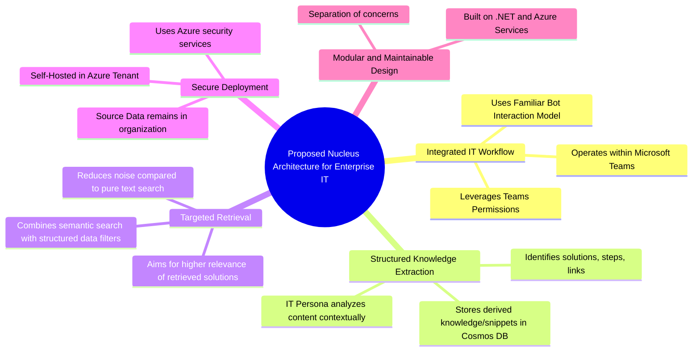

# Reference Implementation: Azure .NET IT Helpdesk

This document outlines a reference architecture for implementing the Nucleus OmniRAG system specifically for an IT Helpdesk scenario, deployed within a Microsoft Azure environment using .NET technologies. It provides a specific implementation example for the general concepts described in the main [Professional Colleague Persona Overview](../ARCHITECTURE_PERSONAS_PROFESSIONAL.md).

## 1. High-Level Component Architecture

**Purpose:** Shows the major software components and their interactions within the Azure ecosystem for the Helpdesk use case.

```mermaid
graph LR
    User[IT Staff]
    TeamsClient[Teams Client]
    DotNetBotFramework[Bot Framework]
    TeamsAdapter[Teams Adapter]
    ServiceBus[Service Bus]
    DotNetProcessingSvc[Processing Service]
    Orchestrator[Orchestrator]
    ItHelpdeskPersona[Helpdesk Persona]
    AzureOpenAI[AI Service]
    CosmosDB[Cosmos DB]
    AzureAppConfig[App Configuration]

    User -- Sends Message --> TeamsClient
    TeamsClient -- Interacts with Bot --> DotNetBotFramework
    DotNetBotFramework -- Uses Adapter --> TeamsAdapter
    TeamsAdapter -- Publishes Job Trigger --> ServiceBus
    ServiceBus -- Triggers Processing --> DotNetProcessingSvc
    DotNetProcessingSvc -- Orchestrates --> Orchestrator
    Orchestrator -- Invokes Persona --> ItHelpdeskPersona
    ItHelpdeskPersona -- Uses AI --> AzureOpenAI
    ItHelpdeskPersona -- Stores Knowledge --> CosmosDB
    AzureAppConfig -- Configures --> Orchestrator
```

**Explanation:** This architecture uses Azure services. User interaction occurs via Teams, handled by a .NET Bot Framework bot and a Nucleus Teams Adapter. Queries and processing job triggers are published to Azure Service Bus Topics for asynchronous handling by a .NET Processing Service (potentially Azure Functions or a Worker Service running in Azure Container Apps). This service orchestrates ephemeral ingestion, interacts with the IT Helpdesk Persona module (which uses Azure OpenAI or similar for analysis), generates embeddings for derived snippets, and reads/writes metadata (`ArtifactMetadata`) and derived knowledge (`PersonaKnowledgeEntry`) to Azure Cosmos DB. Configuration is centrally managed via Azure App Configuration.

## 2. Key Architectural Characteristics

**Purpose:** Highlights the non-functional benefits and design principles of this specific implementation approach.

**Explanation:** This mind map summarizes the advantages of this Azure/.NET-based implementation for a specific IT Helpdesk scenario. Key benefits include seamless integration into the existing Teams workflow, the ability to extract structured solutions (not just text), more precise retrieval using combined vector and metadata filtering, a secure deployment model within the company's Azure tenant, and a modular design based on standard .NET and Azure practices facilitating future maintenance and expansion.
