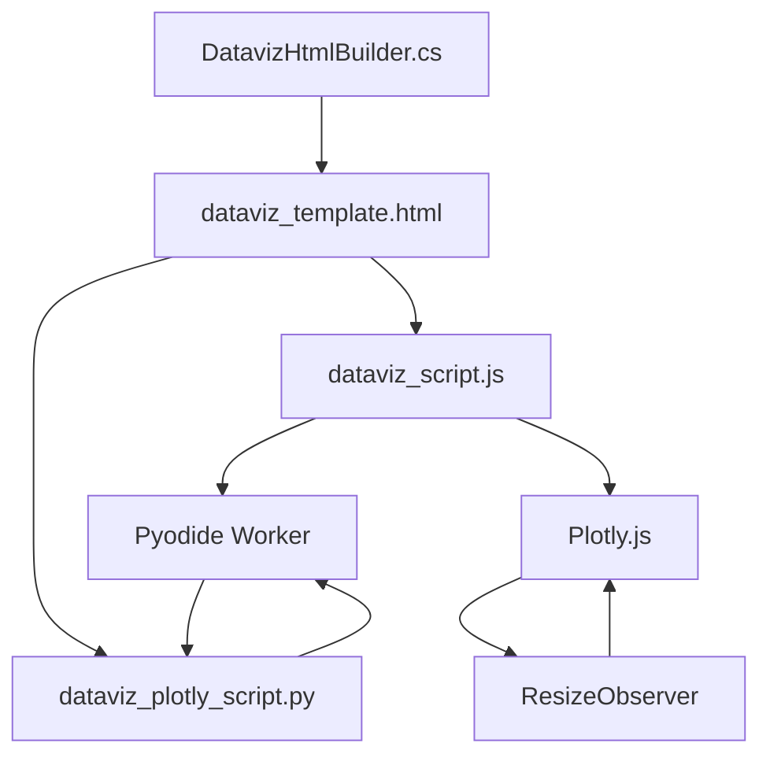

# Cross-Links to Code & Example
- [dataviz_script.js](../../../Nucleus.Processing/Resources/Dataviz/dataviz_script.js)
- [dataviz_plotly_script.py](../../../Nucleus.Processing/Resources/Dataviz/dataviz_plotly_script.py)
- [DatavizHtmlBuilder.cs](../../../Nucleus.Processing/Services/DatavizHtmlBuilder.cs)
- [Working Example Output](./EXAMPLE_OUTPUT_nucleus_dataviz_20250416145545.html)

# Delivering AI-Generated Pyodide Visualizations in Teams via Self-Contained HTML Artifacts

## 1. Introduction

This report details an architecture for generating and delivering interactive, AI-driven data visualizations within Microsoft Teams, based on the concepts outlined in the [Data Visualization Overview](../ARCHITECTURE_PROCESSING_DATAVIZ.md). It builds upon the previous analysis, incorporating the requirements for:

1. **Self-Contained Artifact:** Generating a single `viz.html` file containing all necessary HTML, CSS (branded), JavaScript, the AI-generated Python script, and the associated data.
2. **Teams/SharePoint Storage:** Storing this `viz.html` file as a persistent artifact within the relevant Team's SharePoint document library (specifically in a `.Nucleus/Artifacts/` folder).
3. **Task Module Delivery:** Using a Teams Task Module (Dialog) to present the interactive visualization to the user, launched from a bot message.
4. **Integrated Hosting:** Minimizing external dependencies by integrating the necessary components for delivering the HTML content to the Task Module within the C# Bot Framework application itself, aiming for a single deployable unit.

The core idea is to leverage the C# bot to orchestrate the creation and storage of a fully functional, interactive HTML visualization file, and then reliably deliver its content for rendering within the Teams UI.

> **See also:** [Section 3.1: Rationale for Refactoring Away from Script Injection](#31-rationale-for-refactoring-away-from-script-injection)

## 2. Core Artifact: The `viz.html` Template

The foundation of this approach is a set of template files that the C# [`DatavizHtmlBuilder`](../../../Nucleus.Processing/Services/DatavizHtmlBuilder.cs) populates. These templates include placeholders for branding, the Python script, and the data, along with the necessary JavaScript to load Pyodide and render the visualization.

The key template files involved are:

*   **[`dataviz_template.html`](../../../Nucleus.Processing/Resources/Dataviz/dataviz_template.html):**
    *   Provides the main HTML structure (`<head>`, `<body>`).
    *   Includes CDN links for Pyodide and Plotly.
    *   Defines `div` elements for loading indicators, plot output, errors, buttons, and modals.
    *   Contains placeholders (`{{PLACEHOLDER}}`) where the builder injects CSS, the main script, the worker script, the original Python script (for viewing), and the JSON data (for viewing).

*   **[`dataviz_styles.css`](../../../Nucleus.Processing/Resources/Dataviz/dataviz_styles.css):**
    *   Contains all CSS rules for styling the page elements, including layout, fonts, colors, and modal appearance.
    *   This content is injected directly into a `<style>` tag within the final HTML's `<head>` by the builder.

*   **[`dataviz_script.js`](../../../Nucleus.Processing/Resources/Dataviz/dataviz_script.js):**
    *   Handles the primary client-side logic.
    *   Reads the embedded Python script, JSON data, and worker script from `<script>` tags placed in the final HTML by the builder.
    *   Initializes the Pyodide Web Worker.
    *   Manages communication (`postMessage`/`onmessage`) with the worker.
    *   Updates the DOM to show loading status, plot output, or errors.
    *   Contains event listeners for the export/view buttons and modal logic.
    *   Handles plot resizing logic using `ResizeObserver`.

*   **[`dataviz_worker.js`](../../../Nucleus.Processing/Resources/Dataviz/dataviz_worker.js):**
    *   Runs in a separate Web Worker thread.
    *   Imports and initializes the Pyodide engine.
    *   Installs necessary Python packages (e.g., `micropip`, `plotly`, `pandas`).
    *   Receives the specific Python code snippet and JSON data from the main script via `onmessage`.
    *   Executes the Python code, making the data available to it.
    *   Sends the results (rendered plot HTML/SVG or error messages) back to the main script via `postMessage`.

*   **[`dataviz_plotly_script.py`](../../../Nucleus.Processing/Resources/Dataviz/dataviz_plotly_script.py):**
    *   Provides the standard Python environment structure that runs inside the Pyodide worker.
    *   Includes common imports (`js`, `json`, `pandas`, `plotly`, `matplotlib`, etc.).
    *   Contains helper functions (e.g., `render_plotly_to_div_string`, `render_matplotlib_to_svg_string`).
    *   Includes boilerplate code to load the `jsonData` passed from JavaScript into a pandas DataFrame.
    *   Defines the placeholder area (`### START AI GENERATED CODE ###`...`### END AI GENERATED CODE ###`) where the specific visualization code provided by the Persona is executed.
    *   Captures the output figure (`final_fig_plotly` or `final_fig_matplotlib`) and prepares it for sending back to the main JavaScript thread.

This modular template approach allows the `DatavizHtmlBuilder` to assemble a complete, functional visualization artifact by combining these standard parts with the dynamic content (Python code, JSON data) provided by an AI Persona.

## 3. Artifact Generation Process (`viz.html`)

> **See also:** [Section 3.1: Rationale for Refactoring Away from Script Injection](#31-rationale-for-refactoring-away-from-script-injection)

C#

```csharp
using System.Text;
using System.Text.Json; // Requires System.Text.Json nuget package
using System.Text.RegularExpressions; // For escaping

//... within your bot logic (e.g., inside a Dialog or Activity Handler)

// 1. Load the HTML template content
string templateHtml = await File.ReadAllTextAsync("./path/to/your/template.html"); // Adjust path

// 2. Get Branding CSS (e.g., from config)
string brandingCss = "/* Your custom CSS rules here */\n.plotly-graph-div { border: 1px solid #ccc; }"; // Example

// 3. Get AI-generated Python code snippet and JSON data
string aiPythonSnippet = @"
# Example AI code:
final_fig_plotly = px.histogram(data_frame, x=data_frame.columns, title='AI Histogram')
js.pyodideWorker.postMessage({ type: 'progress', payload: 0.6 });
"; // Replace with actual AI output

object aiDataObject = new { // Replace with actual data structure
    data = new {
        new { category = "A", value = 10 },
        new { category = "B", value = 25 },
        new { category = "C", value = 15 }
    },
    metadata = new { title = "Sample Data" }
};
string aiJsonDataString = JsonSerializer.Serialize(aiDataObject, new JsonSerializerOptions { WriteIndented = true });

// 4. Inject into template
string finalHtml = templateHtml;

// Inject CSS
finalHtml = finalHtml.Replace("", brandingCss);

// Inject Python (escape backticks, backslashes, ${} for JS template literals)
string escapedPythonSnippet = aiPythonSnippet
   .Replace("\\", "\\\\") // Escape backslashes
   .Replace("`", "\\`")  // Escape backticks
   .Replace("${", "\\${"); // Escape ${ sequence
finalHtml = finalHtml.Replace("### START AI GENERATED CODE ###", "### START AI GENERATED CODE ###\n" + escapedPythonSnippet); // Inject within markers

// Inject JSON data
finalHtml = finalHtml.Replace("/* JSON_DATA_PLACEHOLDER */ {}", $"/* JSON_DATA_PLACEHOLDER */ {aiJsonDataString}");

// 'finalHtml' string now contains the complete, ready-to-use HTML content
```

### 3.1 Rationale for Refactoring Away from Script Injection

**Motivation:**
The initial Dataviz prototype used dynamic HTML/script injection (as in the [working example](./EXAMPLE_OUTPUT_nucleus_dataviz_20250415111719.html)) to render Plotly plots and enable export. While this approach “just worked” for static artifacts, it posed challenges for maintainability, security, and agentic AI development.

**Key Reasons for the Shift:**
- **Separation of Concerns:** The new architecture separates Python, JSON data, and rendering logic, allowing each to be reasoned about and validated independently.
- **Maintainability:** Avoids brittle, hard-to-debug dynamic script injection. All dynamic content is injected via well-defined template placeholders.
- **Security:** Reduces risk from arbitrary script execution by controlling all injected logic.
- **AI-Friendliness:** Enables LLMs and agentic tools to generate, review, and validate each component (data, Python, template) separately.
- **Extensibility:** Supports future enhancements (multiple chart types, richer interactivity, new export formats) without re-architecting.

**Trade-Offs:**
- Plotly’s export and resizing logic is tightly coupled to its DOM/script execution context; the new approach requires additional engineering to restore these features.
- Until these are resolved, some “out-of-the-box” Plotly features (like SVG/PNG export) may not work as seamlessly as in the working example.

**References:**
- [`DatavizHtmlBuilder.cs`](../../../../Nucleus.Processing/Services/DatavizHtmlBuilder.cs) (see XML comment at class level)
- [Working Example Output](./EXAMPLE_OUTPUT_nucleus_dataviz_20250415111719.html)

**Next Steps:**
Engineer robust export/resizing logic within this maintainable, agentic architecture. See [section 7: Open Issues & Engineering Plan](#7-open-issues--engineering-plan).

## Plotly Responsiveness: Lessons Learned
Repeated issues with Plotly chart resizing (especially after export or container resizes) led to a series of experiments and bug fixes. The final robust solution is:
- Always call `Plotly.newPlot` with `{responsive: true}` as the config argument.
- Ensure the plot container (`#plot-area`) uses flexible CSS sizing (`width: 100%`, `height: 100%`, or `min-height` as needed).
- Initialization and event listeners (ResizeObserver, window resize) must be attached after `DOMContentLoaded`.
- Manual relayout and resize logic is retained as a fallback for rare edge cases, but Plotly's built-in responsiveness now handles the vast majority of scenarios.

**References:**
- [dataviz_script.js](../../../Nucleus.Processing/Resources/Dataviz/dataviz_script.js)
- [Working Example](./EXAMPLE_OUTPUT_nucleus_dataviz_20250416145545.html)

### Architecture Diagram: Responsive Rendering Pipeline


## 4. Backend Implementation (C# Bot Framework Application)

The C# bot application (deployable as a single Azure App Service or Container App) handles the orchestration.

### 4.1. Artifact Generation:

C#

```csharp
using System.Text;
using System.Text.Json; // Requires System.Text.Json nuget package
using System.Text.RegularExpressions; // For escaping

//... within your bot logic (e.g., inside a Dialog or Activity Handler)

// 1. Load the HTML template content
string templateHtml = await File.ReadAllTextAsync("./path/to/your/template.html"); // Adjust path

// 2. Get Branding CSS (e.g., from config)
string brandingCss = "/* Your custom CSS rules here */\n.plotly-graph-div { border: 1px solid #ccc; }"; // Example

// 3. Get AI-generated Python code snippet and JSON data
string aiPythonSnippet = @"
# Example AI code:
final_fig_plotly = px.histogram(data_frame, x=data_frame.columns, title='AI Histogram')
js.pyodideWorker.postMessage({ type: 'progress', payload: 0.6 });
"; // Replace with actual AI output

object aiDataObject = new { // Replace with actual data structure
    data = new {
        new { category = "A", value = 10 },
        new { category = "B", value = 25 },
        new { category = "C", value = 15 }
    },
    metadata = new { title = "Sample Data" }
};
string aiJsonDataString = JsonSerializer.Serialize(aiDataObject, new JsonSerializerOptions { WriteIndented = true });

// 4. Inject into template
string finalHtml = templateHtml;

// Inject CSS
finalHtml = finalHtml.Replace("", brandingCss);

// Inject Python (escape backticks, backslashes, ${} for JS template literals)
string escapedPythonSnippet = aiPythonSnippet
   .Replace("\\", "\\\\") // Escape backslashes
   .Replace("`", "\\`")  // Escape backticks
   .Replace("${", "\\${"); // Escape ${ sequence
finalHtml = finalHtml.Replace("### START AI GENERATED CODE ###", "### START AI GENERATED CODE ###\n" + escapedPythonSnippet); // Inject within markers

// Inject JSON data
finalHtml = finalHtml.Replace("/* JSON_DATA_PLACEHOLDER */ {}", $"/* JSON_DATA_PLACEHOLDER */ {aiJsonDataString}");

// 'finalHtml' string now contains the complete, ready-to-use HTML content
```

### 4.2. SharePoint Storage (using Microsoft.Graph SDK):

- **Permissions:** Ensure your bot's Azure AD App Registration has `Sites.Selected` Graph API permission (Application type) granted by an admin. Then, grant specific Write permissions to the bot's service principal for the target SharePoint site(s) using the `/sites/{site-id}/permissions` endpoint (this usually requires a separate script or process run by an admin).
- **C# Code Snippet:**

C#

```csharp
using Microsoft.Graph;
using Microsoft.Graph.Models;
using Azure.Identity; // For authentication
using System.IO;
using System.Text;

//... (Assuming you have GraphServiceClient initialized, e.g., 'graphClient')
//... (Assuming you have 'teamId' or 'groupId' for the context)

async Task StoreArtifactInSharePoint(GraphServiceClient graphClient, string groupId, string uniqueId, string htmlContent)
{
    try
    {
        // 1. Get the Team's root site
        var site = await graphClient.Groups[groupId].Sites["root"].GetAsync();
        if (site?.Id == null) throw new Exception("Could not find root site for group.");

        // 2. Get the default document library (Drive)
        var drive = await graphClient.Sites[site.Id].Drive.GetAsync();
        if (drive?.Id == null) throw new Exception("Could not find default drive for site.");

        // 3. Define the target path and filename
        string fileName = $"viz-{uniqueId}.html";
        string targetFolderPath = ".Nucleus/Artifacts"; // Ensure this folder exists or handle creation
        string targetPath = $"{targetFolderPath}/{fileName}"; // Relative to drive root

        // 4. Prepare the content stream
        byte htmlBytes = Encoding.UTF8.GetBytes(htmlContent);
        using var contentStream = new MemoryStream(htmlBytes);

        // 5. Upload the file
        // PUT /drives/{drive.Id}/items/root:/{targetPath}:/content
        var uploadedItem = await graphClient.Drives[drive.Id].Items["root"].ItemWithPath(targetPath).Content.PutAsync(contentStream);

        if (uploadedItem!= null)
        {
            Console.WriteLine($"Artifact stored successfully: {uploadedItem.WebUrl}");
            // Optionally return uploadedItem.WebUrl or ID
        }
        else
        {
            Console.WriteLine("Failed to store artifact in SharePoint.");
        }
    }
    catch (Exception ex)
    {
        Console.WriteLine($"Error storing artifact in SharePoint: {ex.Message}");
        // Handle error appropriately
    }
}

// --- Usage ---
// string uniqueVizId = Guid.NewGuid().ToString();
// await StoreArtifactInSharePoint(graphClient, teamId, uniqueVizId, finalHtml);
```

### 4.3. Task Module Delivery & Integrated Hosting:

- **Caching:** Use `IMemoryCache` for simplicity and alignment with ephemeral processing goals. If performance in a multi-instance deployment *absolutely requires* shared state (which should generally be avoided), an external cache like Redis could be considered, but in-memory is strongly preferred.

C#

```csharp
using Microsoft.Extensions.Caching.Memory; // Add NuGet package

//... inject IMemoryCache cache...

// Store HTML in cache
string vizId = Guid.NewGuid().ToString();
cache.Set(vizId, finalHtml, TimeSpan.FromMinutes(15)); // Cache for 15 mins

// --- In Bot Activity Handler (e.g., OnMessageActivityAsync) ---
// Send card with button like this:
var card = new HeroCard
{
    Title = "Visualization Ready",
    Text = "Click below to view the interactive visualization.",
    Buttons = new List<CardAction> {
        new TaskModuleAction("View Interactive", new { msteams = new { type = "task/fetch" }, data = new { vizId = vizId } })
        // Optionally add a direct link to the SharePoint file if stored
        // new CardAction(ActionTypes.OpenUrl, "View Artifact File", value: sharePointFileWebUrl)
    }
};
await turnContext.SendActivityAsync(MessageFactory.Attachment(card.ToAttachment()), cancellationToken);


// --- In Bot Adapter or Controller (handle task/fetch) ---
// Implement OnTeamsTaskModuleFetchAsync or similar logic
protected override async Task<TaskModuleResponse> OnTeamsTaskModuleFetchAsync(ITurnContext<IInvokeActivity> turnContext, TaskModuleRequest taskModuleRequest, CancellationToken cancellationToken)
{
    var data = JObject.FromObject(taskModuleRequest.Data);
    string fetchedVizId = data["vizId"]?.ToString();

    if (!string.IsNullOrEmpty(fetchedVizId) && cache.TryGetValue(fetchedVizId, out string _)) // Check if ID is valid and in cache
    {
        // Construct URL to the endpoint within *this* bot application
        // Ensure your bot's base URL is correctly configured (e.g., from settings)
        string renderUrl = $"{_botBaseUrl}/api/renderViz?id={fetchedVizId}";

        return new TaskModuleResponse
        {
            Task = new TaskModuleContinueResponse
            {
                Value = new TaskModuleTaskInfo
                {
                    Url = renderUrl,
                    Height = 600, // Adjust size as needed
                    Width = 800,
                    Title = "Interactive Visualization"
                }
            }
        };
    }
    // Handle error: vizId not found or invalid
    //... return error task module...
}

// --- Add Minimal API Endpoint in Program.cs (or a Controller) ---
// In your Bot's Program.cs or Startup.cs
//... other services...
builder.Services.AddMemoryCache(); // Add memory cache service

var app = builder.Build();

//... other middleware...

// Endpoint to serve the cached HTML
app.MapGet("/api/renderViz", (string id, IMemoryCache cache, ILogger<Program> logger) =>
{
    if (!string.IsNullOrEmpty(id) && cache.TryGetValue(id, out string htmlContent))
    {
        logger.LogInformation($"Serving visualization content for ID: {id}");
        // Set CSP Header - IMPORTANT!
        // Adjust directives as needed based on libraries and security posture
        var cspHeader = "default-src 'none'; " +
                        "script-src 'self' 'unsafe-inline' 'unsafe-eval' https://cdn.jsdelivr.net/pyodide/ https://cdn.plot.ly/; " +
                        "style-src 'self' 'unsafe-inline'; " +
                        "img-src 'self' data:; " +
                        "font-src * data:; " + // Allow fonts from anywhere + data URIs
                        "connect-src 'self' https://cdn.jsdelivr.net https://pypi.org https://files.pythonhosted.org; " + // Allow connections to Pyodide/micropip
                        "worker-src 'self' blob:; " + // Allow worker scripts from self and blob URLs
                        "frame-ancestors https://teams.microsoft.com https://*.teams.microsoft.com https://*.cloud.microsoft;"; // Allow embedding in Teams

        return Results.Content(htmlContent, "text/html", System.Text.Encoding.UTF8)
                     .WithHeader("Content-Security-Policy", cspHeader);
    }
    else
    {
        logger.LogWarning($"Visualization content not found or expired for ID: {id}");
        return Results.NotFound("Visualization not found or has expired.");
    }
});

// Map bot framework adapter endpoint (e.g., /api/messages)
//...

app.Run();
```

## 5. Security Considerations

- **Python Template:** The strict structure, pre-defined imports, and clear AI code boundaries are crucial.
- **CSP Header:** The `Content-Security-Policy` header set by the `/api/renderViz` endpoint is vital for mitigating XSS, restricting network connections, and ensuring the content can only be framed by Teams. **Crucially, for Pyodide/micropip to download packages, the `connect-src` directive MUST include `https://cdn.jsdelivr.net`, `https://pypi.org`, and `https://files.pythonhosted.org`. Additionally, `script-src` needs `'unsafe-inline'`, `'unsafe-eval'`, and the CDNs (`https://cdn.jsdelivr.net`, `https://cdn.plot.ly`), while `worker-src` requires `blob:` for the Pyodide worker.**
- **Web Worker:** Isolates Pyodide execution, preventing UI freezes and enabling potential timeouts (though explicit timeout logic isn't shown in the snippet, it can be added around the worker interaction).
- **Graph Permissions:** Use `Sites.Selected` for least privilege access to SharePoint.
- **Input Validation:** The bot backend should ideally perform basic validation on the AI-generated Python snippet (e.g., checking for obviously malicious patterns, though this is hard) and the size/structure of the JSON data before generating the final HTML.

## 6. Deployment

The C# Bot Framework application, now containing the bot logic (`/api/messages`), artifact generation, SharePoint upload logic, caching (`IMemoryCache` preferred), and the HTML serving endpoint (`/api/renderViz`), can be deployed as a single unit to Azure App Service or Azure Container Apps. Ensure the service has network access to Microsoft Graph. External caching (like Redis) should generally be avoided but may require network configuration if deemed strictly necessary.

## 7. Conclusion

This architecture provides a robust method for delivering AI-generated, interactive Python visualizations within Teams. It creates a self-contained, branded HTML artifact stored persistently in SharePoint, while ensuring reliable interactive delivery via a Task Module powered by an integrated endpoint within the bot application itself. This approach balances functionality, security, and deployment simplicity.

## Cross-References
- [ARCHITECTURE_PROCESSING_DATAVIZ.md](../ARCHITECTURE_PROCESSING_DATAVIZ.md)
- [dataviz_script.js](../../../Nucleus.Processing/Resources/Dataviz/dataviz_script.js)
- [dataviz_plotly_script.py](../../../Nucleus.Processing/Resources/Dataviz/dataviz_plotly_script.py)
- [DatavizHtmlBuilder.cs](../../../Nucleus.Processing/Services/DatavizHtmlBuilder.cs)
- [EXAMPLE_OUTPUT_nucleus_dataviz_20250416145545.html](./EXAMPLE_OUTPUT_nucleus_dataviz_20250416145545.html)

---

_Metadata last updated: 2025-04-16_