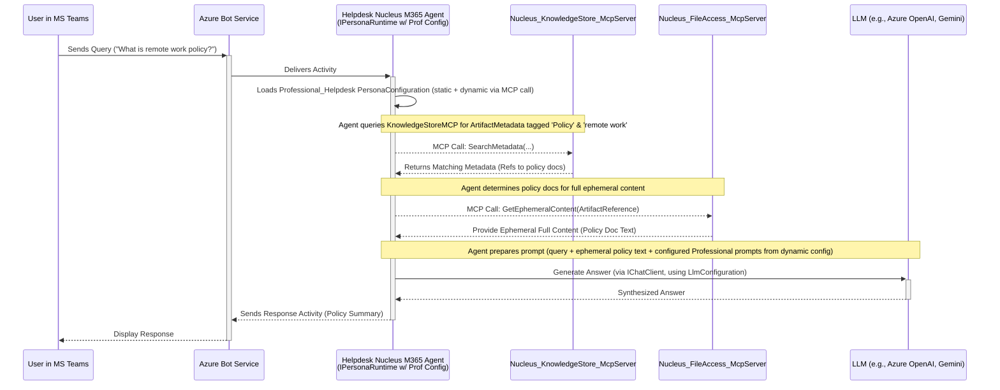

# Persona Configuration: Professional Colleague (M365 Agent)

## 1. Vision & Purpose

The Professional Colleague configuration defines a persona tailored for workplace environments, as outlined in the [Persona Designs Overview](./00_PERSONA_DESIGNS_OVERVIEW.md). It enables a **Nucleus M365 Persona Agent** (e.g., `ProfessionalHelpdeskAgent`) to act as a knowledgeable and helpful assistant, capable of leveraging organizational knowledge by invoking backend **Nucleus MCP Tools** and adhering to professional communication standards and security protocols ([Security Overview and Governance](../../Security/01_SECURITY_OVERVIEW_AND_GOVERNANCE.md)).

When this configuration is loaded by the `IPersonaRuntime` within the M365 Agent, it aims to:

*   **Provide Contextual Assistance:** Answer questions, summarize documents, and provide information based on organizational artifacts, accessed via MCP calls to `Nucleus_KnowledgeStore_McpServer` and `Nucleus_FileAccess_McpServer`.
*   **Facilitate Knowledge Discovery:** Help users find relevant documents, policies, or previous discussions by querying the knowledge store through an MCP Tool.
*   **Maintain Professionalism:** Interact in a manner suitable for a corporate setting (guided by dynamically configured prompts).
*   **Adhere to Security:** Strictly follow protocols for accessing potentially sensitive corporate data ephemerally and securely via MCP Tools that respect M365 permissions.
*   **Support Specific Workflows:** Configurations can be specialized for roles like IT Helpdesk (see [Azure/.NET Helpdesk Example](./Professional/ARCHITECTURE_AZURE_DOTNET_HELPDESK.md)) or project management support.

## 2. Typical Request Flow (Query about Company Policy - M365 Agent & MCP Tools)

**Purpose:** Illustrates how a Nucleus M365 Persona Agent (e.g., `HelpdeskM365Agent`) handles a query about a specific company policy, using its configuration to invoke backend MCP Tools and an LLM.

**Explanation:**
1.  A user asks a question via **MS Teams** (or another M365 surface).
2.  The **Azure Bot Service** routes the incoming `Activity` to the registered **Helpdesk Nucleus M365 Agent**.
3.  The `HelpdeskM365Agent` loads its `Professional_Helpdesk` `PersonaConfiguration` (a merged view of static settings from App Config/KV and dynamic behavioral settings fetched via an MCP call to `Nucleus_PersonaBehaviourConfig_McpServer`).
4.  The agent, guided by its configuration and the user query, makes an MCP call to `Nucleus_KnowledgeStore_McpServer` to find relevant `ArtifactMetadata` (e.g., documents tagged as 'Policy' matching keywords).
5.  `Nucleus_KnowledgeStore_McpServer` returns metadata referencing relevant policy documents.
6.  The agent determines which policy documents require full ephemeral content for an accurate answer.
7.  The agent makes an MCP call to `Nucleus_FileAccess_McpServer`, providing `ArtifactReference` objects, to get the ephemeral full content of these documents.
8.  `Nucleus_FileAccess_McpServer` securely retrieves and returns the ephemeral content (e.g., text from SharePoint documents, respecting user permissions via the agent's identity).
9.  The agent constructs a prompt for its configured **LLM** (e.g., Azure OpenAI, Google Gemini, as specified in `LlmConfiguration`). This prompt includes the user's query, the retrieved ephemeral policy text, and system/response guidelines sourced from its dynamic configuration.
10. The agent invokes the LLM via its `IChatClient` abstraction.
11. The LLM generates a synthesized answer summarizing the policy.
12. The agent sends the response as an `Activity` back through the **Azure Bot Service** to the user in MS Teams.

## 3. Core Functionality (Enabled by Configuration within M365 Agent)

When the `IPersonaRuntime` within the M365 Agent executes with a Professional Colleague configuration, it performs the following based on settings:

*   **Domain-Specific Context:** Interprets queries within a professional/workplace context (guided by dynamically configured prompts).
*   **Targeted Knowledge Retrieval (via MCP):** Invokes `Nucleus_KnowledgeStore_McpServer` to query specified Knowledge Containers for relevant `ArtifactMetadata` or `PersonaKnowledgeEntry` records.
*   **Secure Artifact Access (via MCP):** Orchestrates ephemeral retrieval of full document content by calling `Nucleus_FileAccess_McpServer`, which accesses **User-Controlled Storage** (like SharePoint, OneDrive) respecting M365 permissions.
*   **Synthesis and Summarization:** Uses the configured LLM (as per `LlmConfiguration`) with tailored prompts (dynamically sourced) to analyze retrieved ephemeral content and metadata, summarizing information or answering specific questions.
*   **Professional Response Generation:** Crafts responses appropriate for a workplace setting, potentially including citations to source documents (based on metadata and prompt configuration).

## 4. Configuration Settings (Example Values for M365 Agent)

Refers to settings defined in [Persona Configuration Schema](../../CoreNucleus/02_PERSONA_CONFIGURATION_SCHEMA.md), with Professional Colleague-specific values. Note the shift to dynamic sourcing for behavioral aspects.

*   **`PersonaId`**: `Professional_HelpdeskAgent` (intrinsic to the M365 Agent application)
*   **`DisplayName`**: "Professional Helpdesk Assistant"
*   **`LlmConfiguration`**:
    *   `Provider`: `AzureOpenAI` (or `GoogleGemini`, `OpenRouterAI`)
    *   `ChatModelId`: `gpt-4o` (or `gemini-2.5-pro`)
    *   `EmbeddingModelId`: `text-embedding-3-large`
    *   `ApiKeySecretName`: `MyOrg-AzureOpenAI-ApiKey` (if not using Managed Identity for Azure OpenAI)
    *   `EndpointUrl`: (Optional, e.g., specific Azure OpenAI endpoint)
*   **`EnabledTools`**: `["Nucleus.KnowledgeStore.Search", "Nucleus.KnowledgeStore.GetById", "Nucleus.FileAccess.GetEphemeralContent", "Nucleus.PersonaBehaviourConfig.Get"]` (MCP Tool IDs)
*   **`KnowledgeScope`**:
    *   `Strategy`: `SpecificCollectionIds`
    *   `CollectionIds`: `["company-policies", "it-procedures"]`
    *   `TargetKnowledgeContainerId`: `ProfessionalHelpdesk_Knowledge_v1`
*   **`SystemMessageKey`**: `professional_helpdesk_system_prompt_v2` (Key to fetch from `Nucleus_PersonaBehaviourConfig_McpServer`)
*   **`ResponseGuidelinesKey`**: `professional_response_style_guide_v1`
*   **`CustomPropertiesKeys`**: `["helpdesk_common_issue_links_map"]`
*   **`StrategyType`**: `ToolUsing` (to leverage MCP tools effectively)

## 5. Next Steps (Focus on M365 Agent Development)

1.  **Develop M365 Persona Agent:** Create the `Professional_HelpdeskAgent` application using the Microsoft 365 Agents SDK.
2.  **Implement `IPersonaRuntime`:** Ensure the runtime within the agent correctly loads and interprets the hybrid `PersonaConfiguration`.
3.  **Integrate MCP Tool Calls:** Implement logic within the agent to call the specified `EnabledTools` (e.g., `Nucleus_KnowledgeStore_McpServer`, `Nucleus_FileAccess_McpServer`, `Nucleus_PersonaBehaviourConfig_McpServer`) using an `IMcpToolInvoker`.
4.  **Configure Static & Dynamic Settings:** Set up Azure App Configuration/Key Vault for static parts and populate Cosmos DB for dynamic behavioral configurations accessible by `Nucleus_PersonaBehaviourConfig_McpServer`.
5.  **Test End-to-End Flow:** Verify the agent's interaction from M365 platform through MCP tool calls to LLM and back.