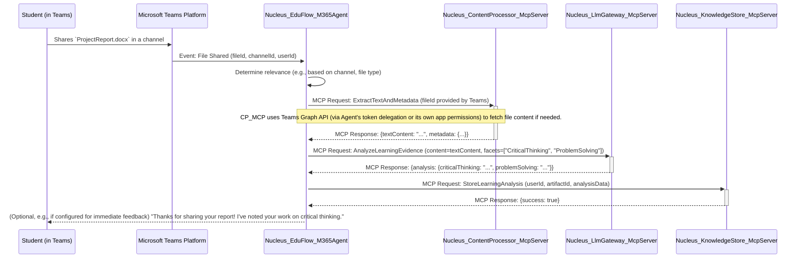

## 1. Overview

This document details the architecture of the **EduFlow OmniEducator**, a specialized educational assistant. This persona is implemented as a **Nucleus M365 Persona Agent application**, designed to operate within platforms like Microsoft Teams or potentially Discord (via a suitable bridge or direct integration if the M365 Agents SDK supports it or can be adapted). It leverages backend **Nucleus MCP (Model Context Protocol) Tool applications** for knowledge processing, AI-driven pedagogical analysis, and content interaction.

The EduFlow OmniEducator aims to:

*   Observe and understand learning activities from files and conversations shared within the platform context (e.g., student submissions, project discussions, shared learning resources).
*   Illuminate learning processes using its "Learning Facets" schema (e.g., identifying critical thinking, collaboration, problem-solving evidence).
*   Build an emergent understanding of a learner's or group's progress and store this as `PersonaKnowledgeEntry` instances via a backend MCP Tool.
*   Provide insights, feedback, and personalized guidance to learners and educators.
*   Facilitate access to relevant educational resources.

This architecture reflects the Nucleus project's pivot to a distributed system where the M365 Persona Agent handles user/platform interaction and orchestration, while backend MCP Tools provide specialized, context-aware functionalities tailored for educational contexts.

## 2. Core Components & Interaction Flow

The EduFlow OmniEducator system comprises:

1.  **`Nucleus_EduFlow_M365Agent` (M365 Persona Agent Application):**
    *   **Platform Integration:** Deployed as a Microsoft Teams bot (primary target). Future adaptations might explore other platforms.
    *   **User/Event Interaction:** Handles user messages, commands, @mentions, and crucially, file sharing events within Teams.
    *   **Orchestration:** Manages the pedagogical interaction flow, state, and analysis logic.
    *   **MCP Client:** Makes requests to various backend Nucleus MCP Tool applications.
    *   **Configuration:** Uses `appsettings.json` and Azure App Configuration. See [Persona Configuration Schema](../../../CoreNucleus/02_PERSONA_CONFIGURATION_SCHEMA.md).

2.  **`Nucleus_KnowledgeStore_McpServer` (MCP Tool Application):**
    *   **Functionality:** Provides access to the Nucleus knowledge base (Cosmos DB) for storing and retrieving `ArtifactMetadata` and `PersonaKnowledgeEntry<LearningFacetAnalysis>`.
    *   **MCP Interface:** Exposes MCP endpoints for querying and persisting educational data.
    *   **Operations (Examples):**
        *   `GetLearnerActivity`: Retrieves past interactions and analyses for a specific learner.
        *   `StoreLearningAnalysis`: Persists new `PersonaKnowledgeEntry` instances containing `LearningFacetAnalysis`.

3.  **`Nucleus_LlmGateway_McpServer` (MCP Tool Application):**
    *   **Functionality:** Provides a standardized interface to LLMs for pedagogical analysis, content summarization, feedback generation, etc.
    *   **MCP Interface:** Exposes MCP endpoints for LLM tasks.
    *   **Operations (Examples):**
        *   `AnalyzeLearningEvidence`: Takes text content (e.g., from a document or conversation) and a target Learning Facet, then returns an analysis.
        *   `GeneratePedagogicalFeedback`: Creates constructive feedback based on an analysis and learner context.

4.  **`Nucleus_ContentProcessor_McpServer` (MCP Tool Application):**
    *   **Functionality:** Handles extraction of text and metadata from various file types (e.g., DOCX, PDF, PPTX, code files) shared in Teams.
    *   **MCP Interface:** Exposes MCP endpoints for content processing.
    *   **Operations (Examples):**
        *   `ExtractTextAndMetadata`: Processes a file (e.g., from a URL provided by Teams) and returns its text content and basic metadata.

### 2.1. Typical Request Flow (Student shares a document in a Team channel monitored by EduFlow)



## 3. M365 Persona Agent Application (`Nucleus_EduFlow_M365Agent`)

This is a .NET application built using the Microsoft 365 Agents SDK.

### 3.1. Key Responsibilities:

*   **Event Handling:** Responds to Teams events, especially file shares and messages.
*   **Contextual Understanding:** Maintains context about learners, assignments, and ongoing discussions.
*   **Pedagogical Logic:** Implements the core logic for when and how to analyze content, trigger feedback, or offer support, guided by its persona configuration.
*   **MCP Tool Orchestration:** Coordinates calls to `Nucleus_ContentProcessor_McpServer`, `Nucleus_LlmGateway_McpServer`, and `Nucleus_KnowledgeStore_McpServer`.
*   **Learning Facet Management:** Understands and applies the "Learning Facets" schema during analysis and feedback.
*   **Adaptive Card Generation:** Presents insights and feedback to users in Teams using rich Adaptive Cards.

### 3.2. Configuration (`appsettings.json` / Azure App Config)

```json
{
  "Logging": { /* ... */ },
  "AllowedHosts": "*",
  "MicrosoftAppId": "YOUR_EDUFLOW_AGENT_APP_ID",
  "MicrosoftAppTenantId": "YOUR_TENANT_ID",
  "MicrosoftAppPassword": "YOUR_EDUFLOW_AGENT_APP_PASSWORD", // Store in Key Vault
  "NucleusMcpConfiguration": {
    "DefaultTimeoutSeconds": 60, // Potentially longer for complex analyses
    "Tools": [
      {
        "ToolId": "Nucleus.ContentProcessor",
        "BaseUrl": "https://nucleus-contentproc-mcpserver.azurewebsites.net/mcp",
        "Endpoints": { "ExtractTextAndMetadata": "content/extract" }
      },
      {
        "ToolId": "Nucleus.LlmGateway",
        "BaseUrl": "https://nucleus-llmgateway-mcpserver.azurewebsites.net/mcp",
        "Endpoints": {
          "AnalyzeLearningEvidence": "llm/analyze/learning",
          "GeneratePedagogicalFeedback": "llm/generate/feedback"
        },
        "LlmConfiguration": {
            "Provider": "Gemini", 
            "ModelName": "gemini-1.5-pro-latest",
            "ApiKey": "LLM_API_KEY_FROM_KV"
        }
      },
      {
        "ToolId": "Nucleus.KnowledgeStore",
        "BaseUrl": "https://nucleus-knowledgestore-mcpserver.azurewebsites.net/mcp",
        "Endpoints": {
          "GetLearnerActivity": "knowledge/learner/activity",
          "StoreLearningAnalysis": "knowledge/learner/analysis"
        }
      }
    ]
  },
  "PersonaSettings": {
    "PersonaName": "EduFlowOmniEducator",
    "LearningFacets": [
      { "Id": "CriticalThinking", "DisplayName": "Critical Thinking", "PromptKeywords": ["analyze", "evaluate", "compare", "contrast"] },
      { "Id": "ProblemSolving", "DisplayName": "Problem Solving", "PromptKeywords": ["solution", "resolve", "address issue"] },
      { "Id": "Collaboration", "DisplayName": "Collaboration", "PromptKeywords": ["teamwork", "joint effort", "shared contribution"] }
      // ... other facets
    ],
    "DefaultAnalysisPrompt": "Analyze the provided student work for evidence of the following learning facets: {{FACET_LIST}}. Provide specific examples and a brief rationale for each identified facet.",
    "FeedbackChannels": [ // Configuration for how/when to provide feedback
        { "ChannelId": "TEAM_CHANNEL_ID_1", "FeedbackMode": "ImmediateSummary" },
        { "ChannelId": "TEAM_CHANNEL_ID_2", "FeedbackMode": "WeeklyDigest" }
    ]
  }
}
```

*   **`NucleusMcpConfiguration.Tools`:** Defines the backend MCP Tools.
    *   Note the specialized endpoints for `Nucleus.LlmGateway` like `llm/analyze/learning`.
*   **`PersonaSettings`:**
    *   **`LearningFacets`:** Defines the schema used for pedagogical analysis.
    *   **`DefaultAnalysisPrompt`:** A template prompt for the LLM, customized by the agent with specific facets and content.
    *   **`FeedbackChannels`:** Configures how and where feedback or summaries are delivered.

## 4. Backend MCP Tool Applications

### 4.1. `Nucleus_ContentProcessor_McpServer`

*   **Purpose:** Extracts text and metadata from various file formats.
*   **Key MCP Endpoints:**
    *   `POST /mcp/content/extract`:
        *   Request: `{ "fileUrl": "...", "sourcePlatformToken": "..." }` (Agent might pass a token if CP needs to fetch from Teams Graph API)
        *   Response: `{ "textContent": "...", "wordCount": 1234, "detectedLanguage": "en", "metadata": { "author": "..." } }`
*   **Dependencies:** Libraries for file parsing (e.g., TikaOnDotNet, OpenXML SDK, PdfPig).

### 4.2. `Nucleus_LlmGateway_McpServer` (Educational Specialization)

*   **Purpose:** Provides LLM capabilities tailored for educational analysis.
*   **Key MCP Endpoints:**
    *   `POST /mcp/llm/analyze/learning`:
        *   Request: `{ "textContent": "...", "learningFacets": ["CriticalThinking"], "studentProfile": { "level": "Undergraduate" }, "llmConfigOverride": { ... } }`
        *   Response: `{ "analysisResults": [ { "facetId": "CriticalThinking", "evidence": ["..."], "score": 0.8, "rationale": "..." } ] }`
    *   `POST /mcp/llm/generate/feedback`:
        *   Request: `{ "analysisResults": ..., "studentProfile": ..., "feedbackStyle": "ConstructiveAndEncouraging" }`
        *   Response: `{ "feedbackText": "..." }`

### 4.3. `Nucleus_KnowledgeStore_McpServer` (Educational Data)

*   **Purpose:** Stores and retrieves educational analyses and learner progress.
*   **Key MCP Endpoints:**
    *   `POST /mcp/knowledge/learner/analysis`:
        *   Request: `{ "learnerId": "...", "artifactId": "...", "analysisData": { "facetAnalyses": [...], "overallSummary": "..." }, "timestamp": "..." }` (Stores `PersonaKnowledgeEntry<LearningFacetAnalysis>`)
        *   Response: `{ "success": true, "entryId": "..." }`
    *   `GET /mcp/knowledge/learner/activity?learnerId=...&timePeriod=Last30Days`:
        *   Response: `{ "activities": [ { "artifactId": "...", "analysisSummary": "...", "timestamp": "..." } ] }`

## 5. Data Model & Storage

*   **`Nucleus_EduFlow_M365Agent`:** Manages conversation state, potentially using M365 agent state services or a light cache.
*   **`Nucleus_KnowledgeStore_McpServer`:** Interacts with Azure Cosmos DB.
    *   `ArtifactMetadata`: Stores info about shared files (e.g., `ProjectReport.docx`).
    *   `PersonaKnowledgeEntry<T>`: For EduFlow, `T` would be a custom class like `LearningFacetAnalysis`:
        ```csharp
        // Example structure for T in PersonaKnowledgeEntry<T>
        public class LearningFacetAnalysis
        {
            public string LearnerId { get; set; }
            public string ArtifactId { get; set; } // Link to original file/submission
            public DateTime Timestamp { get; set; }
            public List<FacetResult> FacetResults { get; set; }
            public string OverallSummary { get; set; }
            public string SuggestedNextSteps { get; set; }
        }

        public class FacetResult
        {
            public string FacetId { get; set; } // e.g., "CriticalThinking"
            public double Score { get; set; } // 0.0 - 1.0
            public List<string> EvidenceSnippets { get; set; }
            public string Rationale { get; set; }
        }
        ```
    *   Vector embeddings might be generated from `textContent` of artifacts or from `EvidenceSnippets` to find related learning activities.

## 6. Security & Privacy Considerations

*   **Student Data Privacy (FERPA, GDPR, etc.):** Paramount.
    *   The M365 Agent and MCP Tools must handle student data with extreme care.
    *   Clear consent models for data processing and analysis.
    *   Data minimization: Only process and store what is necessary for the educational purpose.
    *   Anonymization/pseudonymization techniques should be considered where appropriate for aggregated reporting.
*   **Secure Configuration:** All secrets (API keys, connection strings, M365 app password) stored in Azure Key Vault.
*   **Authentication/Authorization:** Strong authentication between the M365 Agent and MCP Tools.
*   **Role-Based Access Control:** If educators access dashboards or summaries, ensure they only see data for students they are responsible for.

## 7. Deployment

*   Similar to the IT Helpdesk Persona: M365 Agent as Azure App Service/Functions, MCP Tools as separate scalable Azure services (App Services, Container Apps, Functions).
*   See [Deployment Overview](../../../Deployment/01_DEPLOYMENT_OVERVIEW.md) and [CI/CD Strategy](../../../DevelopmentLifecycle/03_CICD_STRATEGY.md).

## 8. Future Enhancements

*   **Personalized Learning Paths:** Suggest resources or activities based on analyzed strengths and weaknesses.
*   **Early Intervention Alerts:** Notify educators if a student appears to be struggling based on analysis patterns.
*   **Group Work Analysis:** Analyze collaborative documents and discussions to assess teamwork facets.
*   **Integration with LMS:** Connect with Learning Management Systems (e.g., Moodle, Canvas) for grade book updates or assignment ingestion (would likely require another specialized MCP Tool).

This architecture provides a robust framework for the EduFlow OmniEducator, enabling deep pedagogical insights and personalized support within collaborative learning environments.
